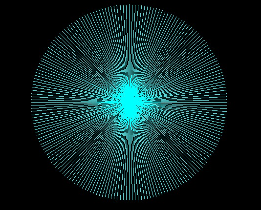

# Assignment 1 report
1. Implementation of Bresenham's algorithm -
```
int X1, Y1, X2, Y2, C, E;

X1 = p1.x;
Y1 = p1.y;
X2 = p2.x;
Y2 = p2.y;
E = -1;
int deltaX = X2 - X1;
int deltaY = Y2 - Y1;
if (X1 == X2) {
  while (Y1 <= Y2) {
    PutPixel(X1, Y1, color);
    Y1 += 1;
  }
  while (Y2 <= Y1) {
    PutPixel(X1, Y1, color);
    Y1 -= 1;
  }
  return;
}

float slope = (float) deltaY / (float) deltaX;

C = Y1 - (slope * X1);

if (slope == 0) {
  if (X1 > X2)
    Swap(X1, Y1, X2, Y2);

  while (X1 <= X2) {
    PutPixel(X1, Y1, color);

    X1 += 1;
  }
} else if (slope == 1) {
  if (X1 > X2)
    Swap(X1, Y1, X2, Y2);

  while (X1 <= X2) {
    PutPixel(X1, Y1, color);

    Y1 += 1;
    X1 += 1;
  }
} else if (slope == -1) {
  if (Y2 > Y1)
    Swap(X1, Y1, X2, Y2);

  while (Y2 <= Y1) {
    PutPixel(X1, Y1, color);

    Y1 -= 1;
    X1 += 1;
  }
} else if (slope > 0) {
  if (X1 > X2) {
    Swap(X1, Y1, X2, Y2);
    deltaX *= -1;
    deltaY *= -1;
  }

  E = (2 * deltaY * X1) + (2 * deltaX * C) - (2 * deltaX * Y1) - 1;

  if (slope < 1) {
    while (X1 <= X2) {
      if (E > 0) {
        Y1 += 1;
        E -= 2 * deltaX;
      }

      PutPixel(X1, Y1, color);

      X1 += 1;
      E += 2 * deltaY;
    }
  } else if (slope > 1) {
    while (Y1 <= Y2) {
      if (E > 0) {
        X1 += 1;
        E -= 2 * deltaY;
      }

      PutPixel(X1, Y1, color);

      Y1 += 1;
      E += 2 * deltaX;
    }
  }

} else if (slope < 0) {
  if (Y1 < Y2) {
    Swap(X1, Y1, X2, Y2);
    deltaX *= -1;
    deltaY *= -1;
  }

  E = (2 * deltaY * X1) + (2 * deltaX * C) - (2 * deltaX * Y1) - 1;

  if (slope > -1) {
    while (X1 <= X2) {
      if (E > 0) {
        Y1 -= 1;
        E -= 2 * deltaX;
      }

      PutPixel(X1, Y1, color);

      X1 += 1;
      E -= 2 * deltaY;
    }
  } else if (slope < -1) {
    while (Y1 >= Y2) {
      if (E > 0) {
        X1 += 1;
        E += 2 * deltaY;
      }

      PutPixel(X1, Y1, color);

      Y1 -= 1;
      E += 2 * deltaX;
    }
  }
}
```

2. A picture of the sanity check result  
  

3. Call batman! 
  