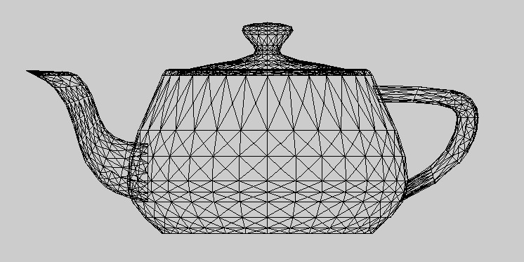
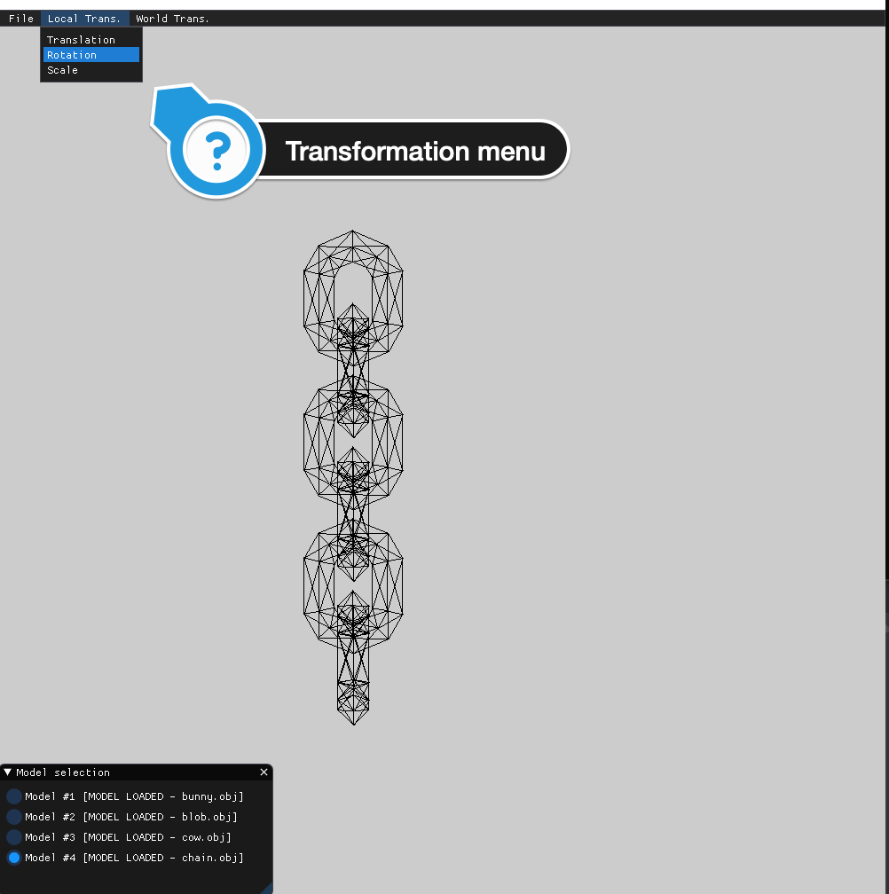
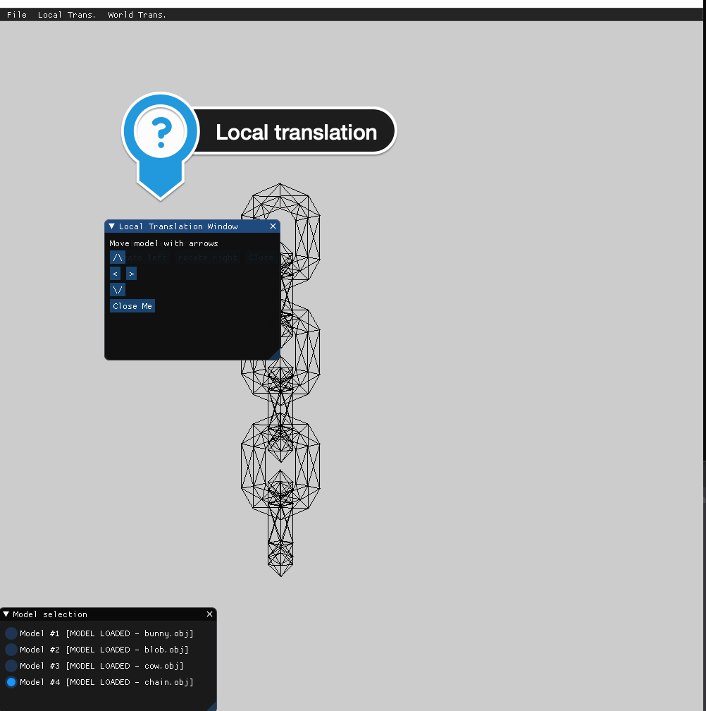
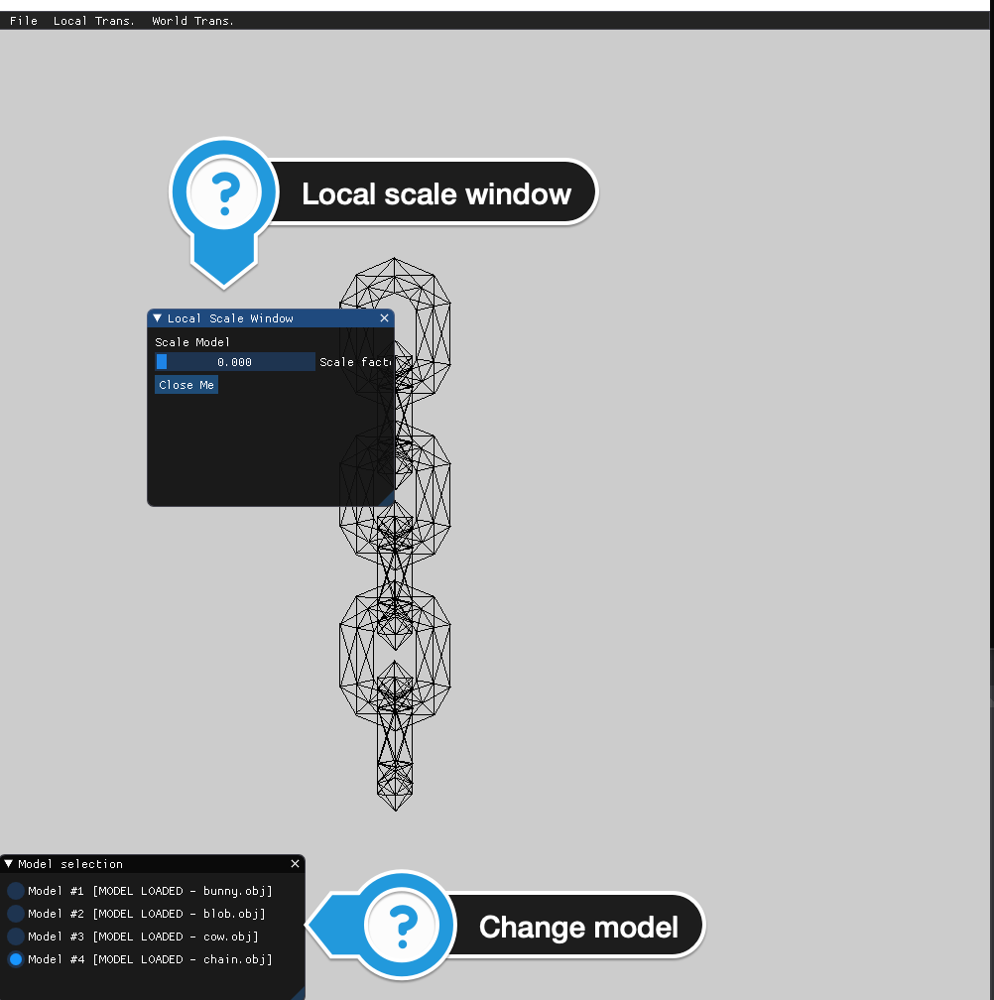
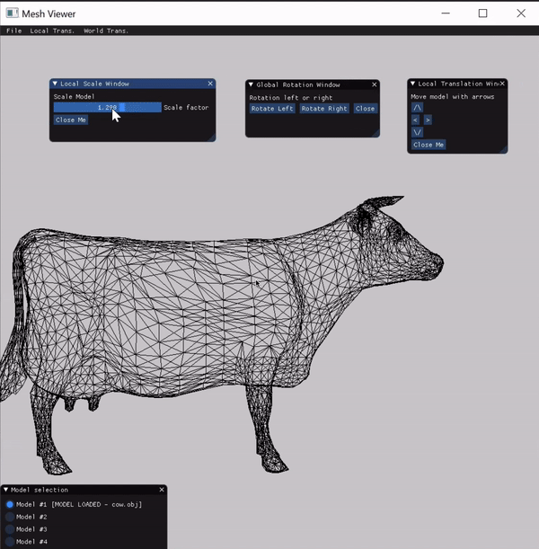
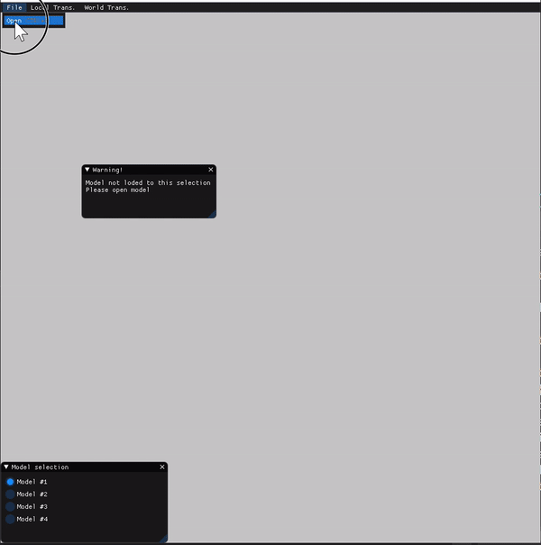

# 1. Teapot - 
### Vertices:  
```
-1.16227 : 0.78691 : 0.14163
-1.18594 : 0.75 : 0
-1.15794 : 0.75 : 0.28525
-1.1388 : 0.82383 : 0.28127
-1.16641 : 0.82383 : 0
-1.1084 : 0.78691 : 0.41446
-1.07744 : 0.75 : 0.5495
-1.05942 : 0.82383 : 0.54183
-1.005 : 0.78691 : 0.66384
-0.94969 : 0.75 : 0.7875
-0.93346 : 0.82383 : 0.77651
-0.85729 : 0.78691 : 0.88454
-0.77994 : 0.75 : 0.994
-0.76607 : 0.82383 : 0.98013
-1.16382 : 0.83613 : 0.14179
-1.161 : 0.84844 : 0.28589
-1.18907 : 0.84844 : 0
-1.10989 : 0.83613 : 0.41493
-1.08032 : 0.84844 : 0.55073
-1.00637 : 0.83613 : 0.66458
-0.95229 : 0.84844 : 0.78926
-0.85849 : 0.83613 : 0.88553
-0.78216 : 0.84844 : 0.99622
-0.67048 : 0.78691 : 1.07135
-0.57344 : 0.75 : 1.16375
-0.56245 : 0.82383 : 1.14752
-0.44978 : 0.78691 : 1.21906
-0.33544 : 0.75 : 1.2915
-0.32777 : 0.82383 : 1.27348
-0.2004 : 0.78691 : 1.32246
-0.07119 : 0.75 : 1.372
-0.06721 : 0.82383 : 1.35286
0.07243 : 0.78691 : 1.37633
0.21406 : 0.75 : 1.4
0.21406 : 0.82383 : 1.38047
-0.67147 : 0.83613 : 1.07255
-0.5752 : 0.84844 : 1.16635
-0.45052 : 0.83613 : 1.22043
-0.33667 : 0.84844 : 1.29438
-0.20087 : 0.83613 : 1.32395
-0.07183 : 0.84844 : 1.37506
0.07227 : 0.83613 : 1.37788
0.21406 : 0.84844 : 1.40313
-1.19785 : 0.83613 : 0.14529
-1.20617 : 0.82383 : 0.29528
-1.23516 : 0.82383 : 0
-1.14259 : 0.83613 : 0.42518
-1.12284 : 0.82383 : 0.56882
-1.03651 : 0.83613 : 0.681
-0.9906 : 0.82383 : 0.81519
-0.88498 : 0.83613 : 0.9074
-0.81488 : 0.82383 : 1.02894
-1.2458 : 0.78691 : 0.15023
-1.25594 : 0.75 : 0.30562
-1.28594 : 0.75 : 0
-1.18866 : 0.78691 : 0.43962
-1.16969 : 0.75 : 0.58875
-1.07899 : 0.78691 : 0.70413
-1.03282 : 0.75 : 0.84375
-0.92231 : 0.78691 : 0.93822
-0.85094 : 0.75 : 1.065
-0.69334 : 0.83613 : 1.09904
-0.60113 : 0.82383 : 1.20466
-0.46694 : 0.83613 : 1.25057
-0.35476 : 0.82383 : 1.3369
-0.21112 : 0.83613 : 1.35665
-0.08122 : 0.82383 : 1.42023
0.06877 : 0.83613 : 1.41191
0.21406 : 0.82383 : 1.44922
-0.72416 : 0.78691 : 1.13637
-0.62969 : 0.75 : 1.24688
-0.49007 : 0.78691 : 1.29305
-0.37469 : 0.75 : 1.38375
-0.22556 : 0.78691 : 1.40272
-0.09156 : 0.75 : 1.47
0.06383 : 0.78691 : 1.45986
0.21406 : 0.75 : 1.5
0.35569 : 0.78691 : 1.37633
0.49931 : 0.75 : 1.372
0.49533 : 0.82383 : 1.35286
0.62852 : 0.78691 : 1.32246
0.76356 : 0.75 : 1.2915
0.75589 : 0.82383 : 1.27348
0.8779 : 0.78691 : 1.21906
1.00156 : 0.75 : 1.16375
0.99057 : 0.82383 : 1.14752
1.0986 : 0.78691 : 1.07135
1.20806 : 0.75 : 0.994
1.19419 : 0.82383 : 0.98013
0.35585 : 0.83613 : 1.37788
0.49995 : 0.84844 : 1.37506
0.62899 : 0.83613 : 1.32395
0.76479 : 0.84844 : 1.29438
0.87864 : 0.83613 : 1.22043
1.00332 : 0.84844 : 1.16635
1.09959 : 0.83613 : 1.07255
1.21028 : 0.84844 : 0.99622
1.28541 : 0.78691 : 0.88454
1.37781 : 0.75 : 0.7875
1.36158 : 0.82383 : 0.77651
1.43312 : 0.78691 : 0.66384
1.50556 : 0.75 : 0.5495
1.48754 : 0.82383 : 0.54183
1.53652 : 0.78691 : 0.41446
1.58606 : 0.75 : 0.28525
1.56692 : 0.82383 : 0.28127
1.59039 : 0.78691 : 0.14163
1.61406 : 0.75 : 0
1.59453 : 0.82383 : 0
1.28661 : 0.83613 : 0.88553
1.38041 : 0.84844 : 0.78926
1.43449 : 0.83613 : 0.66458
1.50844 : 0.84844 : 0.55073
1.53801 : 0.83613 : 0.41493
1.58912 : 0.84844 : 0.28589
1.59194 : 0.83613 : 0.14179
1.61719 : 0.84844 : 0
0.35935 : 0.83613 : 1.41191
0.50934 : 0.82383 : 1.42023
0.63924 : 0.83613 : 1.35665
0.78288 : 0.82383 : 1.3369
0.89506 : 0.83613 : 1.25057
1.02925 : 0.82383 : 1.20466
1.12146 : 0.83613 : 1.09904
1.243 : 0.82383 : 1.02894
0.36429 : 0.78691 : 1.45986
0.51968 : 0.75 : 1.47
0.65368 : 0.78691 : 1.40272
0.80281 : 0.75 : 1.38375
0.91819 : 0.78691 : 1.29305
1.05781 : 0.75 : 1.24688
1.15228 : 0.78691 : 1.13637
1.27906 : 0.75 : 1.065
1.3131 : 0.83613 : 0.9074
1.41872 : 0.82383 : 0.81519
1.46463 : 0.83613 : 0.681
1.55096 : 0.82383 : 0.56882
1.57071 : 0.83613 : 0.42518
1.63429 : 0.82383 : 0.29528
1.62597 : 0.83613 : 0.14529
1.66328 : 0.82383 : 0
1.35043 : 0.78691 : 0.93822
1.46094 : 0.75 : 0.84375
1.50711 : 0.78691 : 0.70413
1.59781 : 0.75 : 0.58875
1.61678 : 0.78691 : 0.43962
1.68406 : 0.75 : 0.30562
1.67392 : 0.78691 : 0.15023
1.71406 : 0.75 : 0
1.59039 : 0.78691 : -0.14163
1.58606 : 0.75 : -0.28525
1.56692 : 0.82383 : -0.28127
1.53652 : 0.78691 : -0.41446
1.50556 : 0.75 : -0.5495
1.48754 : 0.82383 : -0.54183
1.43312 : 0.78691 : -0.66384
1.37781 : 0.75 : -0.7875
1.36158 : 0.82383 : -0.77651
1.28541 : 0.78691 : -0.88454
1.20806 : 0.75 : -0.994
1.19419 : 0.82383 : -0.98013
1.59194 : 0.83613 : -0.14179
1.58912 : 0.84844 : -0.28589
1.53801 : 0.83613 : -0.41493
1.50844 : 0.84844 : -0.55073
1.43449 : 0.83613 : -0.66458
1.38041 : 0.84844 : -0.78926
1.28661 : 0.83613 : -0.88553
1.21028 : 0.84844 : -0.99622
1.0986 : 0.78691 : -1.07135
1.00156 : 0.75 : -1.16375
0.99057 : 0.82383 : -1.14752
0.8779 : 0.78691 : -1.21906
0.76356 : 0.75 : -1.2915
0.75589 : 0.82383 : -1.27348
0.62852 : 0.78691 : -1.32246
0.49931 : 0.75 : -1.372
0.49533 : 0.82383 : -1.35286
0.35569 : 0.78691 : -1.37633
0.21406 : 0.75 : -1.4
0.21406 : 0.82383 : -1.38047
1.09959 : 0.83613 : -1.07255
1.00332 : 0.84844 : -1.16635
0.87864 : 0.83613 : -1.22043
0.76479 : 0.84844 : -1.29438
0.62899 : 0.83613 : -1.32395
0.49995 : 0.84844 : -1.37506
0.35585 : 0.83613 : -1.37788
0.21406 : 0.84844 : -1.40313
1.62597 : 0.83613 : -0.14529
1.63429 : 0.82383 : -0.29528
1.57071 : 0.83613 : -0.42518
1.55096 : 0.82383 : -0.56882
1.46463 : 0.83613 : -0.681
1.41872 : 0.82383 : -0.81519
1.3131 : 0.83613 : -0.9074
1.243 : 0.82383 : -1.02894
1.67392 : 0.78691 : -0.15023
1.68406 : 0.75 : -0.30562
1.61678 : 0.78691 : -0.43962
1.59781 : 0.75 : -0.58875
1.50711 : 0.78691 : -0.70413
1.46094 : 0.75 : -0.84375
1.35043 : 0.78691 : -0.93822
1.27906 : 0.75 : -1.065
1.12146 : 0.83613 : -1.09904
1.02925 : 0.82383 : -1.20466
0.89506 : 0.83613 : -1.25057
0.78288 : 0.82383 : -1.3369
0.63924 : 0.83613 : -1.35665
0.50934 : 0.82383 : -1.42023
0.35935 : 0.83613 : -1.41191
0.21406 : 0.82383 : -1.44922
1.15228 : 0.78691 : -1.13637
1.05781 : 0.75 : -1.24688
0.91819 : 0.78691 : -1.29305
0.80281 : 0.75 : -1.38375
0.65368 : 0.78691 : -1.40272
0.51968 : 0.75 : -1.47
0.36429 : 0.78691 : -1.45986
0.21406 : 0.75 : -1.5
0.07243 : 0.78691 : -1.37633
-0.07119 : 0.75 : -1.372
-0.06721 : 0.82383 : -1.35286
-0.2004 : 0.78691 : -1.32246
-0.33544 : 0.75 : -1.2915
-0.32777 : 0.82383 : -1.27348
-0.44978 : 0.78691 : -1.21906
-0.57344 : 0.75 : -1.16375
-0.56245 : 0.82383 : -1.14752
-0.67048 : 0.78691 : -1.07135
-0.77994 : 0.75 : -0.994
-0.76607 : 0.82383 : -0.98013
0.07227 : 0.83613 : -1.37788
-0.07183 : 0.84844 : -1.37506
-0.20087 : 0.83613 : -1.32395
-0.33667 : 0.84844 : -1.29438
-0.45052 : 0.83613 : -1.22043
-0.5752 : 0.84844 : -1.16635
-0.67147 : 0.83613 : -1.07255
-0.78216 : 0.84844 : -0.99622
-0.85729 : 0.78691 : -0.88454
-0.94969 : 0.75 : -0.7875
-0.93346 : 0.82383 : -0.77651
-1.005 : 0.78691 : -0.66384
-1.07744 : 0.75 : -0.5495
-1.05942 : 0.82383 : -0.54183
-1.1084 : 0.78691 : -0.41446
-1.15794 : 0.75 : -0.28525
-1.1388 : 0.82383 : -0.28127
-1.16227 : 0.78691 : -0.14163
-0.85849 : 0.83613 : -0.88553
-0.95229 : 0.84844 : -0.78926
-1.00637 : 0.83613 : -0.66458
-1.08032 : 0.84844 : -0.55073
-1.10989 : 0.83613 : -0.41493
-1.161 : 0.84844 : -0.28589
-1.16382 : 0.83613 : -0.14179
0.06877 : 0.83613 : -1.41191
-0.08122 : 0.82383 : -1.42023
-0.21112 : 0.83613 : -1.35665
-0.35476 : 0.82383 : -1.3369
-0.46694 : 0.83613 : -1.25057
-0.60113 : 0.82383 : -1.20466
-0.69334 : 0.83613 : -1.09904
-0.81488 : 0.82383 : -1.02894
0.06383 : 0.78691 : -1.45986
-0.09156 : 0.75 : -1.47
-0.22556 : 0.78691 : -1.40272
-0.37469 : 0.75 : -1.38375
-0.49007 : 0.78691 : -1.29305
-0.62969 : 0.75 : -1.24688
-0.72416 : 0.78691 : -1.13637
-0.85094 : 0.75 : -1.065
-0.88498 : 0.83613 : -0.9074
-0.9906 : 0.82383 : -0.81519
-1.03651 : 0.83613 : -0.681
-1.12284 : 0.82383 : -0.56882
-1.14259 : 0.83613 : -0.42518
-1.20617 : 0.82383 : -0.29528
-1.19785 : 0.83613 : -0.14529
-0.92231 : 0.78691 : -0.93822
-1.03282 : 0.75 : -0.84375
-1.07899 : 0.78691 : -0.70413
-1.16969 : 0.75 : -0.58875
-1.18866 : 0.78691 : -0.43962
-1.25594 : 0.75 : -0.30562
-1.2458 : 0.78691 : -0.15023
-1.4411 : 0.36094 : 0.17032
-1.59281 : -0.02813 : 0.37566
-1.62969 : -0.02813 : 0
-1.37631 : 0.36094 : 0.49843
-1.4868 : -0.02813 : 0.72367
-1.25196 : 0.36094 : 0.79832
-1.31856 : -0.02813 : 1.03711
-1.07433 : 0.36094 : 1.06373
-1.095 : -0.02813 : 1.30906
-0.84967 : 0.36094 : 1.28839
-0.82305 : -0.02813 : 1.53262
-0.58426 : 0.36094 : 1.46602
-0.50961 : -0.02813 : 1.70086
-0.28437 : 0.36094 : 1.59037
-0.1616 : -0.02813 : 1.80687
0.04374 : 0.36094 : 1.65516
0.21406 : -0.02813 : 1.84375
-1.66733 : -0.21387 : 0.1936
-1.70383 : -0.39961 : 0.39875
-1.74297 : -0.39961 : 0
-1.59369 : -0.21387 : 0.56655
-1.5913 : -0.39961 : 0.76814
-1.45234 : -0.21387 : 0.90744
-1.41272 : -0.39961 : 1.10083
-1.25043 : -0.21387 : 1.20912
-1.17543 : -0.39961 : 1.38949
-1.74467 : -0.57481 : 0.20156
-1.74594 : -0.75 : 0.4075
-1.78594 : -0.75 : 0
-1.668 : -0.57481 : 0.58985
-1.63094 : -0.75 : 0.785
-1.52085 : -0.57481 : 0.94474
-1.44844 : -0.75 : 1.125
-1.31063 : -0.57481 : 1.25883
-1.20594 : -0.75 : 1.42
-0.99506 : -0.21387 : 1.46449
-0.88677 : -0.39961 : 1.62678
-0.69338 : -0.21387 : 1.6664
-0.55408 : -0.39961 : 1.80536
-0.35249 : -0.21387 : 1.80775
-0.18469 : -0.39961 : 1.91789
0.02046 : -0.21387 : 1.88139
0.21406 : -0.39961 : 1.95703
-1.04477 : -0.57481 : 1.52469
-0.91094 : -0.75 : 1.6625
-0.73068 : -0.57481 : 1.73491
-0.57094 : -0.75 : 1.845
-0.37578 : -0.57481 : 1.88206
-0.19344 : -0.75 : 1.96
0.0125 : -0.57481 : 1.95873
0.21406 : -0.75 : 2
0.38438 : 0.36094 : 1.65516
0.58972 : -0.02813 : 1.80687
0.71249 : 0.36094 : 1.59037
0.93773 : -0.02813 : 1.70086
1.01238 : 0.36094 : 1.46602
1.25117 : -0.02813 : 1.53262
1.27779 : 0.36094 : 1.28839
1.52312 : -0.02813 : 1.30906
1.50245 : 0.36094 : 1.06373
1.74668 : -0.02813 : 1.03711
1.68008 : 0.36094 : 0.79832
1.91492 : -0.02813 : 0.72367
1.80443 : 0.36094 : 0.49843
2.02093 : -0.02813 : 0.37566
1.86922 : 0.36094 : 0.17032
2.05781 : -0.02813 : 0
0.40766 : -0.21387 : 1.88139
0.61281 : -0.39961 : 1.91789
0.78061 : -0.21387 : 1.80775
0.9822 : -0.39961 : 1.80536
1.1215 : -0.21387 : 1.6664
1.31489 : -0.39961 : 1.62678
1.42318 : -0.21387 : 1.46449
1.60355 : -0.39961 : 1.38949
0.41562 : -0.57481 : 1.95873
0.62156 : -0.75 : 1.96
0.80391 : -0.57481 : 1.88206
0.99906 : -0.75 : 1.845
1.1588 : -0.57481 : 1.73491
1.33906 : -0.75 : 1.6625
1.47289 : -0.57481 : 1.52469
1.63406 : -0.75 : 1.42
1.67855 : -0.21387 : 1.20912
1.84084 : -0.39961 : 1.10083
1.88046 : -0.21387 : 0.90744
2.01942 : -0.39961 : 0.76814
2.02181 : -0.21387 : 0.56655
2.13195 : -0.39961 : 0.39875
2.09545 : -0.21387 : 0.1936
2.17109 : -0.39961 : 0
1.73875 : -0.57481 : 1.25883
1.87656 : -0.75 : 1.125
1.94897 : -0.57481 : 0.94474
2.05906 : -0.75 : 0.785
2.09612 : -0.57481 : 0.58985
2.17406 : -0.75 : 0.4075
2.17279 : -0.57481 : 0.20156
2.21406 : -0.75 : 0
1.86922 : 0.36094 : -0.17032
2.02093 : -0.02813 : -0.37566
1.80443 : 0.36094 : -0.49843
1.91492 : -0.02813 : -0.72367
1.68008 : 0.36094 : -0.79832
1.74668 : -0.02813 : -1.03711
1.50245 : 0.36094 : -1.06373
1.52312 : -0.02813 : -1.30906
1.27779 : 0.36094 : -1.28839
1.25117 : -0.02813 : -1.53262
1.01238 : 0.36094 : -1.46602
0.93773 : -0.02813 : -1.70086
0.71249 : 0.36094 : -1.59037
0.58972 : -0.02813 : -1.80687
0.38438 : 0.36094 : -1.65516
0.21406 : -0.02813 : -1.84375
2.09545 : -0.21387 : -0.1936
2.13195 : -0.39961 : -0.39875
2.02181 : -0.21387 : -0.56655
2.01942 : -0.39961 : -0.76814
1.88046 : -0.21387 : -0.90744
1.84084 : -0.39961 : -1.10083
1.67855 : -0.21387 : -1.20912
1.60355 : -0.39961 : -1.38949
2.17279 : -0.57481 : -0.20156
2.17406 : -0.75 : -0.4075
2.09612 : -0.57481 : -0.58985
2.05906 : -0.75 : -0.785
1.94897 : -0.57481 : -0.94474
1.87656 : -0.75 : -1.125
1.73875 : -0.57481 : -1.25883
1.63406 : -0.75 : -1.42
1.42318 : -0.21387 : -1.46449
1.31489 : -0.39961 : -1.62678
1.1215 : -0.21387 : -1.6664
0.9822 : -0.39961 : -1.80536
0.78061 : -0.21387 : -1.80775
0.61281 : -0.39961 : -1.91789
0.40766 : -0.21387 : -1.88139
0.21406 : -0.39961 : -1.95703
1.47289 : -0.57481 : -1.52469
1.33906 : -0.75 : -1.6625
1.1588 : -0.57481 : -1.73491
0.99906 : -0.75 : -1.845
0.80391 : -0.57481 : -1.88206
0.62156 : -0.75 : -1.96
0.41562 : -0.57481 : -1.95873
0.21406 : -0.75 : -2
0.04374 : 0.36094 : -1.65516
-0.1616 : -0.02813 : -1.80687
-0.28437 : 0.36094 : -1.59037
-0.50961 : -0.02813 : -1.70086
-0.58426 : 0.36094 : -1.46602
-0.82305 : -0.02813 : -1.53262
-0.84967 : 0.36094 : -1.28839
-1.095 : -0.02813 : -1.30906
-1.07433 : 0.36094 : -1.06373
-1.31856 : -0.02813 : -1.03711
-1.25196 : 0.36094 : -0.79832
-1.4868 : -0.02813 : -0.72367
-1.37631 : 0.36094 : -0.49843
-1.59281 : -0.02813 : -0.37566
-1.4411 : 0.36094 : -0.17032
0.02046 : -0.21387 : -1.88139
-0.18469 : -0.39961 : -1.91789
-0.35249 : -0.21387 : -1.80775
-0.55408 : -0.39961 : -1.80536
-0.69338 : -0.21387 : -1.6664
-0.88677 : -0.39961 : -1.62678
-0.99506 : -0.21387 : -1.46449
-1.17543 : -0.39961 : -1.38949
0.0125 : -0.57481 : -1.95873
-0.19344 : -0.75 : -1.96
-0.37578 : -0.57481 : -1.88206
-0.57094 : -0.75 : -1.845
-0.73068 : -0.57481 : -1.73491
-0.91094 : -0.75 : -1.6625
-1.04477 : -0.57481 : -1.52469
-1.20594 : -0.75 : -1.42
-1.25043 : -0.21387 : -1.20912
-1.41272 : -0.39961 : -1.10083
-1.45234 : -0.21387 : -0.90744
-1.5913 : -0.39961 : -0.76814
-1.59369 : -0.21387 : -0.56655
-1.70383 : -0.39961 : -0.39875
-1.66733 : -0.21387 : -0.1936
-1.31063 : -0.57481 : -1.25883
-1.44844 : -0.75 : -1.125
-1.52085 : -0.57481 : -0.94474
-1.63094 : -0.75 : -0.785
-1.668 : -0.57481 : -0.58985
-1.74594 : -0.75 : -0.4075
-1.74467 : -0.57481 : -0.20156
-1.75531 : -0.82917 : 0.20266
-1.72489 : -0.90835 : 0.40312
-1.76446 : -0.90835 : 0
-1.67822 : -0.82917 : 0.59305
-1.61112 : -0.90835 : 0.77657
-1.71663 : -0.97742 : 0.19868
-1.66938 : -1.04648 : 0.39158
-1.70782 : -1.04648 : 0
-1.64106 : -0.97742 : 0.5814
-1.55887 : -1.04648 : 0.75434
-1.53027 : -0.82917 : 0.94987
-1.43058 : -0.90835 : 1.11292
-1.31891 : -0.82917 : 1.26567
-1.19069 : -0.90835 : 1.40475
-1.49602 : -0.97742 : 0.93122
-1.3835 : -1.04648 : 1.08106
-1.28881 : -0.97742 : 1.24081
-1.15047 : -1.04648 : 1.36453
-1.60352 : -1.15605 : 0.18704
-1.50094 : -1.26563 : 0.35656
-1.53594 : -1.26563 : 0
-1.53238 : -1.15605 : 0.54734
-1.40031 : -1.26563 : 0.68687
-1.39583 : -1.15605 : 0.87666
-1.24063 : -1.26563 : 0.98438
-1.20076 : -1.15605 : 1.16812
-1.02844 : -1.26563 : 1.2425
-1.05161 : -0.82917 : 1.53297
-0.89886 : -0.90835 : 1.64464
-0.73581 : -0.82917 : 1.74433
-0.56251 : -0.90835 : 1.82518
-1.02675 : -0.97742 : 1.50287
-0.867 : -1.04648 : 1.59756
-0.71716 : -0.97742 : 1.71008
-0.54028 : -1.04648 : 1.77293
-0.37899 : -0.82917 : 1.89228
-0.18906 : -0.90835 : 1.93895
0.0114 : -0.82917 : 1.96937
0.21406 : -0.90835 : 1.97852
-0.36734 : -0.97742 : 1.85512
-0.17752 : -1.04648 : 1.88344
0.01538 : -0.97742 : 1.93069
0.21406 : -1.04648 : 1.92188
-0.95406 : -1.15605 : 1.41482
-0.77031 : -1.26563 : 1.45469
-0.6626 : -1.15605 : 1.60989
-0.47282 : -1.26563 : 1.61437
-0.33328 : -1.15605 : 1.74644
-0.1425 : -1.26563 : 1.715
0.02702 : -1.15605 : 1.81758
0.21406 : -1.26563 : 1.75
-1.43336 : -1.34004 : 0.16953
-1.3325 : -1.41445 : 0.32154
-1.36407 : -1.41445 : 0
-1.36888 : -1.34004 : 0.4961
-1.24176 : -1.41445 : 0.61941
-1.24511 : -1.34004 : 0.79459
-1.09776 : -1.41445 : 0.8877
-1.06831 : -1.34004 : 1.05876
-0.90641 : -1.41445 : 1.12047
-1.30961 : -1.45723 : 0.15679
-1.25594 : -1.5 : 0.30562
-1.28594 : -1.5 : 0
-1.24997 : -1.45723 : 0.45883
-1.16969 : -1.5 : 0.58875
-1.13551 : -1.45723 : 0.7349
-1.03282 : -1.5 : 0.84375
-0.97198 : -1.45723 : 0.97923
-0.85094 : -1.5 : 1.065
-0.8447 : -1.34004 : 1.28237
-0.67364 : -1.41445 : 1.31182
-0.58053 : -1.34004 : 1.45917
-0.40535 : -1.41445 : 1.45582
-0.28204 : -1.34004 : 1.58294
-0.10748 : -1.41445 : 1.54656
0.04453 : -1.34004 : 1.64742
0.21406 : -1.41445 : 1.57813
-0.76517 : -1.45723 : 1.18604
-0.62969 : -1.5 : 1.24688
-0.52084 : -1.45723 : 1.34957
-0.37469 : -1.5 : 1.38375
-0.24477 : -1.45723 : 1.46403
-0.09156 : -1.5 : 1.47
0.05727 : -1.45723 : 1.52367
0.21406 : -1.5 : 1.5
0.41672 : -0.82917 : 1.96937
0.61718 : -0.90835 : 1.93895
0.80711 : -0.82917 : 1.89228
0.99063 : -0.90835 : 1.82518
0.41274 : -0.97742 : 1.93069
0.60564 : -1.04648 : 1.88344
0.79546 : -0.97742 : 1.85512
0.9684 : -1.04648 : 1.77293
1.16393 : -0.82917 : 1.74433
1.32698 : -0.90835 : 1.64464
1.47973 : -0.82917 : 1.53297
1.61881 : -0.90835 : 1.40475
1.14528 : -0.97742 : 1.71008
1.29512 : -1.04648 : 1.59756
1.45487 : -0.97742 : 1.50287
1.57859 : -1.04648 : 1.36453
0.4011 : -1.15605 : 1.81758
0.57062 : -1.26563 : 1.715
0.7614 : -1.15605 : 1.74644
0.90093 : -1.26563 : 1.61437
1.09072 : -1.15605 : 1.60989
1.19843 : -1.26563 : 1.45469
1.38218 : -1.15605 : 1.41482
1.45656 : -1.26563 : 1.2425
1.74703 : -0.82917 : 1.26567
1.8587 : -0.90835 : 1.11292
1.95839 : -0.82917 : 0.94987
2.03924 : -0.90835 : 0.77657
1.71693 : -0.97742 : 1.24081
1.81162 : -1.04648 : 1.08106
1.92414 : -0.97742 : 0.93122
1.98699 : -1.04648 : 0.75434
2.10634 : -0.82917 : 0.59305
2.15301 : -0.90835 : 0.40312
2.18343 : -0.82917 : 0.20266
2.19258 : -0.90835 : 0
2.06918 : -0.97742 : 0.5814
2.0975 : -1.04648 : 0.39158
2.14475 : -0.97742 : 0.19868
2.13594 : -1.04648 : 0
1.62888 : -1.15605 : 1.16812
1.66875 : -1.26563 : 0.98438
1.82395 : -1.15605 : 0.87666
1.82843 : -1.26563 : 0.68687
1.9605 : -1.15605 : 0.54734
1.92906 : -1.26563 : 0.35656
2.03164 : -1.15605 : 0.18704
1.96406 : -1.26563 : 0
0.38359 : -1.34004 : 1.64742
0.5356 : -1.41445 : 1.54656
0.71016 : -1.34004 : 1.58294
0.83347 : -1.41445 : 1.45582
1.00865 : -1.34004 : 1.45917
1.10176 : -1.41445 : 1.31182
1.27282 : -1.34004 : 1.28237
1.33453 : -1.41445 : 1.12047
0.37085 : -1.45723 : 1.52367
0.51968 : -1.5 : 1.47
0.67289 : -1.45723 : 1.46403
0.80281 : -1.5 : 1.38375
0.94896 : -1.45723 : 1.34957
1.05781 : -1.5 : 1.24688
1.19329 : -1.45723 : 1.18604
1.27906 : -1.5 : 1.065
1.49643 : -1.34004 : 1.05876
1.52588 : -1.41445 : 0.8877
1.67323 : -1.34004 : 0.79459
1.66988 : -1.41445 : 0.61941
1.797 : -1.34004 : 0.4961
1.76062 : -1.41445 : 0.32154
1.86148 : -1.34004 : 0.16953
1.79219 : -1.41445 : 0
1.4001 : -1.45723 : 0.97923
1.46094 : -1.5 : 0.84375
1.56363 : -1.45723 : 0.7349
1.59781 : -1.5 : 0.58875
1.67809 : -1.45723 : 0.45883
1.68406 : -1.5 : 0.30562
1.73773 : -1.45723 : 0.15679
1.71406 : -1.5 : 0
2.18343 : -0.82917 : -0.20266
2.15301 : -0.90835 : -0.40312
2.10634 : -0.82917 : -0.59305
2.03924 : -0.90835 : -0.77657
2.14475 : -0.97742 : -0.19868
2.0975 : -1.04648 : -0.39158
2.06918 : -0.97742 : -0.5814
1.98699 : -1.04648 : -0.75434
1.95839 : -0.82917 : -0.94987
1.8587 : -0.90835 : -1.11292
1.74703 : -0.82917 : -1.26567
1.61881 : -0.90835 : -1.40475
1.92414 : -0.97742 : -0.93122
1.81162 : -1.04648 : -1.08106
1.71693 : -0.97742 : -1.24081
1.57859 : -1.04648 : -1.36453
2.03164 : -1.15605 : -0.18704
1.92906 : -1.26563 : -0.35656
1.9605 : -1.15605 : -0.54734
1.82843 : -1.26563 : -0.68687
1.82395 : -1.15605 : -0.87666
1.66875 : -1.26563 : -0.98438
1.62888 : -1.15605 : -1.16812
1.45656 : -1.26563 : -1.2425
1.47973 : -0.82917 : -1.53297
1.32698 : -0.90835 : -1.64464
1.16393 : -0.82917 : -1.74433
0.99063 : -0.90835 : -1.82518
1.45487 : -0.97742 : -1.50287
1.29512 : -1.04648 : -1.59756
1.14528 : -0.97742 : -1.71008
0.9684 : -1.04648 : -1.77293
0.80711 : -0.82917 : -1.89228
0.61718 : -0.90835 : -1.93895
0.41672 : -0.82917 : -1.96937
0.21406 : -0.90835 : -1.97852
0.79546 : -0.97742 : -1.85512
0.60564 : -1.04648 : -1.88344
0.41274 : -0.97742 : -1.93069
0.21406 : -1.04648 : -1.92188
1.38218 : -1.15605 : -1.41482
1.19843 : -1.26563 : -1.45469
1.09072 : -1.15605 : -1.60989
0.90093 : -1.26563 : -1.61437
0.7614 : -1.15605 : -1.74644
0.57062 : -1.26563 : -1.715
0.4011 : -1.15605 : -1.81758
0.21406 : -1.26563 : -1.75
1.86148 : -1.34004 : -0.16953
1.76062 : -1.41445 : -0.32154
1.797 : -1.34004 : -0.4961
1.66988 : -1.41445 : -0.61941
1.67323 : -1.34004 : -0.79459
1.52588 : -1.41445 : -0.8877
1.49643 : -1.34004 : -1.05876
1.33453 : -1.41445 : -1.12047
1.73773 : -1.45723 : -0.15679
1.68406 : -1.5 : -0.30562
1.67809 : -1.45723 : -0.45883
1.59781 : -1.5 : -0.58875
1.56363 : -1.45723 : -0.7349
1.46094 : -1.5 : -0.84375
1.4001 : -1.45723 : -0.97923
1.27906 : -1.5 : -1.065
1.27282 : -1.34004 : -1.28237
1.10176 : -1.41445 : -1.31182
1.00865 : -1.34004 : -1.45917
0.83347 : -1.41445 : -1.45582
0.71016 : -1.34004 : -1.58294
0.5356 : -1.41445 : -1.54656
0.38359 : -1.34004 : -1.64742
0.21406 : -1.41445 : -1.57813
1.19329 : -1.45723 : -1.18604
1.05781 : -1.5 : -1.24688
0.94896 : -1.45723 : -1.34957
0.80281 : -1.5 : -1.38375
0.67289 : -1.45723 : -1.46403
0.51968 : -1.5 : -1.47
0.37085 : -1.45723 : -1.52367
0.21406 : -1.5 : -1.5
0.0114 : -0.82917 : -1.96937
-0.18906 : -0.90835 : -1.93895
-0.37899 : -0.82917 : -1.89228
-0.56251 : -0.90835 : -1.82518
0.01538 : -0.97742 : -1.93069
-0.17752 : -1.04648 : -1.88344
-0.36734 : -0.97742 : -1.85512
-0.54028 : -1.04648 : -1.77293
-0.73581 : -0.82917 : -1.74433
-0.89886 : -0.90835 : -1.64464
-1.05161 : -0.82917 : -1.53297
-1.19069 : -0.90835 : -1.40475
-0.71716 : -0.97742 : -1.71008
-0.867 : -1.04648 : -1.59756
-1.02675 : -0.97742 : -1.50287
-1.15047 : -1.04648 : -1.36453
0.02702 : -1.15605 : -1.81758
-0.1425 : -1.26563 : -1.715
-0.33328 : -1.15605 : -1.74644
-0.47282 : -1.26563 : -1.61437
-0.6626 : -1.15605 : -1.60989
-0.77031 : -1.26563 : -1.45469
-0.95406 : -1.15605 : -1.41482
-1.02844 : -1.26563 : -1.2425
-1.31891 : -0.82917 : -1.26567
-1.43058 : -0.90835 : -1.11292
-1.53027 : -0.82917 : -0.94987
-1.61112 : -0.90835 : -0.77657
-1.28881 : -0.97742 : -1.24081
-1.3835 : -1.04648 : -1.08106
-1.49602 : -0.97742 : -0.93122
-1.55887 : -1.04648 : -0.75434
-1.67822 : -0.82917 : -0.59305
-1.72489 : -0.90835 : -0.40312
-1.75531 : -0.82917 : -0.20266
-1.64106 : -0.97742 : -0.5814
-1.66938 : -1.04648 : -0.39158
-1.71663 : -0.97742 : -0.19868
-1.20076 : -1.15605 : -1.16812
-1.24063 : -1.26563 : -0.98438
-1.39583 : -1.15605 : -0.87666
-1.40031 : -1.26563 : -0.68687
-1.53238 : -1.15605 : -0.54734
-1.50094 : -1.26563 : -0.35656
-1.60352 : -1.15605 : -0.18704
0.04453 : -1.34004 : -1.64742
-0.10748 : -1.41445 : -1.54656
-0.28204 : -1.34004 : -1.58294
-0.40535 : -1.41445 : -1.45582
-0.58053 : -1.34004 : -1.45917
-0.67364 : -1.41445 : -1.31182
-0.8447 : -1.34004 : -1.28237
-0.90641 : -1.41445 : -1.12047
0.05727 : -1.45723 : -1.52367
-0.09156 : -1.5 : -1.47
-0.24477 : -1.45723 : -1.46403
-0.37469 : -1.5 : -1.38375
-0.52084 : -1.45723 : -1.34957
-0.62969 : -1.5 : -1.24688
-0.76517 : -1.45723 : -1.18604
-0.85094 : -1.5 : -1.065
-1.06831 : -1.34004 : -1.05876
-1.09776 : -1.41445 : -0.8877
-1.24511 : -1.34004 : -0.79459
-1.24176 : -1.41445 : -0.61941
-1.36888 : -1.34004 : -0.4961
-1.3325 : -1.41445 : -0.32154
-1.43336 : -1.34004 : -0.16953
-0.97198 : -1.45723 : -0.97923
-1.03282 : -1.5 : -0.84375
-1.13551 : -1.45723 : -0.7349
-1.16969 : -1.5 : -0.58875
-1.24997 : -1.45723 : -0.45883
-1.25594 : -1.5 : -0.30562
-1.30961 : -1.45723 : -0.15679
2.04723 : 0.39068 : 0.08438
1.81406 : 0.375 : 0
1.79844 : 0.41016 : 0.16875
2.29516 : 0.40609 : 0.16875
2.28125 : 0.37148 : 0
2.04586 : 0.44649 : 0.19688
1.76406 : 0.4875 : 0.225
2.32578 : 0.48223 : 0.225
2.46568 : 0.37552 : 0.08438
2.65976 : 0.37764 : 0.16875
2.62656 : 0.34687 : 0
2.50338 : 0.42782 : 0.19688
2.73281 : 0.44531 : 0.225
2.04398 : 0.52323 : 0.19688
1.72969 : 0.56484 : 0.16875
2.35639 : 0.55836 : 0.16875
2.04261 : 0.57904 : 0.08438
1.71406 : 0.6 : 0
2.37031 : 0.59297 : 0
2.55521 : 0.49972 : 0.19688
2.80586 : 0.51299 : 0.16875
2.5929 : 0.55202 : 0.08438
2.83906 : 0.54375 : 0
2.74127 : 0.3192 : 0.04835
2.64524 : 0.36418 : 0.09494
2.85264 : 0.28567 : 0.09844
2.84062 : 0.28008 : 0
2.76049 : 0.33197 : 0.13272
2.88432 : 0.3004 : 0.16875
2.76381 : 0.39059 : 0.19688
2.87685 : 0.4051 : 0.225
2.78579 : 0.33429 : 0.16875
2.88186 : 0.34623 : 0.19688
2.98047 : 0.34512 : 0.225
2.87424 : 0.25437 : 0.04922
2.90819 : 0.22746 : 0.09844
2.8955 : 0.22427 : 0
2.89669 : 0.26235 : 0.13359
2.94162 : 0.23587 : 0.16875
2.91118 : 0.18793 : 0.04922
2.92695 : 0.15 : 0.09844
2.91406 : 0.15 : 0
2.93442 : 0.19083 : 0.13359
2.96094 : 0.15 : 0.16875
2.96237 : 0.2857 : 0.19688
3.04306 : 0.2614 : 0.225
3.00242 : 0.19932 : 0.19688
3.06406 : 0.15 : 0.225
2.8448 : 0.45674 : 0.19688
2.96366 : 0.46356 : 0.16875
2.9744 : 0.4009 : 0.19688
3.07661 : 0.38983 : 0.16875
2.89554 : 0.49646 : 0.13272
2.82038 : 0.52644 : 0.09494
2.99227 : 0.48283 : 0.09844
2.91371 : 0.51079 : 0.04835
3.00312 : 0.49014 : 0
3.03521 : 0.4352 : 0.13359
3.10829 : 0.40457 : 0.09844
3.056 : 0.44692 : 0.04922
3.12031 : 0.41016 : 0
3.06116 : 0.32082 : 0.19688
3.14451 : 0.28693 : 0.16875
3.10471 : 0.21208 : 0.19688
3.16719 : 0.15 : 0.16875
3.12684 : 0.34417 : 0.13359
3.17794 : 0.29534 : 0.09844
3.14929 : 0.35215 : 0.04922
3.19062 : 0.29853 : 0
3.1727 : 0.22057 : 0.13359
3.20117 : 0.15 : 0.09844
3.19595 : 0.22347 : 0.04922
3.21406 : 0.15 : 0
2.04261 : 0.57904 : -0.08438
1.72969 : 0.56484 : -0.16875
2.35639 : 0.55836 : -0.16875
2.04398 : 0.52323 : -0.19688
1.76406 : 0.4875 : -0.225
2.32578 : 0.48223 : -0.225
2.5929 : 0.55202 : -0.08438
2.80586 : 0.51299 : -0.16875
2.55521 : 0.49972 : -0.19688
2.73281 : 0.44531 : -0.225
2.04586 : 0.44649 : -0.19688
1.79844 : 0.41016 : -0.16875
2.29516 : 0.40609 : -0.16875
2.04723 : 0.39068 : -0.08438
2.50338 : 0.42782 : -0.19688
2.65976 : 0.37764 : -0.16875
2.46568 : 0.37552 : -0.08438
2.91371 : 0.51079 : -0.04835
2.82038 : 0.52644 : -0.09494
2.99227 : 0.48283 : -0.09844
2.89554 : 0.49646 : -0.13272
2.96366 : 0.46356 : -0.16875
3.056 : 0.44692 : -0.04922
3.10829 : 0.40457 : -0.09844
3.03521 : 0.4352 : -0.13359
3.07661 : 0.38983 : -0.16875
2.8448 : 0.45674 : -0.19688
2.87685 : 0.4051 : -0.225
2.9744 : 0.4009 : -0.19688
2.98047 : 0.34512 : -0.225
3.14929 : 0.35215 : -0.04922
3.17794 : 0.29534 : -0.09844
3.12684 : 0.34417 : -0.13359
3.14451 : 0.28693 : -0.16875
3.19595 : 0.22347 : -0.04922
3.20117 : 0.15 : -0.09844
3.1727 : 0.22057 : -0.13359
3.16719 : 0.15 : -0.16875
3.06116 : 0.32082 : -0.19688
3.04306 : 0.2614 : -0.225
3.10471 : 0.21208 : -0.19688
3.06406 : 0.15 : -0.225
2.76381 : 0.39059 : -0.19688
2.78579 : 0.33429 : -0.16875
2.88186 : 0.34623 : -0.19688
2.88432 : 0.3004 : -0.16875
2.76049 : 0.33197 : -0.13272
2.64524 : 0.36418 : -0.09494
2.85264 : 0.28567 : -0.09844
2.74127 : 0.3192 : -0.04835
2.96237 : 0.2857 : -0.19688
2.94162 : 0.23587 : -0.16875
3.00242 : 0.19932 : -0.19688
2.96094 : 0.15 : -0.16875
2.89669 : 0.26235 : -0.13359
2.90819 : 0.22746 : -0.09844
2.87424 : 0.25437 : -0.04922
2.93442 : 0.19083 : -0.13359
2.92695 : 0.15 : -0.09844
2.91118 : 0.18793 : -0.04922
2.90068 : 0.04669 : 0.04922
2.88671 : -0.05932 : 0.09844
2.875 : -0.05391 : 0
2.92305 : 0.04177 : 0.13359
2.9176 : -0.07359 : 0.16875
2.98848 : 0.02738 : 0.19688
3.01133 : -0.11689 : 0.225
2.82048 : -0.18255 : 0.04844
2.76866 : -0.31696 : 0.09532
2.75156 : -0.3 : 0
2.8387 : -0.19498 : 0.13281
2.78183 : -0.33003 : 0.16875
2.8898 : -0.22915 : 0.19688
2.84844 : -0.39609 : 0.225
3.10544 : 0.0791 : 0.19688
3.15176 : -0.00553 : 0.16875
3.03876 : 0.02194 : 0.225
3.07672 : -0.06517 : 0.19688
3.10505 : -0.1602 : 0.16875
3.17627 : 0.07017 : 0.13359
3.18496 : -0.01379 : 0.09844
3.19944 : 0.06732 : 0.04922
3.19756 : -0.01692 : 0
3.14443 : -0.0885 : 0.13359
3.13594 : -0.17447 : 0.09844
3.16653 : -0.09626 : 0.04922
3.14765 : -0.17988 : 0
3.01907 : -0.21003 : 0.19688
3.02637 : -0.31281 : 0.16875
2.93354 : -0.25023 : 0.225
2.93084 : -0.35532 : 0.19688
2.91504 : -0.46216 : 0.16875
3.07752 : -0.24287 : 0.13272
3.04273 : -0.32402 : 0.09493
3.09752 : -0.25421 : 0.04834
3.06377 : -0.33845 : 0
2.98762 : -0.4014 : 0.08438
2.94531 : -0.49219 : 0
2.65319 : -0.43982 : 0.08438
2.54499 : -0.58317 : 0.16875
2.53437 : -0.54609 : 0
2.6859 : -0.49351 : 0.19688
2.56836 : -0.66475 : 0.225
2.46147 : -0.61772 : 0.08438
2.37883 : -0.68564 : 0.16875
2.38769 : -0.65596 : 0
2.29853 : -0.71047 : 0.04891
2.38259 : -0.67305 : 0.09718
2.20976 : -0.76289 : 0.09844
2.2924 : -0.72961 : 0.13328
2.19844 : -0.79688 : 0.16875
2.37094 : -0.71331 : 0.18707
2.5579 : -0.62825 : 0.19984
2.18242 : -0.84492 : 0.21094
2.36818 : -0.75948 : 0.21519
2.16406 : -0.9 : 0.225
2.73089 : -0.56733 : 0.19688
2.59172 : -0.74632 : 0.16875
2.7636 : -0.62102 : 0.08438
2.60234 : -0.7834 : 0
2.36423 : -0.80527 : 0.21519
2.57881 : -0.70124 : 0.19984
2.1457 : -0.95508 : 0.21094
2.36148 : -0.85144 : 0.18707
2.12968 : -1.00312 : 0.16875
2.35902 : -0.88722 : 0.13295
2.59631 : -0.76234 : 0.09585
2.11836 : -1.03711 : 0.09844
2.35777 : -0.90821 : 0.04857
2.11406 : -1.05 : 0
3.19944 : 0.06732 : -0.04922
3.18496 : -0.01379 : -0.09844
3.17627 : 0.07017 : -0.13359
3.15176 : -0.00553 : -0.16875
3.16653 : -0.09626 : -0.04922
3.13594 : -0.17447 : -0.09844
3.14443 : -0.0885 : -0.13359
3.10505 : -0.1602 : -0.16875
3.10544 : 0.0791 : -0.19688
3.03876 : 0.02194 : -0.225
3.07672 : -0.06517 : -0.19688
3.01133 : -0.11689 : -0.225
3.09752 : -0.25421 : -0.04834
3.04273 : -0.32402 : -0.09493
3.07752 : -0.24287 : -0.13272
3.02637 : -0.31281 : -0.16875
2.98762 : -0.4014 : -0.08438
2.91504 : -0.46216 : -0.16875
3.01907 : -0.21003 : -0.19688
2.93354 : -0.25023 : -0.225
2.93084 : -0.35532 : -0.19688
2.84844 : -0.39609 : -0.225
2.98848 : 0.02738 : -0.19688
2.9176 : -0.07359 : -0.16875
2.92305 : 0.04177 : -0.13359
2.88671 : -0.05932 : -0.09844
2.90068 : 0.04669 : -0.04922
2.8898 : -0.22915 : -0.19688
2.78183 : -0.33003 : -0.16875
2.8387 : -0.19498 : -0.13281
2.76866 : -0.31696 : -0.09532
2.82048 : -0.18255 : -0.04844
2.7636 : -0.62102 : -0.08438
2.59172 : -0.74632 : -0.16875
2.73089 : -0.56733 : -0.19688
2.56836 : -0.66475 : -0.225
2.35777 : -0.90821 : -0.04857
2.59631 : -0.76234 : -0.09585
2.11836 : -1.03711 : -0.09844
2.35902 : -0.88722 : -0.13295
2.12968 : -1.00312 : -0.16875
2.36148 : -0.85144 : -0.18707
2.57881 : -0.70124 : -0.19984
2.1457 : -0.95508 : -0.21094
2.36423 : -0.80527 : -0.21519
2.16406 : -0.9 : -0.225
2.6859 : -0.49351 : -0.19688
2.54499 : -0.58317 : -0.16875
2.65319 : -0.43982 : -0.08438
2.36818 : -0.75948 : -0.21519
2.5579 : -0.62825 : -0.19984
2.18242 : -0.84492 : -0.21094
2.37094 : -0.71331 : -0.18707
2.19844 : -0.79688 : -0.16875
2.46147 : -0.61772 : -0.08438
2.37883 : -0.68564 : -0.16875
2.2924 : -0.72961 : -0.13328
2.38259 : -0.67305 : -0.09718
2.20976 : -0.76289 : -0.09844
2.29853 : -0.71047 : -0.04891
-1.63002 : -0.22689 : 0.10684
-1.48594 : -0.225 : 0
-1.48594 : -0.26045 : 0.21656
-1.7773 : -0.22669 : 0.21078
-1.7709 : -0.19541 : 0
-1.63583 : -0.28755 : 0.28998
-1.48594 : -0.35391 : 0.37125
-1.79415 : -0.30916 : 0.36134
-1.87238 : -0.16952 : 0.10158
-1.9757 : -0.14113 : 0.19554
-1.96563 : -0.11484 : 0
-1.88735 : -0.22185 : 0.27572
-2.00225 : -0.21043 : 0.33522
-1.64601 : -0.39372 : 0.41208
-1.48594 : -0.48603 : 0.46406
-1.81799 : -0.42576 : 0.45167
-1.6588 : -0.52718 : 0.47313
-1.48594 : -0.6375 : 0.495
-1.84532 : -0.55942 : 0.48179
-1.91354 : -0.31344 : 0.39181
-2.03978 : -0.3084 : 0.41902
-1.94648 : -0.42857 : 0.44986
-2.08282 : -0.4207 : 0.44695
-2.03451 : -0.067 : 0.09238
-2.10432 : -0.01644 : 0.174
-2.09238 : 0.0044 : 0
-2.05451 : -0.10984 : 0.25076
-2.13578 : -0.07136 : 0.29828
-2.13912 : 0.06816 : 0.08082
-2.18633 : 0.13469 : 0.1493
-2.17344 : 0.15 : 0
-2.16169 : 0.03531 : 0.21938
-2.22032 : 0.09434 : 0.25594
-2.08952 : -0.1848 : 0.35634
-2.18026 : -0.14902 : 0.37285
-2.13353 : -0.27904 : 0.40913
-2.23125 : -0.23804 : 0.3977
-2.20118 : -0.02219 : 0.31175
-2.26836 : 0.03728 : 0.31992
-2.25083 : -0.09448 : 0.35793
-2.32344 : -0.02813 : 0.34125
-1.67246 : -0.66974 : 0.47313
-1.48594 : -0.78896 : 0.46406
-1.87264 : -0.69309 : 0.45167
-1.59462 : -0.83056 : 0.41533
-1.48594 : -0.92109 : 0.37125
-1.71166 : -0.87503 : 0.36866
-1.69492 : -0.73715 : 0.45737
-1.79393 : -0.77874 : 0.40976
-1.89647 : -0.80968 : 0.36134
-1.98165 : -0.55156 : 0.44986
-2.12585 : -0.53301 : 0.41902
-1.95516 : -0.70974 : 0.39936
-2.04538 : -0.72751 : 0.34997
-2.00614 : -0.60869 : 0.43446
-2.08519 : -0.62505 : 0.38466
-2.16338 : -0.63098 : 0.33522
-1.60117 : -0.9435 : 0.29288
-1.48594 : -1.01455 : 0.21656
-1.72114 : -0.96333 : 0.21505
-1.81065 : -0.88505 : 0.28896
-1.91333 : -0.89215 : 0.21078
-1.60444 : -1.00618 : 0.1079
-1.48594 : -1.05 : 0
-1.72473 : -0.99683 : 0
-1.81973 : -0.94394 : 0.10646
-1.91973 : -0.92344 : 0
-1.98075 : -0.80824 : 0.28156
-2.06783 : -0.80361 : 0.20415
-2.11663 : -0.71559 : 0.27122
-2.18993 : -0.70028 : 0.19554
-1.99431 : -0.86292 : 0.10373
-2.07635 : -0.83247 : 0
-2.13353 : -0.76573 : 0.09992
-2.2 : -0.72656 : 0
-2.18054 : -0.3797 : 0.40913
-2.28224 : -0.32705 : 0.37285
-2.22455 : -0.47394 : 0.35634
-2.32672 : -0.40471 : 0.29828
-2.30386 : -0.17169 : 0.35793
-2.37852 : -0.09353 : 0.31992
-2.35351 : -0.24397 : 0.31175
-2.42657 : -0.15059 : 0.25594
-2.25956 : -0.5489 : 0.25076
-2.35819 : -0.45964 : 0.174
-2.27956 : -0.59174 : 0.09238
-2.37012 : -0.48047 : 0
-2.39301 : -0.30147 : 0.21938
-2.46055 : -0.19094 : 0.1493
-2.41557 : -0.33432 : 0.08082
-2.47344 : -0.20625 : 0
-2.23762 : 0.30534 : 0.06309
-2.30321 : 0.46555 : 0.10305
-2.2875 : 0.47109 : 0
-2.26362 : 0.28638 : 0.17124
-2.34463 : 0.45095 : 0.17666
-2.30912 : 0.25322 : 0.24334
-2.40319 : 0.43031 : 0.22083
-2.36633 : 0.21153 : 0.27939
-2.47032 : 0.40664 : 0.23555
-2.33505 : 0.54464 : 0.04772
-2.38443 : 0.61992 : 0.08781
-2.36504 : 0.62197 : 0
-2.36695 : 0.53773 : 0.12952
-2.43554 : 0.61451 : 0.15054
-2.43678 : 0.68547 : 0.04246
-2.51172 : 0.75 : 0.08203
-2.48594 : 0.75 : 0
-2.47784 : 0.68361 : 0.11525
-2.57969 : 0.75 : 0.14063
-2.42382 : 0.52555 : 0.18082
-2.51193 : 0.60643 : 0.17525
-2.49402 : 0.51037 : 0.20808
-2.59063 : 0.5981 : 0.20071
-2.59795 : 0.67815 : 0.16984
-2.78594 : 0.75 : 0.1875
-2.38772 : 0.05472 : 0.30402
-2.45136 : 0.14925 : 0.267
-2.39756 : 0.19128 : 0.28791
-2.43985 : 0.0042 : 0.26411
-2.50297 : 0.11167 : 0.2136
-2.46417 : 0.28254 : 0.25282
-2.53744 : 0.38297 : 0.22083
-2.52194 : 0.25155 : 0.21952
-2.596 : 0.36233 : 0.17666
-2.48239 : -0.0362 : 0.18586
-2.53948 : 0.08508 : 0.1246
-2.5067 : -0.05928 : 0.06847
-2.55332 : 0.075 : 0
-2.56897 : 0.2267 : 0.15448
-2.63742 : 0.34773 : 0.10305
-2.59584 : 0.2125 : 0.05691
-2.65313 : 0.34219 : 0
-2.56693 : 0.49437 : 0.20808
-2.66933 : 0.58977 : 0.17525
-2.63712 : 0.47919 : 0.18082
-2.74572 : 0.58168 : 0.15054
-2.71873 : 0.63103 : 0.17221
-2.85436 : 0.67345 : 0.14322
-2.68421 : 0.67088 : 0.19438
-2.82917 : 0.71108 : 0.16643
-2.99219 : 0.75 : 0.14063
-2.69399 : 0.467 : 0.12952
-2.79683 : 0.57627 : 0.08781
-2.7259 : 0.4601 : 0.04772
-2.81621 : 0.57422 : 0
-2.82744 : 0.62567 : 0.11628
-2.91285 : 0.67128 : 0.08354
-2.95489 : 0.71118 : 0.11235
-3.06016 : 0.75 : 0.08203
-2.86523 : 0.62306 : 0.04284
-2.93504 : 0.67046 : 0
-2.9985 : 0.71043 : 0.04139
-3.08594 : 0.75 : 0
-1.60444 : -1.00618 : -0.1079
-1.48594 : -1.01455 : -0.21656
-1.72114 : -0.96333 : -0.21505
-1.81973 : -0.94394 : -0.10646
-1.91333 : -0.89215 : -0.21078
-1.60117 : -0.9435 : -0.29288
-1.48594 : -0.92109 : -0.37125
-1.71166 : -0.87503 : -0.36866
-1.81065 : -0.88505 : -0.28896
-1.89647 : -0.80968 : -0.36134
-1.99431 : -0.86292 : -0.10373
-2.06783 : -0.80361 : -0.20415
-2.13353 : -0.76573 : -0.09992
-2.18993 : -0.70028 : -0.19554
-1.98075 : -0.80824 : -0.28156
-2.04538 : -0.72751 : -0.34997
-2.11663 : -0.71559 : -0.27122
-2.16338 : -0.63098 : -0.33522
-1.59462 : -0.83056 : -0.41533
-1.48594 : -0.78896 : -0.46406
-1.69492 : -0.73715 : -0.45737
-1.79393 : -0.77874 : -0.40976
-1.87264 : -0.69309 : -0.45167
-1.67246 : -0.66974 : -0.47313
-1.48594 : -0.6375 : -0.495
-1.84532 : -0.55942 : -0.48179
-1.95516 : -0.70974 : -0.39936
-2.00614 : -0.60869 : -0.43446
-2.08519 : -0.62505 : -0.38466
-2.12585 : -0.53301 : -0.41902
-1.98165 : -0.55156 : -0.44986
-2.08282 : -0.4207 : -0.44695
-2.27956 : -0.59174 : -0.09238
-2.35819 : -0.45964 : -0.174
-2.25956 : -0.5489 : -0.25076
-2.32672 : -0.40471 : -0.29828
-2.41557 : -0.33432 : -0.08082
-2.46055 : -0.19094 : -0.1493
-2.39301 : -0.30147 : -0.21938
-2.42657 : -0.15059 : -0.25594
-2.22455 : -0.47394 : -0.35634
-2.28224 : -0.32705 : -0.37285
-2.18054 : -0.3797 : -0.40913
-2.23125 : -0.23804 : -0.3977
-2.35351 : -0.24397 : -0.31175
-2.37852 : -0.09353 : -0.31992
-2.30386 : -0.17169 : -0.35793
-2.32344 : -0.02813 : -0.34125
-1.6588 : -0.52718 : -0.47313
-1.48594 : -0.48603 : -0.46406
-1.81799 : -0.42576 : -0.45167
-1.64601 : -0.39372 : -0.41208
-1.48594 : -0.35391 : -0.37125
-1.79415 : -0.30916 : -0.36134
-1.94648 : -0.42857 : -0.44986
-2.03978 : -0.3084 : -0.41902
-1.91354 : -0.31344 : -0.39181
-2.00225 : -0.21043 : -0.33522
-1.63583 : -0.28755 : -0.28998
-1.48594 : -0.26045 : -0.21656
-1.7773 : -0.22669 : -0.21078
-1.63002 : -0.22689 : -0.10684
-1.88735 : -0.22185 : -0.27572
-1.9757 : -0.14113 : -0.19554
-1.87238 : -0.16952 : -0.10158
-2.13353 : -0.27904 : -0.40913
-2.18026 : -0.14902 : -0.37285
-2.08952 : -0.1848 : -0.35634
-2.13578 : -0.07136 : -0.29828
-2.25083 : -0.09448 : -0.35793
-2.26836 : 0.03728 : -0.31992
-2.20118 : -0.02219 : -0.31175
-2.22032 : 0.09434 : -0.25594
-2.05451 : -0.10984 : -0.25076
-2.10432 : -0.01644 : -0.174
-2.03451 : -0.067 : -0.09238
-2.16169 : 0.03531 : -0.21938
-2.18633 : 0.13469 : -0.1493
-2.13912 : 0.06816 : -0.08082
-2.5067 : -0.05928 : -0.06847
-2.53948 : 0.08508 : -0.1246
-2.48239 : -0.0362 : -0.18586
-2.50297 : 0.11167 : -0.2136
-2.59584 : 0.2125 : -0.05691
-2.63742 : 0.34773 : -0.10305
-2.56897 : 0.2267 : -0.15448
-2.596 : 0.36233 : -0.17666
-2.43985 : 0.0042 : -0.26411
-2.45136 : 0.14925 : -0.267
-2.38772 : 0.05472 : -0.30402
-2.39756 : 0.19128 : -0.28791
-2.52194 : 0.25155 : -0.21952
-2.53744 : 0.38297 : -0.22083
-2.46417 : 0.28254 : -0.25282
-2.47032 : 0.40664 : -0.23555
-2.7259 : 0.4601 : -0.04772
-2.79683 : 0.57627 : -0.08781
-2.69399 : 0.467 : -0.12952
-2.74572 : 0.58168 : -0.15054
-2.86523 : 0.62306 : -0.04284
-2.91285 : 0.67128 : -0.08354
-2.9985 : 0.71043 : -0.04139
-3.06016 : 0.75 : -0.08203
-2.82744 : 0.62567 : -0.11628
-2.85436 : 0.67345 : -0.14322
-2.95489 : 0.71118 : -0.11235
-2.99219 : 0.75 : -0.14063
-2.63712 : 0.47919 : -0.18082
-2.66933 : 0.58977 : -0.17525
-2.56693 : 0.49437 : -0.20808
-2.59063 : 0.5981 : -0.20071
-2.71873 : 0.63103 : -0.17221
-2.68421 : 0.67088 : -0.19438
-2.82917 : 0.71108 : -0.16643
-2.78594 : 0.75 : -0.1875
-2.36633 : 0.21153 : -0.27939
-2.40319 : 0.43031 : -0.22083
-2.30912 : 0.25322 : -0.24334
-2.34463 : 0.45095 : -0.17666
-2.26362 : 0.28638 : -0.17124
-2.30321 : 0.46555 : -0.10305
-2.23762 : 0.30534 : -0.06309
-2.49402 : 0.51037 : -0.20808
-2.51193 : 0.60643 : -0.17525
-2.42382 : 0.52555 : -0.18082
-2.43554 : 0.61451 : -0.15054
-2.59795 : 0.67815 : -0.16984
-2.57969 : 0.75 : -0.14063
-2.36695 : 0.53773 : -0.12952
-2.38443 : 0.61992 : -0.08781
-2.33505 : 0.54464 : -0.04772
-2.47784 : 0.68361 : -0.11525
-2.51172 : 0.75 : -0.08203
-2.43678 : 0.68547 : -0.04246
-2.53615 : 0.76919 : 0.03973
-2.58543 : 0.79275 : 0.0769
-2.5615 : 0.784 : 0
-2.58376 : 0.77175 : 0.10785
-2.65822 : 0.79425 : 0.13184
-2.72574 : 0.77326 : 0.15894
-2.8791 : 0.79878 : 0.17578
-2.59868 : 0.79754 : 0.03563
-2.63686 : 0.80716 : 0.06562
-2.61094 : 0.80625 : 0
-2.64642 : 0.80093 : 0.09672
-2.70518 : 0.80955 : 0.1125
-2.78875 : 0.80484 : 0.14253
-2.9125 : 0.8168 : 0.15
-2.93931 : 0.77552 : 0.15894
-3.09999 : 0.80331 : 0.13184
-3.08128 : 0.77703 : 0.10785
-3.17278 : 0.80481 : 0.0769
-3.1283 : 0.78006 : 0.03973
-3.19432 : 0.81543 : 0
-3.00286 : 0.81073 : 0.14253
-3.11983 : 0.82405 : 0.1125
-3.14519 : 0.81465 : 0.09672
-3.18815 : 0.82644 : 0.06562
-3.19233 : 0.8185 : 0.03563
-3.21406 : 0.82734 : 0
-2.63073 : 0.79964 : 0.02999
-2.64857 : 0.79298 : 0.05435
-2.62657 : 0.79219 : 0
-2.6743 : 0.80119 : 0.08141
-2.70658 : 0.79507 : 0.09316
-2.80172 : 0.80571 : 0.11997
-2.88262 : 0.80142 : 0.12422
-2.61605 : 0.77129 : 0.02589
-2.60313 : 0.75 : 0.04922
-2.58594 : 0.75 : 0
-2.65168 : 0.77201 : 0.07028
-2.64844 : 0.75 : 0.08438
-2.75589 : 0.77412 : 0.10356
-2.78594 : 0.75 : 0.1125
-2.9934 : 0.81251 : 0.11997
-3.05866 : 0.80776 : 0.09316
-3.12083 : 0.81702 : 0.08141
-3.11667 : 0.80985 : 0.05435
-3.16506 : 0.81658 : 0.02999
-3.14137 : 0.8027 : 0
-2.91266 : 0.77729 : 0.10356
-2.92344 : 0.75 : 0.08438
-3.01688 : 0.7794 : 0.07028
-2.96875 : 0.75 : 0.04922
-3.05318 : 0.77814 : 0.02589
-2.98594 : 0.75 : 0
-3.1283 : 0.78006 : -0.03973
-3.17278 : 0.80481 : -0.0769
-3.08128 : 0.77703 : -0.10785
-3.09999 : 0.80331 : -0.13184
-2.93931 : 0.77552 : -0.15894
-2.8791 : 0.79878 : -0.17578
-3.19233 : 0.8185 : -0.03563
-3.18815 : 0.82644 : -0.06562
-3.14519 : 0.81465 : -0.09672
-3.11983 : 0.82405 : -0.1125
-3.00286 : 0.81073 : -0.14253
-2.9125 : 0.8168 : -0.15
-2.72574 : 0.77326 : -0.15894
-2.65822 : 0.79425 : -0.13184
-2.58376 : 0.77175 : -0.10785
-2.58543 : 0.79275 : -0.0769
-2.53615 : 0.76919 : -0.03973
-2.78875 : 0.80484 : -0.14253
-2.70518 : 0.80955 : -0.1125
-2.64642 : 0.80093 : -0.09672
-2.63686 : 0.80716 : -0.06562
-2.59868 : 0.79754 : -0.03563
-3.16506 : 0.81658 : -0.02999
-3.11667 : 0.80985 : -0.05435
-3.12083 : 0.81702 : -0.08141
-3.05866 : 0.80776 : -0.09316
-2.9934 : 0.81251 : -0.11997
-2.88262 : 0.80142 : -0.12422
-3.05318 : 0.77814 : -0.02589
-2.96875 : 0.75 : -0.04922
-3.01688 : 0.7794 : -0.07028
-2.92344 : 0.75 : -0.08438
-2.91266 : 0.77729 : -0.10356
-2.78594 : 0.75 : -0.1125
-2.80172 : 0.80571 : -0.11997
-2.70658 : 0.79507 : -0.09316
-2.6743 : 0.80119 : -0.08141
-2.64857 : 0.79298 : -0.05435
-2.63073 : 0.79964 : -0.02999
-2.75589 : 0.77412 : -0.10356
-2.64844 : 0.75 : -0.08438
-2.65168 : 0.77201 : -0.07028
-2.60313 : 0.75 : -0.04922
-2.61605 : 0.77129 : -0.02589
0.10341 : 1.49341 : 0.02278
0.21406 : 1.5 : 0
0.00154 : 1.48682 : 0.09111
-0.01602 : 1.48682 : 0
-0.06036 : 1.4688 : 0.05638
-0.1004 : 1.45078 : 0.13441
-0.12656 : 1.45078 : 0
0.11991 : 1.49341 : 0.0638
0.04999 : 1.48682 : 0.16407
-0.01932 : 1.4688 : 0.15802
-0.02842 : 1.45078 : 0.24248
-0.1238 : 1.42397 : 0.06928
-0.12018 : 1.39717 : 0.1427
-0.14805 : 1.39717 : 0
-0.11626 : 1.36421 : 0.06767
-0.08589 : 1.33125 : 0.12798
-0.11094 : 1.33125 : 0
-0.07314 : 1.42397 : 0.1943
-0.04355 : 1.39717 : 0.25761
-0.06667 : 1.36421 : 0.18986
-0.01706 : 1.33125 : 0.23112
0.15026 : 1.49341 : 0.09415
0.12295 : 1.48682 : 0.21252
0.05604 : 1.4688 : 0.23338
0.07965 : 1.45078 : 0.31446
0.19128 : 1.49341 : 0.11065
0.21406 : 1.48682 : 0.23008
0.15768 : 1.4688 : 0.27442
0.21406 : 1.45078 : 0.34062
0.01976 : 1.42397 : 0.2872
0.07136 : 1.39717 : 0.33424
0.0242 : 1.36421 : 0.28073
0.08608 : 1.33125 : 0.29995
0.14478 : 1.42397 : 0.33786
0.21406 : 1.39717 : 0.36211
0.14639 : 1.36421 : 0.33033
0.21406 : 1.33125 : 0.325
-0.03681 : 1.25742 : 0.05135
0.0324 : 1.18359 : 0.0774
0.01719 : 1.18359 : 0
0.0009 : 1.25742 : 0.1441
0.07416 : 1.18359 : 0.1399
0.03926 : 1.148 : 0.03573
0.06018 : 1.1124 : 0.0655
0.04726 : 1.1124 : 0
0.03777 : 1.0812 : 0.036
0.02956 : 1.05 : 0.0785
0.01406 : 1.05 : 0
0.06559 : 1.148 : 0.10032
0.0956 : 1.1124 : 0.11846
0.06435 : 1.0812 : 0.10112
0.07206 : 1.05 : 0.142
0.06996 : 1.25742 : 0.21316
0.13666 : 1.18359 : 0.18166
0.16271 : 1.25742 : 0.25087
0.21406 : 1.18359 : 0.19688
0.11374 : 1.148 : 0.14848
0.14856 : 1.1124 : 0.15388
0.11294 : 1.0812 : 0.14971
0.13556 : 1.05 : 0.1845
0.17833 : 1.148 : 0.1748
0.21406 : 1.1124 : 0.1668
0.17806 : 1.0812 : 0.17629
0.21406 : 1.05 : 0.2
0.23684 : 1.49341 : 0.11065
0.30517 : 1.48682 : 0.21252
0.27044 : 1.4688 : 0.27442
0.34847 : 1.45078 : 0.31446
0.27786 : 1.49341 : 0.09415
0.37813 : 1.48682 : 0.16407
0.37208 : 1.4688 : 0.23338
0.45654 : 1.45078 : 0.24248
0.28334 : 1.42397 : 0.33786
0.35677 : 1.39717 : 0.33424
0.28173 : 1.36421 : 0.33033
0.34204 : 1.33125 : 0.29995
0.40836 : 1.42397 : 0.2872
0.47167 : 1.39717 : 0.25761
0.40392 : 1.36421 : 0.28073
0.44519 : 1.33125 : 0.23112
0.30821 : 1.49341 : 0.0638
0.42658 : 1.48682 : 0.09111
0.44744 : 1.4688 : 0.15802
0.52852 : 1.45078 : 0.13441
0.32471 : 1.49341 : 0.02278
0.44414 : 1.48682 : 0
0.48848 : 1.4688 : 0.05638
0.55468 : 1.45078 : 0
0.50126 : 1.42397 : 0.1943
0.5483 : 1.39717 : 0.1427
0.49479 : 1.36421 : 0.18986
0.51401 : 1.33125 : 0.12798
0.55192 : 1.42397 : 0.06928
0.57617 : 1.39717 : 0
0.54439 : 1.36421 : 0.06767
0.53906 : 1.33125 : 0
0.26541 : 1.25742 : 0.25087
0.29147 : 1.18359 : 0.18166
0.35816 : 1.25742 : 0.21316
0.35396 : 1.18359 : 0.1399
0.24979 : 1.148 : 0.1748
0.27956 : 1.1124 : 0.15388
0.25006 : 1.0812 : 0.17629
0.29256 : 1.05 : 0.1845
0.31438 : 1.148 : 0.14848
0.33252 : 1.1124 : 0.11846
0.31518 : 1.0812 : 0.14971
0.35606 : 1.05 : 0.142
0.42722 : 1.25742 : 0.1441
0.39572 : 1.18359 : 0.0774
0.46493 : 1.25742 : 0.05135
0.41094 : 1.18359 : 0
0.36253 : 1.148 : 0.10032
0.36794 : 1.1124 : 0.0655
0.36377 : 1.0812 : 0.10112
0.39856 : 1.05 : 0.0785
0.38886 : 1.148 : 0.03573
0.38086 : 1.1124 : 0
0.39035 : 1.0812 : 0.036
0.41406 : 1.05 : 0
0.32471 : 1.49341 : -0.02278
0.42658 : 1.48682 : -0.09111
0.48848 : 1.4688 : -0.05638
0.52852 : 1.45078 : -0.13441
0.30821 : 1.49341 : -0.0638
0.37813 : 1.48682 : -0.16407
0.44744 : 1.4688 : -0.15802
0.45654 : 1.45078 : -0.24248
0.55192 : 1.42397 : -0.06928
0.5483 : 1.39717 : -0.1427
0.54439 : 1.36421 : -0.06767
0.51401 : 1.33125 : -0.12798
0.50126 : 1.42397 : -0.1943
0.47167 : 1.39717 : -0.25761
0.49479 : 1.36421 : -0.18986
0.44519 : 1.33125 : -0.23112
0.27786 : 1.49341 : -0.09415
0.30517 : 1.48682 : -0.21252
0.37208 : 1.4688 : -0.23338
0.34847 : 1.45078 : -0.31446
0.23684 : 1.49341 : -0.11065
0.21406 : 1.48682 : -0.23008
0.27044 : 1.4688 : -0.27442
0.21406 : 1.45078 : -0.34062
0.40836 : 1.42397 : -0.2872
0.35677 : 1.39717 : -0.33424
0.40392 : 1.36421 : -0.28073
0.34204 : 1.33125 : -0.29995
0.28334 : 1.42397 : -0.33786
0.21406 : 1.39717 : -0.36211
0.28173 : 1.36421 : -0.33033
0.21406 : 1.33125 : -0.325
0.46493 : 1.25742 : -0.05135
0.39572 : 1.18359 : -0.0774
0.42722 : 1.25742 : -0.1441
0.35396 : 1.18359 : -0.1399
0.38886 : 1.148 : -0.03573
0.36794 : 1.1124 : -0.0655
0.39035 : 1.0812 : -0.036
0.39856 : 1.05 : -0.0785
0.36253 : 1.148 : -0.10032
0.33252 : 1.1124 : -0.11846
0.36377 : 1.0812 : -0.10112
0.35606 : 1.05 : -0.142
0.35816 : 1.25742 : -0.21316
0.29147 : 1.18359 : -0.18166
0.26541 : 1.25742 : -0.25087
0.21406 : 1.18359 : -0.19688
0.31438 : 1.148 : -0.14848
0.27956 : 1.1124 : -0.15388
0.31518 : 1.0812 : -0.14971
0.29256 : 1.05 : -0.1845
0.24979 : 1.148 : -0.1748
0.21406 : 1.1124 : -0.1668
0.25006 : 1.0812 : -0.17629
0.21406 : 1.05 : -0.2
0.19128 : 1.49341 : -0.11065
0.12295 : 1.48682 : -0.21252
0.15768 : 1.4688 : -0.27442
0.07965 : 1.45078 : -0.31446
0.15026 : 1.49341 : -0.09415
0.04999 : 1.48682 : -0.16407
0.05604 : 1.4688 : -0.23338
-0.02842 : 1.45078 : -0.24248
0.14478 : 1.42397 : -0.33786
0.07136 : 1.39717 : -0.33424
0.14639 : 1.36421 : -0.33033
0.08608 : 1.33125 : -0.29995
0.01976 : 1.42397 : -0.2872
-0.04355 : 1.39717 : -0.25761
0.0242 : 1.36421 : -0.28073
-0.01706 : 1.33125 : -0.23112
0.11991 : 1.49341 : -0.0638
0.00154 : 1.48682 : -0.09111
-0.01932 : 1.4688 : -0.15802
-0.1004 : 1.45078 : -0.13441
0.10341 : 1.49341 : -0.02278
-0.06036 : 1.4688 : -0.05638
-0.07314 : 1.42397 : -0.1943
-0.12018 : 1.39717 : -0.1427
-0.06667 : 1.36421 : -0.18986
-0.08589 : 1.33125 : -0.12798
-0.1238 : 1.42397 : -0.06928
-0.11626 : 1.36421 : -0.06767
0.16271 : 1.25742 : -0.25087
0.13666 : 1.18359 : -0.18166
0.06996 : 1.25742 : -0.21316
0.07416 : 1.18359 : -0.1399
0.17833 : 1.148 : -0.1748
0.14856 : 1.1124 : -0.15388
0.17806 : 1.0812 : -0.17629
0.13556 : 1.05 : -0.1845
0.11374 : 1.148 : -0.14848
0.0956 : 1.1124 : -0.11846
0.11294 : 1.0812 : -0.14971
0.07206 : 1.05 : -0.142
0.0009 : 1.25742 : -0.1441
0.0324 : 1.18359 : -0.0774
-0.03681 : 1.25742 : -0.05135
0.06559 : 1.148 : -0.10032
0.06018 : 1.1124 : -0.0655
0.06435 : 1.0812 : -0.10112
0.02956 : 1.05 : -0.0785
0.03926 : 1.148 : -0.03573
0.03777 : 1.0812 : -0.036
-0.10135 : 1.00547 : 0.0644
-0.20683 : 0.96094 : 0.17908
-0.24219 : 0.96094 : 0
-0.05377 : 1.00547 : 0.18088
-0.10988 : 0.96094 : 0.32394
-0.41794 : 0.93047 : 0.06482
-0.22418 : 0.96094 : 0.09121
-0.59444 : 0.9 : 0.16809
-0.61094 : 0.9 : 0
-0.39311 : 0.93047 : 0.19055
-0.547 : 0.9 : 0.32381
-0.34591 : 0.93047 : 0.30471
-0.1581 : 0.96094 : 0.25189
-0.47172 : 0.9 : 0.46406
-0.27785 : 0.93047 : 0.40641
-0.37169 : 0.9 : 0.58575
0.03318 : 1.00547 : 0.26783
0.03498 : 0.96094 : 0.42089
0.14966 : 1.00547 : 0.31541
0.21406 : 0.96094 : 0.45625
-0.19235 : 0.93047 : 0.49191
-0.03783 : 0.96094 : 0.37216
-0.25 : 0.9 : 0.68578
-0.09065 : 0.93047 : 0.55997
-0.10975 : 0.9 : 0.76106
0.02351 : 0.93047 : 0.60717
0.12285 : 0.96094 : 0.43824
0.04597 : 0.9 : 0.8085
0.14923 : 0.93047 : 0.632
0.21406 : 0.9 : 0.825
-0.76666 : 0.86953 : 0.10092
-0.91906 : 0.83906 : 0.23559
-0.94219 : 0.83906 : 0
-0.72827 : 0.86953 : 0.29533
-0.85258 : 0.83906 : 0.45383
-0.65459 : 0.86953 : 0.47302
-0.74707 : 0.83906 : 0.65039
-0.54934 : 0.86953 : 0.63029
-0.60688 : 0.83906 : 0.82094
-0.98245 : 0.81943 : 0.12313
-1.02166 : 0.7998 : 0.25692
-1.04688 : 0.7998 : 0
-0.93562 : 0.81943 : 0.36031
-0.94916 : 0.7998 : 0.49492
-1.0536 : 0.7749 : 0.13045
-1.05994 : 0.75 : 0.26487
-1.08594 : 0.75 : 0
-1.00399 : 0.7749 : 0.38174
-0.98519 : 0.75 : 0.51025
-0.84573 : 0.81943 : 0.5771
-0.83409 : 0.7998 : 0.70928
-0.71731 : 0.81943 : 0.76897
-0.68121 : 0.7998 : 0.89527
-0.90875 : 0.7749 : 0.61142
-0.86657 : 0.75 : 0.73125
-0.7727 : 0.7749 : 0.8147
-0.70894 : 0.75 : 0.923
-0.41622 : 0.86953 : 0.7634
-0.43633 : 0.83906 : 0.96113
-0.25896 : 0.86953 : 0.86865
-0.23977 : 0.83906 : 1.06664
-0.08127 : 0.86953 : 0.94233
-0.02153 : 0.83906 : 1.13312
0.11314 : 0.86953 : 0.98072
0.21406 : 0.83906 : 1.15625
-0.55491 : 0.81943 : 0.93137
-0.49522 : 0.7998 : 1.04815
-0.36304 : 0.81943 : 1.05979
-0.28086 : 0.7998 : 1.16322
-0.60064 : 0.7749 : 0.98676
-0.51719 : 0.75 : 1.08063
-0.39736 : 0.7749 : 1.12281
-0.29619 : 0.75 : 1.19925
-0.14625 : 0.81943 : 1.14968
-0.04286 : 0.7998 : 1.23572
0.09093 : 0.81943 : 1.19651
0.21406 : 0.7998 : 1.26094
-0.16768 : 0.7749 : 1.21805
-0.05082 : 0.75 : 1.274
0.08361 : 0.7749 : 1.26766
0.21406 : 0.75 : 1.3
0.27845 : 1.00547 : 0.31541
0.39314 : 0.96094 : 0.42089
0.39494 : 1.00547 : 0.26783
0.538 : 0.96094 : 0.32394
0.27889 : 0.93047 : 0.632
0.30527 : 0.96094 : 0.43824
0.38215 : 0.9 : 0.8085
0.40461 : 0.93047 : 0.60717
0.53787 : 0.9 : 0.76106
0.51877 : 0.93047 : 0.55997
0.46595 : 0.96094 : 0.37216
0.67812 : 0.9 : 0.68578
0.62047 : 0.93047 : 0.49191
0.79981 : 0.9 : 0.58575
0.48189 : 1.00547 : 0.18088
0.63495 : 0.96094 : 0.17908
0.52947 : 1.00547 : 0.0644
0.67031 : 0.96094 : 0
0.70597 : 0.93047 : 0.40641
0.58622 : 0.96094 : 0.25189
0.89984 : 0.9 : 0.46406
0.77403 : 0.93047 : 0.30471
0.97512 : 0.9 : 0.32381
0.82123 : 0.93047 : 0.19055
0.6523 : 0.96094 : 0.09121
1.02256 : 0.9 : 0.16809
0.84606 : 0.93047 : 0.06482
1.03906 : 0.9 : 0
0.31498 : 0.86953 : 0.98072
0.44965 : 0.83906 : 1.13312
0.50939 : 0.86953 : 0.94233
0.66789 : 0.83906 : 1.06664
0.68708 : 0.86953 : 0.86865
0.86445 : 0.83906 : 0.96113
0.84434 : 0.86953 : 0.7634
1.035 : 0.83906 : 0.82094
0.33718 : 0.81943 : 1.19651
0.47098 : 0.7998 : 1.23572
0.57437 : 0.81943 : 1.14968
0.70898 : 0.7998 : 1.16322
0.34451 : 0.7749 : 1.26766
0.47894 : 0.75 : 1.274
0.5958 : 0.7749 : 1.21805
0.72431 : 0.75 : 1.19925
0.79116 : 0.81943 : 1.05979
0.92334 : 0.7998 : 1.04815
0.98303 : 0.81943 : 0.93137
1.10933 : 0.7998 : 0.89527
0.82548 : 0.7749 : 1.12281
0.94531 : 0.75 : 1.08063
1.02876 : 0.7749 : 0.98676
1.13706 : 0.75 : 0.923
0.97746 : 0.86953 : 0.63029
1.17519 : 0.83906 : 0.65039
1.08271 : 0.86953 : 0.47302
1.2807 : 0.83906 : 0.45383
1.15639 : 0.86953 : 0.29533
1.34718 : 0.83906 : 0.23559
1.19478 : 0.86953 : 0.10092
1.37031 : 0.83906 : 0
1.14543 : 0.81943 : 0.76897
1.26221 : 0.7998 : 0.70928
1.27385 : 0.81943 : 0.5771
1.37728 : 0.7998 : 0.49492
1.20082 : 0.7749 : 0.8147
1.29469 : 0.75 : 0.73125
1.33687 : 0.7749 : 0.61142
1.41331 : 0.75 : 0.51025
1.36374 : 0.81943 : 0.36031
1.44978 : 0.7998 : 0.25692
1.41057 : 0.81943 : 0.12313
1.475 : 0.7998 : 0
1.43211 : 0.7749 : 0.38174
1.48806 : 0.75 : 0.26487
1.48172 : 0.7749 : 0.13045
1.51406 : 0.75 : 0
0.52947 : 1.00547 : -0.0644
0.63495 : 0.96094 : -0.17908
0.48189 : 1.00547 : -0.18088
0.538 : 0.96094 : -0.32394
0.84606 : 0.93047 : -0.06482
0.6523 : 0.96094 : -0.09121
1.02256 : 0.9 : -0.16809
0.82123 : 0.93047 : -0.19055
0.97512 : 0.9 : -0.32381
0.77403 : 0.93047 : -0.30471
0.58622 : 0.96094 : -0.25189
0.89984 : 0.9 : -0.46406
0.70597 : 0.93047 : -0.40641
0.79981 : 0.9 : -0.58575
0.39494 : 1.00547 : -0.26783
0.39314 : 0.96094 : -0.42089
0.27845 : 1.00547 : -0.31541
0.21406 : 0.96094 : -0.45625
0.62047 : 0.93047 : -0.49191
0.46595 : 0.96094 : -0.37216
0.67812 : 0.9 : -0.68578
0.51877 : 0.93047 : -0.55997
0.53787 : 0.9 : -0.76106
0.40461 : 0.93047 : -0.60717
0.30527 : 0.96094 : -0.43824
0.38215 : 0.9 : -0.8085
0.27889 : 0.93047 : -0.632
0.21406 : 0.9 : -0.825
1.19478 : 0.86953 : -0.10092
1.34718 : 0.83906 : -0.23559
1.15639 : 0.86953 : -0.29533
1.2807 : 0.83906 : -0.45383
1.08271 : 0.86953 : -0.47302
1.17519 : 0.83906 : -0.65039
0.97746 : 0.86953 : -0.63029
1.035 : 0.83906 : -0.82094
1.41057 : 0.81943 : -0.12313
1.44978 : 0.7998 : -0.25692
1.36374 : 0.81943 : -0.36031
1.37728 : 0.7998 : -0.49492
1.48172 : 0.7749 : -0.13045
1.48806 : 0.75 : -0.26487
1.43211 : 0.7749 : -0.38174
1.41331 : 0.75 : -0.51025
1.27385 : 0.81943 : -0.5771
1.26221 : 0.7998 : -0.70928
1.14543 : 0.81943 : -0.76897
1.10933 : 0.7998 : -0.89527
1.33687 : 0.7749 : -0.61142
1.29469 : 0.75 : -0.73125
1.20082 : 0.7749 : -0.8147
1.13706 : 0.75 : -0.923
0.84434 : 0.86953 : -0.7634
0.86445 : 0.83906 : -0.96113
0.68708 : 0.86953 : -0.86865
0.66789 : 0.83906 : -1.06664
0.50939 : 0.86953 : -0.94233
0.44965 : 0.83906 : -1.13312
0.31498 : 0.86953 : -0.98072
0.21406 : 0.83906 : -1.15625
0.98303 : 0.81943 : -0.93137
0.92334 : 0.7998 : -1.04815
0.79116 : 0.81943 : -1.05979
0.70898 : 0.7998 : -1.16322
1.02876 : 0.7749 : -0.98676
0.94531 : 0.75 : -1.08063
0.82548 : 0.7749 : -1.12281
0.72431 : 0.75 : -1.19925
0.57437 : 0.81943 : -1.14968
0.47098 : 0.7998 : -1.23572
0.33718 : 0.81943 : -1.19651
0.21406 : 0.7998 : -1.26094
0.5958 : 0.7749 : -1.21805
0.47894 : 0.75 : -1.274
0.34451 : 0.7749 : -1.26766
0.21406 : 0.75 : -1.3
0.14966 : 1.00547 : -0.31541
0.03498 : 0.96094 : -0.42089
0.03318 : 1.00547 : -0.26783
-0.10988 : 0.96094 : -0.32394
0.14923 : 0.93047 : -0.632
0.12285 : 0.96094 : -0.43824
0.04597 : 0.9 : -0.8085
0.02351 : 0.93047 : -0.60717
-0.10975 : 0.9 : -0.76106
-0.09065 : 0.93047 : -0.55997
-0.03783 : 0.96094 : -0.37216
-0.25 : 0.9 : -0.68578
-0.19235 : 0.93047 : -0.49191
-0.37169 : 0.9 : -0.58575
-0.05377 : 1.00547 : -0.18088
-0.20683 : 0.96094 : -0.17908
-0.10135 : 1.00547 : -0.0644
-0.27785 : 0.93047 : -0.40641
-0.1581 : 0.96094 : -0.25189
-0.47172 : 0.9 : -0.46406
-0.34591 : 0.93047 : -0.30471
-0.547 : 0.9 : -0.32381
-0.39311 : 0.93047 : -0.19055
-0.22418 : 0.96094 : -0.09121
-0.59444 : 0.9 : -0.16809
-0.41794 : 0.93047 : -0.06482
0.11314 : 0.86953 : -0.98072
-0.02153 : 0.83906 : -1.13312
-0.08127 : 0.86953 : -0.94233
-0.23977 : 0.83906 : -1.06664
-0.25896 : 0.86953 : -0.86865
-0.43633 : 0.83906 : -0.96113
-0.41622 : 0.86953 : -0.7634
-0.60688 : 0.83906 : -0.82094
0.09093 : 0.81943 : -1.19651
-0.04286 : 0.7998 : -1.23572
-0.14625 : 0.81943 : -1.14968
-0.28086 : 0.7998 : -1.16322
0.08361 : 0.7749 : -1.26766
-0.05082 : 0.75 : -1.274
-0.16768 : 0.7749 : -1.21805
-0.29619 : 0.75 : -1.19925
-0.36304 : 0.81943 : -1.05979
-0.49522 : 0.7998 : -1.04815
-0.55491 : 0.81943 : -0.93137
-0.68121 : 0.7998 : -0.89527
-0.39736 : 0.7749 : -1.12281
-0.51719 : 0.75 : -1.08063
-0.60064 : 0.7749 : -0.98676
-0.70894 : 0.75 : -0.923
-0.54934 : 0.86953 : -0.63029
-0.74707 : 0.83906 : -0.65039
-0.65459 : 0.86953 : -0.47302
-0.85258 : 0.83906 : -0.45383
-0.72827 : 0.86953 : -0.29533
-0.91906 : 0.83906 : -0.23559
-0.76666 : 0.86953 : -0.10092
-0.71731 : 0.81943 : -0.76897
-0.83409 : 0.7998 : -0.70928
-0.84573 : 0.81943 : -0.5771
-0.94916 : 0.7998 : -0.49492
-0.7727 : 0.7749 : -0.8147
-0.86657 : 0.75 : -0.73125
-0.90875 : 0.7749 : -0.61142
-0.98519 : 0.75 : -0.51025
-0.93562 : 0.81943 : -0.36031
-1.02166 : 0.7998 : -0.25692
-0.98245 : 0.81943 : -0.12313
-1.00399 : 0.7749 : -0.38174
-1.05994 : 0.75 : -0.26487
-1.0536 : 0.7749 : -0.13045
```
### Faces:
```
3//1 2//2 1//3
4//4 3//1 1//3
5//5 4//4 1//3
2//2 5//5 1//3
7//6 3//1 6//7
8//8 7//6 6//7
4//4 8//8 6//7
3//1 4//4 6//7
10//9 7//6 9//10
11//11 10//9 9//10
8//8 11//11 9//10
7//6 8//8 9//10
13//12 10//9 12//13
14//14 13//12 12//13
11//11 14//14 12//13
10//9 11//11 12//13
4//15 5//16 15//17
16//18 4//15 15//17
17//19 16//18 15//17
5//16 17//19 15//17
8//20 4//15 18//21
19//22 8//20 18//21
16//18 19//22 18//21
4//15 16//18 18//21
11//23 8//20 20//24
21//25 11//23 20//24
19//22 21//25 20//24
8//20 19//22 20//24
14//26 11//23 22//27
23//28 14//26 22//27
21//25 23//28 22//27
11//23 21//25 22//27
25//29 13//12 24//30
26//31 25//29 24//30
14//14 26//31 24//30
13//12 14//14 24//30
28//32 25//29 27//33
29//34 28//32 27//33
26//31 29//34 27//33
25//29 26//31 27//33
31//35 28//32 30//36
32//37 31//35 30//36
29//34 32//37 30//36
28//32 29//34 30//36
34//38 31//35 33//39
35//40 34//38 33//39
32//37 35//40 33//39
31//35 32//37 33//39
26//41 14//26 36//42
37//43 26//41 36//42
23//28 37//43 36//42
14//26 23//28 36//42
29//44 26//41 38//45
39//46 29//44 38//45
37//43 39//46 38//45
26//41 37//43 38//45
32//47 29//44 40//48
41//49 32//47 40//48
39//46 41//49 40//48
29//44 39//46 40//48
35//50 32//47 42//51
43//52 35//50 42//51
41//49 43//52 42//51
32//47 41//49 42//51
16//53 17//54 44//55
45//56 16//53 44//55
46//57 45//56 44//55
17//54 46//57 44//55
19//58 16//53 47//59
48//60 19//58 47//59
45//56 48//60 47//59
16//53 45//56 47//59
21//61 19//58 49//62
50//63 21//61 49//62
48//60 50//63 49//62
19//58 48//60 49//62
23//64 21//61 51//65
52//66 23//64 51//65
50//63 52//66 51//65
21//61 50//63 51//65
45//56 46//57 53//67
54//68 45//56 53//67
55//69 54//68 53//67
46//57 55//69 53//67
48//60 45//56 56//70
57//71 48//60 56//70
54//68 57//71 56//70
45//56 54//68 56//70
50//63 48//60 58//72
59//73 50//63 58//72
57//71 59//73 58//72
48//60 57//71 58//72
52//66 50//63 60//74
61//75 52//66 60//74
59//73 61//75 60//74
50//63 59//73 60//74
37//76 23//64 62//77
63//78 37//76 62//77
52//66 63//78 62//77
23//64 52//66 62//77
39//79 37//76 64//80
65//81 39//79 64//80
63//78 65//81 64//80
37//76 63//78 64//80
41//82 39//79 66//83
67//84 41//82 66//83
65//81 67//84 66//83
39//79 65//81 66//83
43//85 41//82 68//86
69//87 43//85 68//86
67//84 69//87 68//86
41//82 67//84 68//86
63//78 52//66 70//88
71//89 63//78 70//88
61//75 71//89 70//88
52//66 61//75 70//88
65//81 63//78 72//90
73//91 65//81 72//90
71//89 73//91 72//90
63//78 71//89 72//90
67//84 65//81 74//92
75//93 67//84 74//92
73//91 75//93 74//92
65//81 73//91 74//92
69//87 67//84 76//94
77//95 69//87 76//94
75//93 77//95 76//94
67//84 75//93 76//94
79//96 34//38 78//97
80//98 79//96 78//97
35//40 80//98 78//97
34//38 35//40 78//97
82//99 79//96 81//100
83//101 82//99 81//100
80//98 83//101 81//100
79//96 80//98 81//100
85//102 82//99 84//103
86//104 85//102 84//103
83//101 86//104 84//103
82//99 83//101 84//103
88//105 85//102 87//106
89//107 88//105 87//106
86//104 89//107 87//106
85//102 86//104 87//106
80//108 35//50 90//109
91//110 80//108 90//109
43//52 91//110 90//109
35//50 43//52 90//109
83//111 80//108 92//112
93//113 83//111 92//112
91//110 93//113 92//112
80//108 91//110 92//112
86//114 83//111 94//115
95//116 86//114 94//115
93//113 95//116 94//115
83//111 93//113 94//115
89//117 86//114 96//118
97//119 89//117 96//118
95//116 97//119 96//118
86//114 95//116 96//118
99//120 88//105 98//121
100//122 99//120 98//121
89//107 100//122 98//121
88//105 89//107 98//121
102//123 99//120 101//124
103//125 102//123 101//124
100//122 103//125 101//124
99//120 100//122 101//124
105//126 102//123 104//127
106//128 105//126 104//127
103//125 106//128 104//127
102//123 103//125 104//127
108//129 105//126 107//130
109//131 108//129 107//130
106//128 109//131 107//130
105//126 106//128 107//130
100//132 89//117 110//133
111//134 100//132 110//133
97//119 111//134 110//133
89//117 97//119 110//133
103//135 100//132 112//136
113//137 103//135 112//136
111//134 113//137 112//136
100//132 111//134 112//136
106//138 103//135 114//139
115//140 106//138 114//139
113//137 115//140 114//139
103//135 113//137 114//139
109//141 106//138 116//142
117//143 109//141 116//142
115//140 117//143 116//142
106//138 115//140 116//142
91//144 43//85 118//145
119//146 91//144 118//145
69//87 119//146 118//145
43//85 69//87 118//145
93//147 91//144 120//148
121//149 93//147 120//148
119//146 121//149 120//148
91//144 119//146 120//148
95//150 93//147 122//151
123//152 95//150 122//151
121//149 123//152 122//151
93//147 121//149 122//151
97//153 95//150 124//154
125//155 97//153 124//154
123//152 125//155 124//154
95//150 123//152 124//154
119//146 69//87 126//156
127//157 119//146 126//156
77//95 127//157 126//156
69//87 77//95 126//156
121//149 119//146 128//158
129//159 121//149 128//158
127//157 129//159 128//158
119//146 127//157 128//158
123//152 121//149 130//160
131//161 123//152 130//160
129//159 131//161 130//160
121//149 129//159 130//160
125//155 123//152 132//162
133//163 125//155 132//162
131//161 133//163 132//162
123//152 131//161 132//162
111//164 97//153 134//165
135//166 111//164 134//165
125//155 135//166 134//165
97//153 125//155 134//165
113//167 111//164 136//168
137//169 113//167 136//168
135//166 137//169 136//168
111//164 135//166 136//168
115//170 113//167 138//171
139//172 115//170 138//171
137//169 139//172 138//171
113//167 137//169 138//171
117//173 115//170 140//174
141//175 117//173 140//174
139//172 141//175 140//174
115//170 139//172 140//174
135//166 125//155 142//176
143//177 135//166 142//176
133//163 143//177 142//176
125//155 133//163 142//176
137//169 135//166 144//178
145//179 137//169 144//178
143//177 145//179 144//178
135//166 143//177 144//178
139//172 137//169 146//180
147//181 139//172 146//180
145//179 147//181 146//180
137//169 145//179 146//180
141//175 139//172 148//182
149//183 141//175 148//182
147//181 149//183 148//182
139//172 147//181 148//182
151//184 108//129 150//185
152//186 151//184 150//185
109//131 152//186 150//185
108//129 109//131 150//185
154//187 151//184 153//188
155//189 154//187 153//188
152//186 155//189 153//188
151//184 152//186 153//188
157//190 154//187 156//191
158//192 157//190 156//191
155//189 158//192 156//191
154//187 155//189 156//191
160//193 157//190 159//194
161//195 160//193 159//194
158//192 161//195 159//194
157//190 158//192 159//194
152//196 109//141 162//197
163//198 152//196 162//197
117//143 163//198 162//197
109//141 117//143 162//197
155//199 152//196 164//200
165//201 155//199 164//200
163//198 165//201 164//200
152//196 163//198 164//200
158//202 155//199 166//203
167//204 158//202 166//203
165//201 167//204 166//203
155//199 165//201 166//203
161//205 158//202 168//206
169//207 161//205 168//206
167//204 169//207 168//206
158//202 167//204 168//206
171//208 160//193 170//209
172//210 171//208 170//209
161//195 172//210 170//209
160//193 161//195 170//209
174//211 171//208 173//212
175//213 174//211 173//212
172//210 175//213 173//212
171//208 172//210 173//212
177//214 174//211 176//215
178//216 177//214 176//215
175//213 178//216 176//215
174//211 175//213 176//215
180//217 177//214 179//218
181//219 180//217 179//218
178//216 181//219 179//218
177//214 178//216 179//218
172//220 161//205 182//221
183//222 172//220 182//221
169//207 183//222 182//221
161//205 169//207 182//221
175//223 172//220 184//224
185//225 175//223 184//224
183//222 185//225 184//224
172//220 183//222 184//224
178//226 175//223 186//227
187//228 178//226 186//227
185//225 187//228 186//227
175//223 185//225 186//227
181//229 178//226 188//230
189//231 181//229 188//230
187//228 189//231 188//230
178//226 187//228 188//230
163//232 117//173 190//233
191//234 163//232 190//233
141//175 191//234 190//233
117//173 141//175 190//233
165//235 163//232 192//236
193//237 165//235 192//236
191//234 193//237 192//236
163//232 191//234 192//236
167//238 165//235 194//239
195//240 167//238 194//239
193//237 195//240 194//239
165//235 193//237 194//239
169//241 167//238 196//242
197//243 169//241 196//242
195//240 197//243 196//242
167//238 195//240 196//242
191//234 141//175 198//244
199//245 191//234 198//244
149//183 199//245 198//244
141//175 149//183 198//244
193//237 191//234 200//246
201//247 193//237 200//246
199//245 201//247 200//246
191//234 199//245 200//246
195//240 193//237 202//248
203//249 195//240 202//248
201//247 203//249 202//248
193//237 201//247 202//248
197//243 195//240 204//250
205//251 197//243 204//250
203//249 205//251 204//250
195//240 203//249 204//250
183//252 169//241 206//253
207//254 183//252 206//253
197//243 207//254 206//253
169//241 197//243 206//253
185//255 183//252 208//256
209//257 185//255 208//256
207//254 209//257 208//256
183//252 207//254 208//256
187//258 185//255 210//259
211//260 187//258 210//259
209//257 211//260 210//259
185//255 209//257 210//259
189//261 187//258 212//262
213//263 189//261 212//262
211//260 213//263 212//262
187//258 211//260 212//262
207//254 197//243 214//264
215//265 207//254 214//264
205//251 215//265 214//264
197//243 205//251 214//264
209//257 207//254 216//266
217//267 209//257 216//266
215//265 217//267 216//266
207//254 215//265 216//266
211//260 209//257 218//268
219//269 211//260 218//268
217//267 219//269 218//268
209//257 217//267 218//268
213//263 211//260 220//270
221//271 213//263 220//270
219//269 221//271 220//270
211//260 219//269 220//270
223//272 180//217 222//273
224//274 223//272 222//273
181//219 224//274 222//273
180//217 181//219 222//273
226//275 223//272 225//276
227//277 226//275 225//276
224//274 227//277 225//276
223//272 224//274 225//276
229//278 226//275 228//279
230//280 229//278 228//279
227//277 230//280 228//279
226//275 227//277 228//279
232//281 229//278 231//282
233//283 232//281 231//282
230//280 233//283 231//282
229//278 230//280 231//282
224//284 181//229 234//285
235//286 224//284 234//285
189//231 235//286 234//285
181//229 189//231 234//285
227//287 224//284 236//288
237//289 227//287 236//288
235//286 237//289 236//288
224//284 235//286 236//288
230//290 227//287 238//291
239//292 230//290 238//291
237//289 239//292 238//291
227//287 237//289 238//291
233//293 230//290 240//294
241//295 233//293 240//294
239//292 241//295 240//294
230//290 239//292 240//294
243//296 232//281 242//297
244//298 243//296 242//297
233//283 244//298 242//297
232//281 233//283 242//297
246//299 243//296 245//300
247//301 246//299 245//300
244//298 247//301 245//300
243//296 244//298 245//300
249//302 246//299 248//303
250//304 249//302 248//303
247//301 250//304 248//303
246//299 247//301 248//303
2//2 249//302 251//305
5//5 2//2 251//305
250//304 5//5 251//305
249//302 250//304 251//305
244//306 233//293 252//307
253//308 244//306 252//307
241//295 253//308 252//307
233//293 241//295 252//307
247//309 244//306 254//310
255//311 247//309 254//310
253//308 255//311 254//310
244//306 253//308 254//310
250//312 247//309 256//313
257//314 250//312 256//313
255//311 257//314 256//313
247//309 255//311 256//313
5//16 250//312 258//315
17//19 5//16 258//315
257//314 17//19 258//315
250//312 257//314 258//315
235//316 189//261 259//317
260//318 235//316 259//317
213//263 260//318 259//317
189//261 213//263 259//317
237//319 235//316 261//320
262//321 237//319 261//320
260//318 262//321 261//320
235//316 260//318 261//320
239//322 237//319 263//323
264//324 239//322 263//323
262//321 264//324 263//323
237//319 262//321 263//323
241//325 239//322 265//326
266//327 241//325 265//326
264//324 266//327 265//326
239//322 264//324 265//326
260//318 213//263 267//328
268//329 260//318 267//328
221//271 268//329 267//328
213//263 221//271 267//328
262//321 260//318 269//330
270//331 262//321 269//330
268//329 270//331 269//330
260//318 268//329 269//330
264//324 262//321 271//332
272//333 264//324 271//332
270//331 272//333 271//332
262//321 270//331 271//332
266//327 264//324 273//334
274//335 266//327 273//334
272//333 274//335 273//334
264//324 272//333 273//334
253//336 241//325 275//337
276//338 253//336 275//337
266//327 276//338 275//337
241//325 266//327 275//337
255//339 253//336 277//340
278//341 255//339 277//340
276//338 278//341 277//340
253//336 276//338 277//340
257//342 255//339 279//343
280//344 257//342 279//343
278//341 280//344 279//343
255//339 278//341 279//343
17//54 257//342 281//345
46//57 17//54 281//345
280//344 46//57 281//345
257//342 280//344 281//345
276//338 266//327 282//346
283//347 276//338 282//346
274//335 283//347 282//346
266//327 274//335 282//346
278//341 276//338 284//348
285//349 278//341 284//348
283//347 285//349 284//348
276//338 283//347 284//348
280//344 278//341 286//350
287//351 280//344 286//350
285//349 287//351 286//350
278//341 285//349 286//350
46//57 280//344 288//352
55//69 46//57 288//352
287//351 55//69 288//352
280//344 287//351 288//352
54//68 55//69 289//353
290//354 54//68 289//353
291//355 290//354 289//353
55//69 291//355 289//353
57//71 54//68 292//356
293//357 57//71 292//356
290//354 293//357 292//356
54//68 290//354 292//356
59//73 57//71 294//358
295//359 59//73 294//358
293//357 295//359 294//358
57//71 293//357 294//358
61//75 59//73 296//360
297//361 61//75 296//360
295//359 297//361 296//360
59//73 295//359 296//360
71//89 61//75 298//362
299//363 71//89 298//362
297//361 299//363 298//362
61//75 297//361 298//362
73//91 71//89 300//364
301//365 73//91 300//364
299//363 301//365 300//364
71//89 299//363 300//364
75//93 73//91 302//366
303//367 75//93 302//366
301//365 303//367 302//366
73//91 301//365 302//366
77//95 75//93 304//368
305//369 77//95 304//368
303//367 305//369 304//368
75//93 303//367 304//368
290//354 291//355 306//370
307//371 290//354 306//370
308//372 307//371 306//370
291//355 308//372 306//370
293//357 290//354 309//373
310//374 293//357 309//373
307//371 310//374 309//373
290//354 307//371 309//373
295//359 293//357 311//375
312//376 295//359 311//375
310//374 312//376 311//375
293//357 310//374 311//375
297//361 295//359 313//377
314//378 297//361 313//377
312//376 314//378 313//377
295//359 312//376 313//377
307//371 308//372 315//379
316//380 307//371 315//379
317//381 316//380 315//379
308//372 317//381 315//379
310//374 307//371 318//382
319//383 310//374 318//382
316//380 319//383 318//382
307//371 316//380 318//382
312//376 310//374 320//384
321//385 312//376 320//384
319//383 321//385 320//384
310//374 319//383 320//384
314//378 312//376 322//386
323//387 314//378 322//386
321//385 323//387 322//386
312//376 321//385 322//386
299//363 297//361 324//388
325//389 299//363 324//388
314//378 325//389 324//388
297//361 314//378 324//388
301//365 299//363 326//390
327//391 301//365 326//390
325//389 327//391 326//390
299//363 325//389 326//390
303//367 301//365 328//392
329//393 303//367 328//392
327//391 329//393 328//392
301//365 327//391 328//392
305//369 303//367 330//394
331//395 305//369 330//394
329//393 331//395 330//394
303//367 329//393 330//394
325//389 314//378 332//396
333//397 325//389 332//396
323//387 333//397 332//396
314//378 323//387 332//396
327//391 325//389 334//398
335//399 327//391 334//398
333//397 335//399 334//398
325//389 333//397 334//398
329//393 327//391 336//400
337//401 329//393 336//400
335//399 337//401 336//400
327//391 335//399 336//400
331//395 329//393 338//402
339//403 331//395 338//402
337//401 339//403 338//402
329//393 337//401 338//402
127//157 77//95 340//404
341//405 127//157 340//404
305//369 341//405 340//404
77//95 305//369 340//404
129//159 127//157 342//406
343//407 129//159 342//406
341//405 343//407 342//406
127//157 341//405 342//406
131//161 129//159 344//408
345//409 131//161 344//408
343//407 345//409 344//408
129//159 343//407 344//408
133//163 131//161 346//410
347//411 133//163 346//410
345//409 347//411 346//410
131//161 345//409 346//410
143//177 133//163 348//412
349//413 143//177 348//412
347//411 349//413 348//412
133//163 347//411 348//412
145//179 143//177 350//414
351//415 145//179 350//414
349//413 351//415 350//414
143//177 349//413 350//414
147//181 145//179 352//416
353//417 147//181 352//416
351//415 353//417 352//416
145//179 351//415 352//416
149//183 147//181 354//418
355//419 149//183 354//418
353//417 355//419 354//418
147//181 353//417 354//418
341//405 305//369 356//420
357//421 341//405 356//420
331//395 357//421 356//420
305//369 331//395 356//420
343//407 341//405 358//422
359//423 343//407 358//422
357//421 359//423 358//422
341//405 357//421 358//422
345//409 343//407 360//424
361//425 345//409 360//424
359//423 361//425 360//424
343//407 359//423 360//424
347//411 345//409 362//426
363//427 347//411 362//426
361//425 363//427 362//426
345//409 361//425 362//426
357//421 331//395 364//428
365//429 357//421 364//428
339//403 365//429 364//428
331//395 339//403 364//428
359//423 357//421 366//430
367//431 359//423 366//430
365//429 367//431 366//430
357//421 365//429 366//430
361//425 359//423 368//432
369//433 361//425 368//432
367//431 369//433 368//432
359//423 367//431 368//432
363//427 361//425 370//434
371//435 363//427 370//434
369//433 371//435 370//434
361//425 369//433 370//434
349//413 347//411 372//436
373//437 349//413 372//436
363//427 373//437 372//436
347//411 363//427 372//436
351//415 349//413 374//438
375//439 351//415 374//438
373//437 375//439 374//438
349//413 373//437 374//438
353//417 351//415 376//440
377//441 353//417 376//440
375//439 377//441 376//440
351//415 375//439 376//440
355//419 353//417 378//442
379//443 355//419 378//442
377//441 379//443 378//442
353//417 377//441 378//442
373//437 363//427 380//444
381//445 373//437 380//444
371//435 381//445 380//444
363//427 371//435 380//444
375//439 373//437 382//446
383//447 375//439 382//446
381//445 383//447 382//446
373//437 381//445 382//446
377//441 375//439 384//448
385//449 377//441 384//448
383//447 385//449 384//448
375//439 383//447 384//448
379//443 377//441 386//450
387//451 379//443 386//450
385//449 387//451 386//450
377//441 385//449 386//450
199//245 149//183 388//452
389//453 199//245 388//452
355//419 389//453 388//452
149//183 355//419 388//452
201//247 199//245 390//454
391//455 201//247 390//454
389//453 391//455 390//454
199//245 389//453 390//454
203//249 201//247 392//456
393//457 203//249 392//456
391//455 393//457 392//456
201//247 391//455 392//456
205//251 203//249 394//458
395//459 205//251 394//458
393//457 395//459 394//458
203//249 393//457 394//458
215//265 205//251 396//460
397//461 215//265 396//460
395//459 397//461 396//460
205//251 395//459 396//460
217//267 215//265 398//462
399//463 217//267 398//462
397//461 399//463 398//462
215//265 397//461 398//462
219//269 217//267 400//464
401//465 219//269 400//464
399//463 401//465 400//464
217//267 399//463 400//464
221//271 219//269 402//466
403//467 221//271 402//466
401//465 403//467 402//466
219//269 401//465 402//466
389//453 355//419 404//468
405//469 389//453 404//468
379//443 405//469 404//468
355//419 379//443 404//468
391//455 389//453 406//470
407//471 391//455 406//470
405//469 407//471 406//470
389//453 405//469 406//470
393//457 391//455 408//472
409//473 393//457 408//472
407//471 409//473 408//472
391//455 407//471 408//472
395//459 393//457 410//474
411//475 395//459 410//474
409//473 411//475 410//474
393//457 409//473 410//474
405//469 379//443 412//476
413//477 405//469 412//476
387//451 413//477 412//476
379//443 387//451 412//476
407//471 405//469 414//478
415//479 407//471 414//478
413//477 415//479 414//478
405//469 413//477 414//478
409//473 407//471 416//480
417//481 409//473 416//480
415//479 417//481 416//480
407//471 415//479 416//480
411//475 409//473 418//482
419//483 411//475 418//482
417//481 419//483 418//482
409//473 417//481 418//482
397//461 395//459 420//484
421//485 397//461 420//484
411//475 421//485 420//484
395//459 411//475 420//484
399//463 397//461 422//486
423//487 399//463 422//486
421//485 423//487 422//486
397//461 421//485 422//486
401//465 399//463 424//488
425//489 401//465 424//488
423//487 425//489 424//488
399//463 423//487 424//488
403//467 401//465 426//490
427//491 403//467 426//490
425//489 427//491 426//490
401//465 425//489 426//490
421//485 411//475 428//492
429//493 421//485 428//492
419//483 429//493 428//492
411//475 419//483 428//492
423//487 421//485 430//494
431//495 423//487 430//494
429//493 431//495 430//494
421//485 429//493 430//494
425//489 423//487 432//496
433//497 425//489 432//496
431//495 433//497 432//496
423//487 431//495 432//496
427//491 425//489 434//498
435//499 427//491 434//498
433//497 435//499 434//498
425//489 433//497 434//498
268//329 221//271 436//500
437//501 268//329 436//500
403//467 437//501 436//500
221//271 403//467 436//500
270//331 268//329 438//502
439//503 270//331 438//502
437//501 439//503 438//502
268//329 437//501 438//502
272//333 270//331 440//504
441//505 272//333 440//504
439//503 441//505 440//504
270//331 439//503 440//504
274//335 272//333 442//506
443//507 274//335 442//506
441//505 443//507 442//506
272//333 441//505 442//506
283//347 274//335 444//508
445//509 283//347 444//508
443//507 445//509 444//508
274//335 443//507 444//508
285//349 283//347 446//510
447//511 285//349 446//510
445//509 447//511 446//510
283//347 445//509 446//510
287//351 285//349 448//512
449//513 287//351 448//512
447//511 449//513 448//512
285//349 447//511 448//512
55//69 287//351 450//514
291//355 55//69 450//514
449//513 291//355 450//514
287//351 449//513 450//514
437//501 403//467 451//515
452//516 437//501 451//515
427//491 452//516 451//515
403//467 427//491 451//515
439//503 437//501 453//517
454//518 439//503 453//517
452//516 454//518 453//517
437//501 452//516 453//517
441//505 439//503 455//519
456//520 441//505 455//519
454//518 456//520 455//519
439//503 454//518 455//519
443//507 441//505 457//521
458//522 443//507 457//521
456//520 458//522 457//521
441//505 456//520 457//521
452//516 427//491 459//523
460//524 452//516 459//523
435//499 460//524 459//523
427//491 435//499 459//523
454//518 452//516 461//525
462//526 454//518 461//525
460//524 462//526 461//525
452//516 460//524 461//525
456//520 454//518 463//527
464//528 456//520 463//527
462//526 464//528 463//527
454//518 462//526 463//527
458//522 456//520 465//529
466//530 458//522 465//529
464//528 466//530 465//529
456//520 464//528 465//529
445//509 443//507 467//531
468//532 445//509 467//531
458//522 468//532 467//531
443//507 458//522 467//531
447//511 445//509 469//533
470//534 447//511 469//533
468//532 470//534 469//533
445//509 468//532 469//533
449//513 447//511 471//535
472//536 449//513 471//535
470//534 472//536 471//535
447//511 470//534 471//535
291//355 449//513 473//537
308//372 291//355 473//537
472//536 308//372 473//537
449//513 472//536 473//537
468//532 458//522 474//538
475//539 468//532 474//538
466//530 475//539 474//538
458//522 466//530 474//538
470//534 468//532 476//540
477//541 470//534 476//540
475//539 477//541 476//540
468//532 475//539 476//540
472//536 470//534 478//542
479//543 472//536 478//542
477//541 479//543 478//542
470//534 477//541 478//542
308//372 472//536 480//544
317//381 308//372 480//544
479//543 317//381 480//544
472//536 479//543 480//544
316//380 317//381 481//545
482//546 316//380 481//545
483//547 482//546 481//545
317//381 483//547 481//545
319//383 316//380 484//548
485//549 319//383 484//548
482//546 485//549 484//548
316//380 482//546 484//548
482//546 483//547 486//550
487//551 482//546 486//550
488//552 487//551 486//550
483//547 488//552 486//550
485//549 482//546 489//553
490//554 485//549 489//553
487//551 490//554 489//553
482//546 487//551 489//553
321//385 319//383 491//555
492//556 321//385 491//555
485//549 492//556 491//555
319//383 485//549 491//555
323//387 321//385 493//557
494//558 323//387 493//557
492//556 494//558 493//557
321//385 492//556 493//557
492//556 485//549 495//559
496//560 492//556 495//559
490//554 496//560 495//559
485//549 490//554 495//559
494//558 492//556 497//561
498//562 494//558 497//561
496//560 498//562 497//561
492//556 496//560 497//561
487//551 488//552 499//563
500//564 487//551 499//563
501//565 500//564 499//563
488//552 501//565 499//563
490//554 487//551 502//566
503//567 490//554 502//566
500//564 503//567 502//566
487//551 500//564 502//566
496//560 490//554 504//568
505//569 496//560 504//568
503//567 505//569 504//568
490//554 503//567 504//568
498//562 496//560 506//570
507//571 498//562 506//570
505//569 507//571 506//570
496//560 505//569 506//570
333//397 323//387 508//572
509//573 333//397 508//572
494//558 509//573 508//572
323//387 494//558 508//572
335//399 333//397 510//574
511//575 335//399 510//574
509//573 511//575 510//574
333//397 509//573 510//574
509//573 494//558 512//576
513//577 509//573 512//576
498//562 513//577 512//576
494//558 498//562 512//576
511//575 509//573 514//578
515//579 511//575 514//578
513//577 515//579 514//578
509//573 513//577 514//578
337//401 335//399 516//580
517//581 337//401 516//580
511//575 517//581 516//580
335//399 511//575 516//580
339//403 337//401 518//582
519//583 339//403 518//582
517//581 519//583 518//582
337//401 517//581 518//582
517//581 511//575 520//584
521//585 517//581 520//584
515//579 521//585 520//584
511//575 515//579 520//584
519//583 517//581 522//586
523//587 519//583 522//586
521//585 523//587 522//586
517//581 521//585 522//586
513//577 498//562 524//588
525//589 513//577 524//588
507//571 525//589 524//588
498//562 507//571 524//588
515//579 513//577 526//590
527//591 515//579 526//590
525//589 527//591 526//590
513//577 525//589 526//590
521//585 515//579 528//592
529//593 521//585 528//592
527//591 529//593 528//592
515//579 527//591 528//592
523//587 521//585 530//594
531//595 523//587 530//594
529//593 531//595 530//594
521//585 529//593 530//594
500//564 501//565 532//596
533//597 500//564 532//596
534//598 533//597 532//596
501//565 534//598 532//596
503//567 500//564 535//599
536//600 503//567 535//599
533//597 536//600 535//599
500//564 533//597 535//599
505//569 503//567 537//601
538//602 505//569 537//601
536//600 538//602 537//601
503//567 536//600 537//601
507//571 505//569 539//603
540//604 507//571 539//603
538//602 540//604 539//603
505//569 538//602 539//603
533//597 534//598 541//605
542//606 533//597 541//605
543//607 542//606 541//605
534//598 543//607 541//605
536//600 533//597 544//608
545//609 536//600 544//608
542//606 545//609 544//608
533//597 542//606 544//608
538//602 536//600 546//610
547//611 538//602 546//610
545//609 547//611 546//610
536//600 545//609 546//610
540//604 538//602 548//612
549//613 540//604 548//612
547//611 549//613 548//612
538//602 547//611 548//612
525//589 507//571 550//614
551//615 525//589 550//614
540//604 551//615 550//614
507//571 540//604 550//614
527//591 525//589 552//616
553//617 527//591 552//616
551//615 553//617 552//616
525//589 551//615 552//616
529//593 527//591 554//618
555//619 529//593 554//618
553//617 555//619 554//618
527//591 553//617 554//618
531//595 529//593 556//620
557//621 531//595 556//620
555//619 557//621 556//620
529//593 555//619 556//620
551//615 540//604 558//622
559//623 551//615 558//622
549//613 559//623 558//622
540//604 549//613 558//622
553//617 551//615 560//624
561//625 553//617 560//624
559//623 561//625 560//624
551//615 559//623 560//624
555//619 553//617 562//626
563//627 555//619 562//626
561//625 563//627 562//626
553//617 561//625 562//626
557//621 555//619 564//628
565//629 557//621 564//628
563//627 565//629 564//628
555//619 563//627 564//628
365//429 339//403 566//630
567//631 365//429 566//630
519//583 567//631 566//630
339//403 519//583 566//630
367//431 365//429 568//632
569//633 367//431 568//632
567//631 569//633 568//632
365//429 567//631 568//632
567//631 519//583 570//634
571//635 567//631 570//634
523//587 571//635 570//634
519//583 523//587 570//634
569//633 567//631 572//636
573//637 569//633 572//636
571//635 573//637 572//636
567//631 571//635 572//636
369//433 367//431 574//638
575//639 369//433 574//638
569//633 575//639 574//638
367//431 569//633 574//638
371//435 369//433 576//640
577//641 371//435 576//640
575//639 577//641 576//640
369//433 575//639 576//640
575//639 569//633 578//642
579//643 575//639 578//642
573//637 579//643 578//642
569//633 573//637 578//642
577//641 575//639 580//644
581//645 577//641 580//644
579//643 581//645 580//644
575//639 579//643 580//644
571//635 523//587 582//646
583//647 571//635 582//646
531//595 583//647 582//646
523//587 531//595 582//646
573//637 571//635 584//648
585//649 573//637 584//648
583//647 585//649 584//648
571//635 583//647 584//648
579//643 573//637 586//650
587//651 579//643 586//650
585//649 587//651 586//650
573//637 585//649 586//650
581//645 579//643 588//652
589//653 581//645 588//652
587//651 589//653 588//652
579//643 587//651 588//652
381//445 371//435 590//654
591//655 381//445 590//654
577//641 591//655 590//654
371//435 577//641 590//654
383//447 381//445 592//656
593//657 383//447 592//656
591//655 593//657 592//656
381//445 591//655 592//656
591//655 577//641 594//658
595//659 591//655 594//658
581//645 595//659 594//658
577//641 581//645 594//658
593//657 591//655 596//660
597//661 593//657 596//660
595//659 597//661 596//660
591//655 595//659 596//660
385//449 383//447 598//662
599//663 385//449 598//662
593//657 599//663 598//662
383//447 593//657 598//662
387//451 385//449 600//664
601//665 387//451 600//664
599//663 601//665 600//664
385//449 599//663 600//664
599//663 593//657 602//666
603//667 599//663 602//666
597//661 603//667 602//666
593//657 597//661 602//666
601//665 599//663 604//668
605//669 601//665 604//668
603//667 605//669 604//668
599//663 603//667 604//668
595//659 581//645 606//670
607//671 595//659 606//670
589//653 607//671 606//670
581//645 589//653 606//670
597//661 595//659 608//672
609//673 597//661 608//672
607//671 609//673 608//672
595//659 607//671 608//672
603//667 597//661 610//674
611//675 603//667 610//674
609//673 611//675 610//674
597//661 609//673 610//674
605//669 603//667 612//676
613//677 605//669 612//676
611//675 613//677 612//676
603//667 611//675 612//676
583//647 531//595 614//678
615//679 583//647 614//678
557//621 615//679 614//678
531//595 557//621 614//678
585//649 583//647 616//680
617//681 585//649 616//680
615//679 617//681 616//680
583//647 615//679 616//680
587//651 585//649 618//682
619//683 587//651 618//682
617//681 619//683 618//682
585//649 617//681 618//682
589//653 587//651 620//684
621//685 589//653 620//684
619//683 621//685 620//684
587//651 619//683 620//684
615//679 557//621 622//686
623//687 615//679 622//686
565//629 623//687 622//686
557//621 565//629 622//686
617//681 615//679 624//688
625//689 617//681 624//688
623//687 625//689 624//688
615//679 623//687 624//688
619//683 617//681 626//690
627//691 619//683 626//690
625//689 627//691 626//690
617//681 625//689 626//690
621//685 619//683 628//692
629//693 621//685 628//692
627//691 629//693 628//692
619//683 627//691 628//692
607//671 589//653 630//694
631//695 607//671 630//694
621//685 631//695 630//694
589//653 621//685 630//694
609//673 607//671 632//696
633//697 609//673 632//696
631//695 633//697 632//696
607//671 631//695 632//696
611//675 609//673 634//698
635//699 611//675 634//698
633//697 635//699 634//698
609//673 633//697 634//698
613//677 611//675 636//700
637//701 613//677 636//700
635//699 637//701 636//700
611//675 635//699 636//700
631//695 621//685 638//702
639//703 631//695 638//702
629//693 639//703 638//702
621//685 629//693 638//702
633//697 631//695 640//704
641//705 633//697 640//704
639//703 641//705 640//704
631//695 639//703 640//704
635//699 633//697 642//706
643//707 635//699 642//706
641//705 643//707 642//706
633//697 641//705 642//706
637//701 635//699 644//708
645//709 637//701 644//708
643//707 645//709 644//708
635//699 643//707 644//708
413//477 387//451 646//710
647//711 413//477 646//710
601//665 647//711 646//710
387//451 601//665 646//710
415//479 413//477 648//712
649//713 415//479 648//712
647//711 649//713 648//712
413//477 647//711 648//712
647//711 601//665 650//714
651//715 647//711 650//714
605//669 651//715 650//714
601//665 605//669 650//714
649//713 647//711 652//716
653//717 649//713 652//716
651//715 653//717 652//716
647//711 651//715 652//716
417//481 415//479 654//718
655//719 417//481 654//718
649//713 655//719 654//718
415//479 649//713 654//718
419//483 417//481 656//720
657//721 419//483 656//720
655//719 657//721 656//720
417//481 655//719 656//720
655//719 649//713 658//722
659//723 655//719 658//722
653//717 659//723 658//722
649//713 653//717 658//722
657//721 655//719 660//724
661//725 657//721 660//724
659//723 661//725 660//724
655//719 659//723 660//724
651//715 605//669 662//726
663//727 651//715 662//726
613//677 663//727 662//726
605//669 613//677 662//726
653//717 651//715 664//728
665//729 653//717 664//728
663//727 665//729 664//728
651//715 663//727 664//728
659//723 653//717 666//730
667//731 659//723 666//730
665//729 667//731 666//730
653//717 665//729 666//730
661//725 659//723 668//732
669//733 661//725 668//732
667//731 669//733 668//732
659//723 667//731 668//732
429//493 419//483 670//734
671//735 429//493 670//734
657//721 671//735 670//734
419//483 657//721 670//734
431//495 429//493 672//736
673//737 431//495 672//736
671//735 673//737 672//736
429//493 671//735 672//736
671//735 657//721 674//738
675//739 671//735 674//738
661//725 675//739 674//738
657//721 661//725 674//738
673//737 671//735 676//740
677//741 673//737 676//740
675//739 677//741 676//740
671//735 675//739 676//740
433//497 431//495 678//742
679//743 433//497 678//742
673//737 679//743 678//742
431//495 673//737 678//742
435//499 433//497 680//744
681//745 435//499 680//744
679//743 681//745 680//744
433//497 679//743 680//744
679//743 673//737 682//746
683//747 679//743 682//746
677//741 683//747 682//746
673//737 677//741 682//746
681//745 679//743 684//748
685//749 681//745 684//748
683//747 685//749 684//748
679//743 683//747 684//748
675//739 661//725 686//750
687//751 675//739 686//750
669//733 687//751 686//750
661//725 669//733 686//750
677//741 675//739 688//752
689//753 677//741 688//752
687//751 689//753 688//752
675//739 687//751 688//752
683//747 677//741 690//754
691//755 683//747 690//754
689//753 691//755 690//754
677//741 689//753 690//754
685//749 683//747 692//756
693//757 685//749 692//756
691//755 693//757 692//756
683//747 691//755 692//756
663//727 613//677 694//758
695//759 663//727 694//758
637//701 695//759 694//758
613//677 637//701 694//758
665//729 663//727 696//760
697//761 665//729 696//760
695//759 697//761 696//760
663//727 695//759 696//760
667//731 665//729 698//762
699//763 667//731 698//762
697//761 699//763 698//762
665//729 697//761 698//762
669//733 667//731 700//764
701//765 669//733 700//764
699//763 701//765 700//764
667//731 699//763 700//764
695//759 637//701 702//766
703//767 695//759 702//766
645//709 703//767 702//766
637//701 645//709 702//766
697//761 695//759 704//768
705//769 697//761 704//768
703//767 705//769 704//768
695//759 703//767 704//768
699//763 697//761 706//770
707//771 699//763 706//770
705//769 707//771 706//770
697//761 705//769 706//770
701//765 699//763 708//772
709//773 701//765 708//772
707//771 709//773 708//772
699//763 707//771 708//772
687//751 669//733 710//774
711//775 687//751 710//774
701//765 711//775 710//774
669//733 701//765 710//774
689//753 687//751 712//776
713//777 689//753 712//776
711//775 713//777 712//776
687//751 711//775 712//776
691//755 689//753 714//778
715//779 691//755 714//778
713//777 715//779 714//778
689//753 713//777 714//778
693//757 691//755 716//780
717//781 693//757 716//780
715//779 717//781 716//780
691//755 715//779 716//780
711//775 701//765 718//782
719//783 711//775 718//782
709//773 719//783 718//782
701//765 709//773 718//782
713//777 711//775 720//784
721//785 713//777 720//784
719//783 721//785 720//784
711//775 719//783 720//784
715//779 713//777 722//786
723//787 715//779 722//786
721//785 723//787 722//786
713//777 721//785 722//786
717//781 715//779 724//788
725//789 717//781 724//788
723//787 725//789 724//788
715//779 723//787 724//788
460//524 435//499 726//790
727//791 460//524 726//790
681//745 727//791 726//790
435//499 681//745 726//790
462//526 460//524 728//792
729//793 462//526 728//792
727//791 729//793 728//792
460//524 727//791 728//792
727//791 681//745 730//794
731//795 727//791 730//794
685//749 731//795 730//794
681//745 685//749 730//794
729//793 727//791 732//796
733//797 729//793 732//796
731//795 733//797 732//796
727//791 731//795 732//796
464//528 462//526 734//798
735//799 464//528 734//798
729//793 735//799 734//798
462//526 729//793 734//798
466//530 464//528 736//800
737//801 466//530 736//800
735//799 737//801 736//800
464//528 735//799 736//800
735//799 729//793 738//802
739//803 735//799 738//802
733//797 739//803 738//802
729//793 733//797 738//802
737//801 735//799 740//804
741//805 737//801 740//804
739//803 741//805 740//804
735//799 739//803 740//804
731//795 685//749 742//806
743//807 731//795 742//806
693//757 743//807 742//806
685//749 693//757 742//806
733//797 731//795 744//808
745//809 733//797 744//808
743//807 745//809 744//808
731//795 743//807 744//808
739//803 733//797 746//810
747//811 739//803 746//810
745//809 747//811 746//810
733//797 745//809 746//810
741//805 739//803 748//812
749//813 741//805 748//812
747//811 749//813 748//812
739//803 747//811 748//812
475//539 466//530 750//814
751//815 475//539 750//814
737//801 751//815 750//814
466//530 737//801 750//814
477//541 475//539 752//816
753//817 477//541 752//816
751//815 753//817 752//816
475//539 751//815 752//816
751//815 737//801 754//818
755//819 751//815 754//818
741//805 755//819 754//818
737//801 741//805 754//818
753//817 751//815 756//820
757//821 753//817 756//820
755//819 757//821 756//820
751//815 755//819 756//820
479//543 477//541 758//822
759//823 479//543 758//822
753//817 759//823 758//822
477//541 753//817 758//822
317//381 479//543 760//824
483//547 317//381 760//824
759//823 483//547 760//824
479//543 759//823 760//824
759//823 753//817 761//825
762//826 759//823 761//825
757//821 762//826 761//825
753//817 757//821 761//825
483//547 759//823 763//827
488//552 483//547 763//827
762//826 488//552 763//827
759//823 762//826 763//827
755//819 741//805 764//828
765//829 755//819 764//828
749//813 765//829 764//828
741//805 749//813 764//828
757//821 755//819 766//830
767//831 757//821 766//830
765//829 767//831 766//830
755//819 765//829 766//830
762//826 757//821 768//832
769//833 762//826 768//832
767//831 769//833 768//832
757//821 767//831 768//832
488//552 762//826 770//834
501//565 488//552 770//834
769//833 501//565 770//834
762//826 769//833 770//834
743//807 693//757 771//835
772//836 743//807 771//835
717//781 772//836 771//835
693//757 717//781 771//835
745//809 743//807 773//837
774//838 745//809 773//837
772//836 774//838 773//837
743//807 772//836 773//837
747//811 745//809 775//839
776//840 747//811 775//839
774//838 776//840 775//839
745//809 774//838 775//839
749//813 747//811 777//841
778//842 749//813 777//841
776//840 778//842 777//841
747//811 776//840 777//841
772//836 717//781 779//843
780//844 772//836 779//843
725//789 780//844 779//843
717//781 725//789 779//843
774//838 772//836 781//845
782//846 774//838 781//845
780//844 782//846 781//845
772//836 780//844 781//845
776//840 774//838 783//847
784//848 776//840 783//847
782//846 784//848 783//847
774//838 782//846 783//847
778//842 776//840 785//849
786//850 778//842 785//849
784//848 786//850 785//849
776//840 784//848 785//849
765//829 749//813 787//851
788//852 765//829 787//851
778//842 788//852 787//851
749//813 778//842 787//851
767//831 765//829 789//853
790//854 767//831 789//853
788//852 790//854 789//853
765//829 788//852 789//853
769//833 767//831 791//855
792//856 769//833 791//855
790//854 792//856 791//855
767//831 790//854 791//855
501//565 769//833 793//857
534//598 501//565 793//857
792//856 534//598 793//857
769//833 792//856 793//857
788//852 778//842 794//858
795//859 788//852 794//858
786//850 795//859 794//858
778//842 786//850 794//858
790//854 788//852 796//860
797//861 790//854 796//860
795//859 797//861 796//860
788//852 795//859 796//860
792//856 790//854 798//862
799//863 792//856 798//862
797//861 799//863 798//862
790//854 797//861 798//862
534//598 792//856 800//864
543//607 534//598 800//864
799//863 543//607 800//864
792//856 799//863 800//864
803//865 802//866 801//867
804//868 803//865 801//867
805//869 804//868 801//867
802//866 805//869 801//867
807//870 803//871 806//872
808//873 807//870 806//872
804//874 808//873 806//872
803//871 804//874 806//872
804//868 805//869 809//875
810//876 804//868 809//875
811//877 810//876 809//875
805//869 811//877 809//875
808//873 804//874 812//878
813//879 808//873 812//878
810//880 813//879 812//878
804//874 810//880 812//878
815//881 807//882 814//883
816//884 815//881 814//883
808//885 816//884 814//883
807//882 808//885 814//883
818//886 815//887 817//888
819//889 818//886 817//888
816//890 819//889 817//888
815//887 816//890 817//888
816//884 808//885 820//891
821//892 816//884 820//891
813//893 821//892 820//891
808//885 813//893 820//891
819//889 816//890 822//894
823//895 819//889 822//894
821//896 823//895 822//894
816//890 821//896 822//894
825//897 811//877 824//898
826//899 825//897 824//898
827//900 826//899 824//898
811//877 827//900 824//898
810//876 825//897 828//901
829//902 810//876 828//901
826//899 829//902 828//901
825//897 826//899 828//901
813//879 810//880 830//903
831//904 813//879 830//903
832//905 831//904 830//903
810//880 832//905 830//903
831//904 832//905 833//906
834//907 831//904 833//906
829//902 834//907 833//906
832//905 829//902 833//906
826//899 827//900 835//908
836//909 826//899 835//908
837//910 836//909 835//908
827//900 837//910 835//908
829//902 826//899 838//911
839//912 829//902 838//911
836//909 839//912 838//911
826//899 836//909 838//911
836//909 837//910 840//913
841//914 836//909 840//913
842//915 841//914 840//913
837//910 842//915 840//913
839//912 836//909 843//916
844//917 839//912 843//916
841//914 844//917 843//916
836//909 841//914 843//916
834//907 829//902 845//918
846//919 834//907 845//918
839//912 846//919 845//918
829//902 839//912 845//918
846//919 839//912 847//920
848//921 846//919 847//920
844//922 848//921 847//920
839//912 844//922 847//920
821//892 813//893 849//923
850//924 821//892 849//923
831//925 850//924 849//923
813//893 831//925 849//923
850//924 831//925 851//926
852//927 850//924 851//926
834//928 852//927 851//926
831//925 834//928 851//926
854//929 821//896 853//930
855//931 854//929 853//930
850//924 855//931 853//930
821//896 850//924 853//930
823//895 854//929 856//932
857//933 823//895 856//932
855//931 857//933 856//932
854//929 855//931 856//932
855//931 850//924 858//934
859//935 855//931 858//934
852//927 859//935 858//934
850//924 852//927 858//934
857//933 855//931 860//936
861//937 857//933 860//936
859//935 861//937 860//936
855//931 859//935 860//936
852//927 834//928 862//938
863//939 852//927 862//938
846//940 863//939 862//938
834//928 846//940 862//938
863//939 846//940 864//941
865//942 863//939 864//941
848//943 865//942 864//941
846//940 848//943 864//941
859//935 852//927 866//944
867//945 859//935 866//944
863//939 867//945 866//944
852//927 863//939 866//944
861//937 859//935 868//946
869//947 861//937 868//946
867//945 869//947 868//946
859//935 867//945 868//946
867//945 863//939 870//948
871//949 867//945 870//948
865//950 871//949 870//948
863//939 865//950 870//948
869//947 867//945 872//951
873//952 869//947 872//951
871//949 873//952 872//951
867//945 871//949 872//951
875//953 818//886 874//954
876//955 875//953 874//954
819//889 876//955 874//954
818//886 819//889 874//954
878//956 875//957 877//958
879//959 878//956 877//958
876//960 879//959 877//958
875//957 876//960 877//958
876//955 819//889 880//961
881//962 876//955 880//961
823//895 881//962 880//961
819//889 823//895 880//961
879//959 876//960 882//963
883//964 879//959 882//963
881//965 883//964 882//963
876//960 881//965 882//963
885//966 878//967 884//968
886//969 885//966 884//968
879//970 886//969 884//968
878//967 879//970 884//968
802//866 885//971 887//972
805//869 802//866 887//972
886//973 805//869 887//972
885//971 886//973 887//972
886//969 879//970 888//974
889//975 886//969 888//974
883//976 889//975 888//974
879//970 883//976 888//974
805//869 886//973 890//977
811//877 805//869 890//977
889//978 811//877 890//977
886//973 889//978 890//977
892//979 823//895 891//980
893//981 892//979 891//980
857//933 893//981 891//980
823//895 857//933 891//980
881//962 892//979 894//982
895//983 881//962 894//982
893//981 895//983 894//982
892//979 893//981 894//982
893//981 857//933 896//984
897//985 893//981 896//984
861//937 897//985 896//984
857//933 861//937 896//984
895//983 893//981 898//986
899//987 895//983 898//986
897//985 899//987 898//986
893//981 897//985 898//986
883//964 881//965 900//988
901//989 883//964 900//988
895//983 901//989 900//988
881//965 895//983 900//988
901//989 895//983 902//990
903//991 901//989 902//990
899//987 903//991 902//990
895//983 899//987 902//990
897//985 861//937 904//992
905//993 897//985 904//992
869//947 905//993 904//992
861//937 869//947 904//992
899//987 897//985 906//994
907//995 899//987 906//994
905//993 907//995 906//994
897//985 905//993 906//994
905//993 869//947 908//996
909//997 905//993 908//996
873//952 909//997 908//996
869//947 873//952 908//996
907//995 905//993 910//998
911//999 907//995 910//998
909//997 911//999 910//998
905//993 909//997 910//998
903//991 899//987 912//1000
913//1001 903//991 912//1000
907//995 913//1001 912//1000
899//987 907//995 912//1000
913//1001 907//995 914//1002
915//1003 913//1001 914//1002
911//1004 915//1003 914//1002
907//995 911//1004 914//1002
889//975 883//976 916//1005
917//1006 889//975 916//1005
901//1007 917//1006 916//1005
883//976 901//1007 916//1005
917//1006 901//1007 918//1008
919//1009 917//1006 918//1008
903//1010 919//1009 918//1008
901//1007 903//1010 918//1008
921//1011 889//978 920//1012
922//1013 921//1011 920//1012
919//1009 922//1013 920//1012
889//978 919//1009 920//1012
811//877 921//1011 923//1014
827//900 811//877 923//1014
922//1013 827//900 923//1014
921//1011 922//1013 923//1014
919//1009 903//1010 924//1015
925//1016 919//1009 924//1015
913//1017 925//1016 924//1015
903//1010 913//1017 924//1015
925//1016 913//1017 926//1018
927//1019 925//1016 926//1018
915//1020 927//1019 926//1018
913//1017 915//1020 926//1018
922//1013 919//1009 928//1021
929//1022 922//1013 928//1021
925//1016 929//1022 928//1021
919//1009 925//1016 928//1021
827//900 922//1013 930//1023
837//910 827//900 930//1023
929//1022 837//910 930//1023
922//1013 929//1022 930//1023
929//1022 925//1016 931//1024
932//1025 929//1022 931//1024
927//1026 932//1025 931//1024
925//1016 927//1026 931//1024
837//910 929//1022 933//1027
842//915 837//910 933//1027
932//1025 842//915 933//1027
929//1022 932//1025 933//1027
841//914 842//915 934//1028
935//1029 841//914 934//1028
936//1030 935//1029 934//1028
842//915 936//1030 934//1028
844//917 841//914 937//1031
938//1032 844//917 937//1031
935//1029 938//1032 937//1031
841//914 935//1029 937//1031
848//921 844//922 939//1033
940//1034 848//921 939//1033
938//1032 940//1034 939//1033
844//922 938//1032 939//1033
935//1029 936//1030 941//1035
942//1036 935//1029 941//1035
943//1037 942//1036 941//1035
936//1030 943//1037 941//1035
938//1032 935//1029 944//1038
945//1039 938//1032 944//1038
942//1036 945//1039 944//1038
935//1029 942//1036 944//1038
940//1034 938//1032 946//1040
947//1041 940//1034 946//1040
945//1042 947//1041 946//1040
938//1032 945//1042 946//1040
865//942 848//943 948//1043
949//1044 865//942 948//1043
950//1045 949//1044 948//1043
848//943 950//1045 948//1043
949//1044 950//1045 951//1046
952//1047 949//1044 951//1046
940//1048 952//1047 951//1046
950//1045 940//1048 951//1046
871//949 865//950 953//1049
954//1050 871//949 953//1049
949//1051 954//1050 953//1049
865//950 949//1051 953//1049
873//952 871//949 955//1052
956//1053 873//952 955//1052
954//1050 956//1053 955//1052
871//949 954//1050 955//1052
954//1050 949//1051 957//1054
958//1055 954//1050 957//1054
952//1056 958//1055 957//1054
949//1051 952//1056 957//1054
956//1053 954//1050 959//1057
960//1058 956//1053 959//1057
958//1055 960//1058 959//1057
954//1050 958//1055 959//1057
952//1047 940//1048 961//1059
962//1060 952//1047 961//1059
963//1061 962//1060 961//1059
940//1048 963//1061 961//1059
962//1060 963//1061 964//1062
965//1063 962//1060 964//1062
947//1064 965//1063 964//1062
963//1061 947//1064 964//1062
958//1055 952//1056 966//1065
967//1066 958//1055 966//1065
962//1067 967//1066 966//1065
952//1056 962//1067 966//1065
960//1058 958//1055 968//1068
969//1069 960//1058 968//1068
967//1066 969//1069 968//1068
958//1055 967//1066 968//1068
969//1069 962//1067 970//1070
971//1071 969//1069 970//1070
965//1072 971//1071 970//1070
962//1067 965//1072 970//1070
945//1039 943//1037 972//1073
973//1074 945//1039 972//1073
974//1075 973//1074 972//1073
943//1037 974//1075 972//1073
947//1041 945//1042 975//1076
976//1077 947//1041 975//1076
973//1074 976//1077 975//1076
945//1042 973//1074 975//1076
973//1074 974//1075 977//1078
978//1079 973//1074 977//1078
979//1080 978//1079 977//1078
974//1075 979//1080 977//1078
981//1081 979//1080 980//1082
982//1083 981//1081 980//1082
387//1084 982//1083 980//1082
979//1080 387//1084 980//1082
978//1079 981//1081 983//1085
984//1086 978//1079 983//1085
982//1083 984//1086 983//1085
981//1081 982//1083 983//1085
986//1087 973//1074 985//1088
987//1089 986//1087 985//1088
984//1086 987//1089 985//1088
973//1074 984//1086 985//1088
976//1077 986//1087 988//1090
989//1091 976//1077 988//1090
987//1089 989//1091 988//1090
986//1087 987//1089 988//1090
965//1063 947//1064 990//1092
991//1093 965//1063 990//1092
976//1094 991//1093 990//1092
947//1064 976//1094 990//1092
971//1071 965//1072 992//1095
993//1096 971//1071 992//1095
991//1093 993//1096 992//1095
965//1072 991//1093 992//1095
995//1097 976//1094 994//1098
996//1099 995//1097 994//1098
989//1100 996//1099 994//1098
976//1094 989//1100 994//1098
991//1093 995//1097 997//1101
998//1102 991//1093 997//1101
996//1099 998//1102 997//1101
995//1097 996//1099 997//1101
1000//1103 991//1093 999//1104
1001//1105 1000//1103 999//1104
998//1102 1001//1105 999//1104
991//1093 998//1102 999//1104
993//1096 1000//1103 1002//1106
1003//1107 993//1096 1002//1106
1001//1105 1003//1107 1002//1106
1000//1103 1001//1105 1002//1106
909//997 873//952 1004//1108
1005//1109 909//997 1004//1108
956//1053 1005//1109 1004//1108
873//952 956//1053 1004//1108
911//999 909//997 1006//1110
1007//1111 911//999 1006//1110
1005//1109 1007//1111 1006//1110
909//997 1005//1109 1006//1110
1005//1109 956//1053 1008//1112
1009//1113 1005//1109 1008//1112
960//1058 1009//1113 1008//1112
956//1053 960//1058 1008//1112
1007//1111 1005//1109 1010//1114
1011//1115 1007//1111 1010//1114
1009//1113 1011//1115 1010//1114
1005//1109 1009//1113 1010//1114
915//1003 911//1004 1012//1116
1013//1117 915//1003 1012//1116
1007//1118 1013//1117 1012//1116
911//1004 1007//1118 1012//1116
1013//1117 1007//1118 1014//1119
1015//1120 1013//1117 1014//1119
1011//1121 1015//1120 1014//1119
1007//1118 1011//1121 1014//1119
1009//1113 960//1058 1016//1122
1017//1123 1009//1113 1016//1122
969//1069 1017//1123 1016//1122
960//1058 969//1069 1016//1122
1011//1115 1009//1113 1018//1124
1019//1125 1011//1115 1018//1124
1017//1123 1019//1125 1018//1124
1009//1113 1017//1123 1018//1124
1019//1125 969//1069 1020//1126
1021//1127 1019//1125 1020//1126
971//1071 1021//1127 1020//1126
969//1069 971//1071 1020//1126
1015//1120 1011//1121 1022//1128
1023//1129 1015//1120 1022//1128
1019//1130 1023//1129 1022//1128
1011//1121 1019//1130 1022//1128
1023//1129 1019//1130 1024//1131
1025//1132 1023//1129 1024//1131
1021//1133 1025//1132 1024//1131
1019//1130 1021//1133 1024//1131
927//1019 915//1020 1026//1134
1027//1135 927//1019 1026//1134
1015//1136 1027//1135 1026//1134
915//1020 1015//1136 1026//1134
932//1025 927//1026 1028//1137
1029//1138 932//1025 1028//1137
1027//1135 1029//1138 1028//1137
927//1026 1027//1135 1028//1137
842//915 932//1025 1030//1139
936//1030 842//915 1030//1139
1029//1138 936//1030 1030//1139
932//1025 1029//1138 1030//1139
1027//1135 1015//1136 1031//1140
1032//1141 1027//1135 1031//1140
1025//1142 1032//1141 1031//1140
1015//1136 1025//1142 1031//1140
1029//1138 1027//1135 1033//1143
1034//1144 1029//1138 1033//1143
1032//1145 1034//1144 1033//1143
1027//1135 1032//1145 1033//1143
936//1030 1029//1138 1035//1146
943//1037 936//1030 1035//1146
1034//1144 943//1037 1035//1146
1029//1138 1034//1144 1035//1146
1021//1127 971//1071 1036//1147
1037//1148 1021//1127 1036//1147
993//1096 1037//1148 1036//1147
971//1071 993//1096 1036//1147
1025//1132 1021//1133 1038//1149
1039//1150 1025//1132 1038//1149
1037//1148 1039//1150 1038//1149
1021//1133 1037//1148 1038//1149
1041//1151 993//1096 1040//1152
1042//1153 1041//1151 1040//1152
1003//1107 1042//1153 1040//1152
993//1096 1003//1107 1040//1152
1037//1148 1041//1151 1043//1154
1044//1155 1037//1148 1043//1154
1042//1153 1044//1155 1043//1154
1041//1151 1042//1153 1043//1154
1046//1156 1037//1148 1045//1157
1047//1158 1046//1156 1045//1157
1044//1155 1047//1158 1045//1157
1037//1148 1044//1155 1045//1157
1039//1150 1046//1156 1048//1159
1049//1160 1039//1150 1048//1159
1047//1158 1049//1160 1048//1159
1046//1156 1047//1158 1048//1159
1032//1141 1025//1142 1050//1161
1051//1162 1032//1141 1050//1161
1039//1163 1051//1162 1050//1161
1025//1142 1039//1163 1050//1161
943//1037 1032//1145 1052//1164
974//1075 943//1037 1052//1164
1051//1162 974//1075 1052//1164
1032//1145 1051//1162 1052//1164
1054//1165 1039//1163 1053//1166
1055//1167 1054//1165 1053//1166
1049//1168 1055//1167 1053//1166
1039//1163 1049//1168 1053//1166
1051//1162 1054//1165 1056//1169
1057//1170 1051//1162 1056//1169
1055//1167 1057//1170 1056//1169
1054//1165 1055//1167 1056//1169
974//1075 1051//1162 1058//1171
979//1080 974//1075 1058//1171
1059//1172 979//1080 1058//1171
1051//1162 1059//1172 1058//1171
1061//1173 1059//1172 1060//1174
1062//1175 1061//1173 1060//1174
1057//1170 1062//1175 1060//1174
1059//1172 1057//1170 1060//1174
979//1080 1061//1173 1063//1176
387//1084 979//1080 1063//1176
1062//1175 387//1084 1063//1176
1061//1173 1062//1175 1063//1176
1066//1177 1065//1178 1064//1179
1067//1180 1066//1177 1064//1179
1068//1181 1067//1180 1064//1179
1065//1178 1068//1181 1064//1179
1070//1182 1066//1177 1069//1183
1071//1184 1070//1182 1069//1183
1067//1180 1071//1184 1069//1183
1066//1177 1067//1180 1069//1183
1067//1180 1068//1181 1072//1185
1073//1186 1067//1180 1072//1185
1074//1187 1073//1186 1072//1185
1068//1181 1074//1187 1072//1185
1071//1184 1067//1180 1075//1188
1076//1189 1071//1184 1075//1188
1073//1186 1076//1189 1075//1188
1067//1180 1073//1186 1075//1188
1078//1190 1070//1182 1077//1191
1079//1192 1078//1190 1077//1191
1071//1184 1079//1192 1077//1191
1070//1182 1071//1184 1077//1191
1081//1193 1078//1190 1080//1194
1082//1195 1081//1193 1080//1194
1079//1192 1082//1195 1080//1194
1078//1190 1079//1192 1080//1194
1079//1192 1071//1184 1083//1196
1084//1197 1079//1192 1083//1196
1076//1189 1084//1197 1083//1196
1071//1184 1076//1189 1083//1196
1082//1195 1079//1192 1085//1198
1086//1199 1082//1195 1085//1198
1084//1197 1086//1199 1085//1198
1079//1192 1084//1197 1085//1198
1073//1186 1074//1187 1087//1200
1088//1201 1073//1186 1087//1200
1089//1202 1088//1201 1087//1200
1074//1187 1089//1202 1087//1200
1076//1189 1073//1186 1090//1203
1091//1204 1076//1189 1090//1203
1088//1201 1091//1204 1090//1203
1073//1186 1088//1201 1090//1203
1088//1201 1089//1202 1092//1205
1093//1206 1088//1201 1092//1205
1094//1207 1093//1206 1092//1205
1089//1202 1094//1207 1092//1205
1091//1204 1088//1201 1095//1208
1096//1209 1091//1204 1095//1208
1093//1206 1096//1209 1095//1208
1088//1201 1093//1206 1095//1208
1084//1197 1076//1189 1097//1210
1098//1211 1084//1197 1097//1210
1091//1204 1098//1211 1097//1210
1076//1189 1091//1204 1097//1210
1086//1199 1084//1197 1099//1212
1100//1213 1086//1199 1099//1212
1098//1211 1100//1213 1099//1212
1084//1197 1098//1211 1099//1212
1098//1211 1091//1204 1101//1214
1102//1215 1098//1211 1101//1214
1096//1209 1102//1215 1101//1214
1091//1204 1096//1209 1101//1214
1100//1213 1098//1211 1103//1216
1104//1217 1100//1213 1103//1216
1102//1215 1104//1217 1103//1216
1098//1211 1102//1215 1103//1216
1106//1218 1081//1193 1105//1219
1107//1220 1106//1218 1105//1219
1082//1195 1107//1220 1105//1219
1081//1193 1082//1195 1105//1219
1109//1221 1106//1218 1108//1222
1110//1223 1109//1221 1108//1222
1111//1224 1110//1223 1108//1222
1106//1218 1111//1224 1108//1222
1110//1223 1111//1224 1112//1225
1113//1226 1110//1223 1112//1225
1107//1220 1113//1226 1112//1225
1111//1224 1107//1220 1112//1225
1107//1220 1082//1195 1114//1227
1115//1228 1107//1220 1114//1227
1086//1199 1115//1228 1114//1227
1082//1195 1086//1199 1114//1227
1113//1226 1107//1220 1116//1229
1117//1230 1113//1226 1116//1229
1118//1231 1117//1230 1116//1229
1107//1220 1118//1231 1116//1229
1117//1230 1118//1231 1119//1232
1120//1233 1117//1230 1119//1232
1115//1228 1120//1233 1119//1232
1118//1231 1115//1228 1119//1232
1122//1234 1109//1221 1121//1235
1123//1236 1122//1234 1121//1235
1110//1223 1123//1236 1121//1235
1109//1221 1110//1223 1121//1235
1123//1236 1110//1223 1124//1237
1125//1238 1123//1236 1124//1237
1113//1226 1125//1238 1124//1237
1110//1223 1113//1226 1124//1237
1127//1239 1122//1234 1126//1240
1128//1241 1127//1239 1126//1240
1123//1236 1128//1241 1126//1240
1122//1234 1123//1236 1126//1240
1128//1241 1123//1236 1129//1242
1130//1243 1128//1241 1129//1242
1125//1238 1130//1243 1129//1242
1123//1236 1125//1238 1129//1242
1125//1238 1113//1226 1131//1244
1132//1245 1125//1238 1131//1244
1117//1230 1132//1245 1131//1244
1113//1226 1117//1230 1131//1244
1132//1245 1117//1230 1133//1246
1134//1247 1132//1245 1133//1246
1120//1233 1134//1247 1133//1246
1117//1230 1120//1233 1133//1246
1130//1243 1125//1238 1135//1248
1136//1249 1130//1243 1135//1248
1132//1245 1136//1249 1135//1248
1125//1238 1132//1245 1135//1248
1136//1249 1132//1245 1137//1250
1138//1251 1136//1249 1137//1250
1134//1247 1138//1251 1137//1250
1132//1245 1134//1247 1137//1250
1115//1228 1086//1199 1139//1252
1140//1253 1115//1228 1139//1252
1100//1213 1140//1253 1139//1252
1086//1199 1100//1213 1139//1252
1120//1233 1115//1228 1141//1254
1142//1255 1120//1233 1141//1254
1140//1253 1142//1255 1141//1254
1115//1228 1140//1253 1141//1254
1140//1253 1100//1213 1143//1256
1144//1257 1140//1253 1143//1256
1104//1217 1144//1257 1143//1256
1100//1213 1104//1217 1143//1256
1142//1255 1140//1253 1145//1258
1146//1259 1142//1255 1145//1258
1144//1257 1146//1259 1145//1258
1140//1253 1144//1257 1145//1258
1134//1247 1120//1233 1147//1260
1148//1261 1134//1247 1147//1260
1142//1255 1148//1261 1147//1260
1120//1233 1142//1255 1147//1260
1138//1251 1134//1247 1149//1262
1150//1263 1138//1251 1149//1262
1148//1261 1150//1263 1149//1262
1134//1247 1148//1261 1149//1262
1148//1261 1142//1255 1151//1264
1152//1265 1148//1261 1151//1264
1146//1259 1152//1265 1151//1264
1142//1255 1146//1259 1151//1264
1150//1263 1148//1261 1153//1266
1154//1267 1150//1263 1153//1266
1152//1265 1154//1267 1153//1266
1148//1261 1152//1265 1153//1266
1093//1206 1094//1207 1155//1268
1156//1269 1093//1206 1155//1268
1157//1270 1156//1269 1155//1268
1094//1207 1157//1270 1155//1268
1096//1209 1093//1206 1158//1271
1159//1272 1096//1209 1158//1271
1156//1269 1159//1272 1158//1271
1093//1206 1156//1269 1158//1271
1102//1215 1096//1209 1160//1273
1161//1274 1102//1215 1160//1273
1159//1272 1161//1274 1160//1273
1096//1209 1159//1272 1160//1273
1104//1217 1102//1215 1162//1275
1163//1276 1104//1217 1162//1275
1161//1274 1163//1276 1162//1275
1102//1215 1161//1274 1162//1275
1156//1269 1157//1270 1164//1277
1165//1278 1156//1269 1164//1277
1166//1279 1165//1278 1164//1277
1157//1270 1166//1279 1164//1277
1159//1272 1156//1269 1167//1280
1168//1281 1159//1272 1167//1280
1165//1278 1168//1281 1167//1280
1156//1269 1165//1278 1167//1280
1165//1278 1166//1279 1169//1282
1170//1283 1165//1278 1169//1282
1171//1284 1170//1283 1169//1282
1166//1279 1171//1284 1169//1282
1168//1281 1165//1278 1172//1285
1173//1286 1168//1281 1172//1285
1170//1283 1173//1286 1172//1285
1165//1278 1170//1283 1172//1285
1161//1274 1159//1272 1174//1287
1175//1288 1161//1274 1174//1287
1168//1281 1175//1288 1174//1287
1159//1272 1168//1281 1174//1287
1163//1276 1161//1274 1176//1289
1177//1290 1163//1276 1176//1289
1175//1288 1177//1290 1176//1289
1161//1274 1175//1288 1176//1289
1177//1290 1168//1281 1178//1291
1179//1292 1177//1290 1178//1291
1173//1286 1179//1292 1178//1291
1168//1281 1173//1286 1178//1291
1144//1257 1104//1217 1180//1293
1181//1294 1144//1257 1180//1293
1182//1295 1181//1294 1180//1293
1104//1217 1182//1295 1180//1293
1146//1259 1144//1257 1183//1296
1184//1297 1146//1259 1183//1296
1181//1294 1184//1297 1183//1296
1144//1257 1181//1294 1183//1296
1181//1294 1182//1295 1185//1298
1186//1299 1181//1294 1185//1298
1163//1276 1186//1299 1185//1298
1182//1295 1163//1276 1185//1298
1184//1297 1181//1294 1187//1300
1188//1301 1184//1297 1187//1300
1186//1299 1188//1301 1187//1300
1181//1294 1186//1299 1187//1300
1152//1265 1146//1259 1189//1302
1190//1303 1152//1265 1189//1302
1184//1297 1190//1303 1189//1302
1146//1259 1184//1297 1189//1302
1154//1267 1152//1265 1191//1304
1192//1305 1154//1267 1191//1304
1190//1303 1192//1305 1191//1304
1152//1265 1190//1303 1191//1304
1190//1303 1184//1297 1193//1306
1194//1307 1190//1303 1193//1306
1188//1301 1194//1307 1193//1306
1184//1297 1188//1301 1193//1306
1192//1305 1190//1303 1195//1308
1196//1309 1192//1305 1195//1308
1194//1307 1196//1309 1195//1308
1190//1303 1194//1307 1195//1308
1186//1299 1163//1276 1197//1310
1198//1311 1186//1299 1197//1310
1177//1290 1198//1311 1197//1310
1163//1276 1177//1290 1197//1310
1188//1301 1186//1299 1199//1312
1200//1313 1188//1301 1199//1312
1198//1311 1200//1313 1199//1312
1186//1299 1198//1311 1199//1312
1200//1313 1177//1290 1201//1314
1202//1315 1200//1313 1201//1314
1203//1316 1202//1315 1201//1314
1177//1290 1203//1316 1201//1314
1202//1315 1203//1316 1204//1317
1205//1318 1202//1315 1204//1317
1179//1319 1205//1318 1204//1317
1203//1316 1179//1319 1204//1317
1194//1307 1188//1301 1206//1320
1207//1321 1194//1307 1206//1320
1200//1313 1207//1321 1206//1320
1188//1301 1200//1313 1206//1320
1196//1309 1194//1307 1208//1322
1209//1323 1196//1309 1208//1322
1207//1321 1209//1323 1208//1322
1194//1307 1207//1321 1208//1322
1207//1321 1200//1313 1210//1324
1211//1325 1207//1321 1210//1324
1202//1315 1211//1325 1210//1324
1200//1313 1202//1315 1210//1324
1211//1325 1202//1315 1212//1326
1213//1327 1211//1325 1212//1326
1205//1318 1213//1327 1212//1326
1202//1315 1205//1318 1212//1326
1209//1323 1207//1321 1214//1328
1215//1329 1209//1323 1214//1328
1211//1325 1215//1329 1214//1328
1207//1321 1211//1325 1214//1328
1215//1329 1211//1325 1216//1330
1217//1331 1215//1329 1216//1330
1213//1327 1217//1331 1216//1330
1211//1325 1213//1327 1216//1330
1219//1332 1127//1239 1218//1333
1220//1334 1219//1332 1218//1333
1128//1241 1220//1334 1218//1333
1127//1239 1128//1241 1218//1333
1220//1334 1128//1241 1221//1335
1222//1336 1220//1334 1221//1335
1130//1243 1222//1336 1221//1335
1128//1241 1130//1243 1221//1335
1224//1337 1219//1332 1223//1338
1225//1339 1224//1337 1223//1338
1220//1334 1225//1339 1223//1338
1219//1332 1220//1334 1223//1338
1225//1339 1220//1334 1226//1340
1227//1341 1225//1339 1226//1340
1222//1336 1227//1341 1226//1340
1220//1334 1222//1336 1226//1340
1222//1336 1130//1243 1228//1342
1229//1343 1222//1336 1228//1342
1136//1249 1229//1343 1228//1342
1130//1243 1136//1249 1228//1342
1229//1343 1136//1249 1230//1344
1231//1345 1229//1343 1230//1344
1138//1251 1231//1345 1230//1344
1136//1249 1138//1251 1230//1344
1227//1341 1222//1336 1232//1346
1233//1347 1227//1341 1232//1346
1229//1343 1233//1347 1232//1346
1222//1336 1229//1343 1232//1346
1233//1347 1229//1343 1234//1348
1235//1349 1233//1347 1234//1348
1231//1345 1235//1349 1234//1348
1229//1343 1231//1345 1234//1348
1237//1350 1224//1337 1236//1351
1238//1352 1237//1350 1236//1351
1225//1339 1238//1352 1236//1351
1224//1337 1225//1339 1236//1351
1238//1352 1225//1339 1239//1353
1240//1354 1238//1352 1239//1353
1227//1341 1240//1354 1239//1353
1225//1339 1227//1341 1239//1353
1242//1355 1237//1350 1241//1356
1243//1357 1242//1355 1241//1356
1240//1354 1243//1357 1241//1356
1237//1350 1240//1354 1241//1356
1240//1354 1227//1341 1244//1358
1245//1359 1240//1354 1244//1358
1233//1347 1245//1359 1244//1358
1227//1341 1233//1347 1244//1358
1245//1359 1233//1347 1246//1360
1247//1361 1245//1359 1246//1360
1235//1349 1247//1361 1246//1360
1233//1347 1235//1349 1246//1360
1243//1357 1240//1354 1248//1362
1249//1363 1243//1357 1248//1362
1247//1361 1249//1363 1248//1362
1240//1354 1247//1361 1248//1362
1231//1345 1138//1251 1250//1364
1251//1365 1231//1345 1250//1364
1150//1263 1251//1365 1250//1364
1138//1251 1150//1263 1250//1364
1235//1349 1231//1345 1252//1366
1253//1367 1235//1349 1252//1366
1251//1365 1253//1367 1252//1366
1231//1345 1251//1365 1252//1366
1251//1365 1150//1263 1254//1368
1255//1369 1251//1365 1254//1368
1154//1267 1255//1369 1254//1368
1150//1263 1154//1267 1254//1368
1253//1367 1251//1365 1256//1370
1257//1371 1253//1367 1256//1370
1255//1369 1257//1371 1256//1370
1251//1365 1255//1369 1256//1370
1247//1361 1235//1349 1258//1372
1259//1373 1247//1361 1258//1372
1253//1367 1259//1373 1258//1372
1235//1349 1253//1367 1258//1372
1249//1363 1247//1361 1260//1374
1261//1375 1249//1363 1260//1374
1259//1373 1261//1375 1260//1374
1247//1361 1259//1373 1260//1374
1259//1373 1253//1367 1262//1376
1263//1377 1259//1373 1262//1376
1257//1371 1263//1377 1262//1376
1253//1367 1257//1371 1262//1376
1261//1375 1259//1373 1264//1378
1265//1379 1261//1375 1264//1378
1263//1377 1265//1379 1264//1378
1259//1373 1263//1377 1264//1378
1267//1380 1242//1355 1266//1381
1268//1382 1267//1380 1266//1381
1243//1357 1268//1382 1266//1381
1242//1355 1243//1357 1266//1381
1270//1383 1267//1380 1269//1384
1271//1385 1270//1383 1269//1384
1268//1382 1271//1385 1269//1384
1267//1380 1268//1382 1269//1384
1268//1382 1243//1357 1272//1386
1273//1387 1268//1382 1272//1386
1249//1363 1273//1387 1272//1386
1243//1357 1249//1363 1272//1386
1271//1385 1268//1382 1274//1388
1275//1389 1271//1385 1274//1388
1273//1387 1275//1389 1274//1388
1268//1382 1273//1387 1274//1388
1277//1390 1270//1383 1276//1391
1278//1392 1277//1390 1276//1391
1271//1385 1278//1392 1276//1391
1270//1383 1271//1385 1276//1391
1065//1178 1277//1390 1279//1393
1068//1181 1065//1178 1279//1393
1278//1392 1068//1181 1279//1393
1277//1390 1278//1392 1279//1393
1278//1392 1271//1385 1280//1394
1281//1395 1278//1392 1280//1394
1275//1389 1281//1395 1280//1394
1271//1385 1275//1389 1280//1394
1068//1181 1278//1392 1282//1396
1074//1187 1068//1181 1282//1396
1281//1395 1074//1187 1282//1396
1278//1392 1281//1395 1282//1396
1273//1387 1249//1363 1283//1397
1284//1398 1273//1387 1283//1397
1261//1375 1284//1398 1283//1397
1249//1363 1261//1375 1283//1397
1275//1389 1273//1387 1285//1399
1286//1400 1275//1389 1285//1399
1284//1398 1286//1400 1285//1399
1273//1387 1284//1398 1285//1399
1284//1398 1261//1375 1287//1401
1288//1402 1284//1398 1287//1401
1265//1379 1288//1402 1287//1401
1261//1375 1265//1379 1287//1401
1286//1400 1284//1398 1289//1403
1290//1404 1286//1400 1289//1403
1288//1402 1290//1404 1289//1403
1284//1398 1288//1402 1289//1403
1281//1395 1275//1389 1291//1405
1292//1406 1281//1395 1291//1405
1286//1400 1292//1406 1291//1405
1275//1389 1286//1400 1291//1405
1074//1187 1281//1395 1293//1407
1089//1202 1074//1187 1293//1407
1292//1406 1089//1202 1293//1407
1281//1395 1292//1406 1293//1407
1292//1406 1286//1400 1294//1408
1295//1409 1292//1406 1294//1408
1290//1404 1295//1409 1294//1408
1286//1400 1290//1404 1294//1408
1089//1202 1292//1406 1296//1410
1094//1207 1089//1202 1296//1410
1295//1409 1094//1207 1296//1410
1292//1406 1295//1409 1296//1410
1255//1369 1154//1267 1297//1411
1298//1412 1255//1369 1297//1411
1192//1305 1298//1412 1297//1411
1154//1267 1192//1305 1297//1411
1257//1371 1255//1369 1299//1413
1300//1414 1257//1371 1299//1413
1298//1412 1300//1414 1299//1413
1255//1369 1298//1412 1299//1413
1298//1412 1192//1305 1301//1415
1302//1416 1298//1412 1301//1415
1196//1309 1302//1416 1301//1415
1192//1305 1196//1309 1301//1415
1300//1414 1298//1412 1303//1417
1304//1418 1300//1414 1303//1417
1302//1416 1304//1418 1303//1417
1298//1412 1302//1416 1303//1417
1263//1377 1257//1371 1305//1419
1306//1420 1263//1377 1305//1419
1300//1414 1306//1420 1305//1419
1257//1371 1300//1414 1305//1419
1265//1379 1263//1377 1307//1421
1308//1422 1265//1379 1307//1421
1306//1420 1308//1422 1307//1421
1263//1377 1306//1420 1307//1421
1306//1420 1300//1414 1309//1423
1310//1424 1306//1420 1309//1423
1304//1418 1310//1424 1309//1423
1300//1414 1304//1418 1309//1423
1308//1422 1306//1420 1311//1425
1312//1426 1308//1422 1311//1425
1310//1424 1312//1426 1311//1425
1306//1420 1310//1424 1311//1425
1302//1416 1196//1309 1313//1427
1314//1428 1302//1416 1313//1427
1209//1323 1314//1428 1313//1427
1196//1309 1209//1323 1313//1427
1304//1418 1302//1416 1315//1429
1316//1430 1304//1418 1315//1429
1314//1428 1316//1430 1315//1429
1302//1416 1314//1428 1315//1429
1314//1428 1209//1323 1317//1431
1318//1432 1314//1428 1317//1431
1215//1329 1318//1432 1317//1431
1209//1323 1215//1329 1317//1431
1318//1432 1215//1329 1319//1433
1320//1434 1318//1432 1319//1433
1217//1331 1320//1434 1319//1433
1215//1329 1217//1331 1319//1433
1316//1430 1314//1428 1321//1435
1322//1436 1316//1430 1321//1435
1318//1432 1322//1436 1321//1435
1314//1428 1318//1432 1321//1435
1322//1436 1318//1432 1323//1437
1324//1438 1322//1436 1323//1437
1320//1434 1324//1438 1323//1437
1318//1432 1320//1434 1323//1437
1310//1424 1304//1418 1325//1439
1326//1440 1310//1424 1325//1439
1316//1430 1326//1440 1325//1439
1304//1418 1316//1430 1325//1439
1312//1426 1310//1424 1327//1441
1328//1442 1312//1426 1327//1441
1326//1440 1328//1442 1327//1441
1310//1424 1326//1440 1327//1441
1328//1442 1316//1430 1329//1443
1330//1444 1328//1442 1329//1443
1322//1436 1330//1444 1329//1443
1316//1430 1322//1436 1329//1443
1330//1444 1322//1436 1331//1445
1332//1446 1330//1444 1331//1445
1324//1438 1332//1446 1331//1445
1322//1436 1324//1438 1331//1445
1288//1402 1265//1379 1333//1447
1334//1448 1288//1402 1333//1447
1312//1426 1334//1448 1333//1447
1265//1379 1312//1426 1333//1447
1290//1404 1288//1402 1335//1449
1336//1450 1290//1404 1335//1449
1334//1448 1336//1450 1335//1449
1288//1402 1334//1448 1335//1449
1295//1409 1290//1404 1337//1451
1338//1452 1295//1409 1337//1451
1336//1450 1338//1452 1337//1451
1290//1404 1336//1450 1337//1451
1094//1207 1295//1409 1339//1453
1157//1270 1094//1207 1339//1453
1338//1452 1157//1270 1339//1453
1295//1409 1338//1452 1339//1453
1334//1448 1312//1426 1340//1454
1341//1455 1334//1448 1340//1454
1328//1442 1341//1455 1340//1454
1312//1426 1328//1442 1340//1454
1336//1450 1334//1448 1342//1456
1343//1457 1336//1450 1342//1456
1341//1455 1343//1457 1342//1456
1334//1448 1341//1455 1342//1456
1343//1457 1328//1442 1344//1458
1345//1459 1343//1457 1344//1458
1332//1460 1345//1459 1344//1458
1328//1442 1332//1460 1344//1458
1338//1452 1336//1450 1346//1461
1347//1462 1338//1452 1346//1461
1343//1457 1347//1462 1346//1461
1336//1450 1343//1457 1346//1461
1157//1270 1338//1452 1348//1463
1166//1279 1157//1270 1348//1463
1347//1462 1166//1279 1348//1463
1338//1452 1347//1462 1348//1463
1347//1462 1343//1457 1349//1464
1350//1465 1347//1462 1349//1464
1345//1459 1350//1465 1349//1464
1343//1457 1345//1459 1349//1464
1166//1279 1347//1462 1351//1466
1171//1284 1166//1279 1351//1466
1350//1465 1171//1284 1351//1466
1347//1462 1350//1465 1351//1466
1170//1283 1171//1284 1352//1467
1353//1468 1170//1283 1352//1467
1354//1469 1353//1468 1352//1467
1171//1284 1354//1469 1352//1467
1173//1286 1170//1283 1355//1470
1356//1471 1173//1286 1355//1470
1353//1468 1356//1471 1355//1470
1170//1283 1353//1468 1355//1470
1179//1292 1173//1286 1357//1472
1358//1473 1179//1292 1357//1472
1356//1471 1358//1473 1357//1472
1173//1286 1356//1471 1357//1472
1353//1468 1354//1469 1359//1474
1360//1475 1353//1468 1359//1474
1361//1476 1360//1475 1359//1474
1354//1469 1361//1476 1359//1474
1356//1471 1353//1468 1362//1477
1363//1478 1356//1471 1362//1477
1360//1475 1363//1478 1362//1477
1353//1468 1360//1475 1362//1477
1358//1473 1356//1471 1364//1479
1365//1480 1358//1473 1364//1479
1363//1478 1365//1480 1364//1479
1356//1471 1363//1478 1364//1479
1205//1318 1179//1319 1366//1481
1367//1482 1205//1318 1366//1481
1358//1483 1367//1482 1366//1481
1179//1319 1358//1483 1366//1481
1213//1327 1205//1318 1368//1484
1369//1485 1213//1327 1368//1484
1367//1486 1369//1485 1368//1484
1205//1318 1367//1486 1368//1484
1217//1331 1213//1327 1370//1487
1371//1488 1217//1331 1370//1487
1369//1485 1371//1488 1370//1487
1213//1327 1369//1485 1370//1487
1367//1482 1358//1473 1372//1489
1373//1490 1367//1482 1372//1489
1365//1480 1373//1490 1372//1489
1358//1473 1365//1480 1372//1489
1369//1491 1367//1482 1374//1492
1375//1493 1369//1491 1374//1492
1373//1490 1375//1493 1374//1492
1367//1482 1373//1490 1374//1492
1371//1488 1369//1485 1376//1494
1377//1495 1371//1488 1376//1494
1375//1496 1377//1495 1376//1494
1369//1485 1375//1496 1376//1494
1360//1497 1361//1498 1378//1499
1379//1500 1360//1497 1378//1499
1380//1501 1379//1500 1378//1499
1361//1498 1380//1501 1378//1499
1363//1502 1360//1497 1381//1503
1382//1504 1363//1502 1381//1503
1379//1500 1382//1504 1381//1503
1360//1497 1379//1500 1381//1503
1365//1505 1363//1502 1383//1506
1384//1507 1365//1505 1383//1506
1382//1504 1384//1507 1383//1506
1363//1502 1382//1504 1383//1506
1379//1508 1380//1509 1385//1510
1386//1511 1379//1508 1385//1510
1387//1512 1386//1511 1385//1510
1380//1509 1387//1512 1385//1510
1382//1513 1379//1508 1388//1514
1389//1515 1382//1513 1388//1514
1386//1511 1389//1515 1388//1514
1379//1508 1386//1511 1388//1514
1384//1516 1382//1513 1390//1517
1391//1518 1384//1516 1390//1517
1389//1515 1391//1518 1390//1517
1382//1513 1389//1515 1390//1517
1373//1519 1365//1505 1392//1520
1393//1521 1373//1519 1392//1520
1384//1507 1393//1521 1392//1520
1365//1505 1384//1507 1392//1520
1375//1522 1373//1519 1394//1523
1395//1524 1375//1522 1394//1523
1393//1521 1395//1524 1394//1523
1373//1519 1393//1521 1394//1523
1377//1525 1375//1522 1396//1526
1397//1527 1377//1525 1396//1526
1395//1524 1397//1527 1396//1526
1375//1522 1395//1524 1396//1526
1393//1521 1384//1507 1398//1528
1399//1529 1393//1521 1398//1528
1391//1530 1399//1529 1398//1528
1384//1507 1391//1530 1398//1528
1395//1524 1393//1521 1400//1531
1401//1532 1395//1524 1400//1531
1399//1529 1401//1532 1400//1531
1393//1521 1399//1529 1400//1531
1397//1527 1395//1524 1402//1533
1403//1534 1397//1527 1402//1533
1401//1532 1403//1534 1402//1533
1395//1524 1401//1532 1402//1533
1320//1434 1217//1331 1404//1535
1405//1536 1320//1434 1404//1535
1371//1488 1405//1536 1404//1535
1217//1331 1371//1488 1404//1535
1324//1438 1320//1434 1406//1537
1407//1538 1324//1438 1406//1537
1405//1536 1407//1538 1406//1537
1320//1434 1405//1536 1406//1537
1332//1446 1324//1438 1408//1539
1409//1540 1332//1446 1408//1539
1407//1541 1409//1540 1408//1539
1324//1438 1407//1541 1408//1539
1405//1536 1371//1488 1410//1542
1411//1543 1405//1536 1410//1542
1377//1495 1411//1543 1410//1542
1371//1488 1377//1495 1410//1542
1407//1541 1405//1544 1412//1545
1413//1546 1407//1541 1412//1545
1411//1547 1413//1546 1412//1545
1405//1544 1411//1547 1412//1545
1409//1548 1407//1541 1414//1549
1415//1550 1409//1548 1414//1549
1413//1546 1415//1550 1414//1549
1407//1541 1413//1546 1414//1549
1345//1459 1332//1460 1416//1551
1417//1552 1345//1459 1416//1551
1409//1548 1417//1552 1416//1551
1332//1460 1409//1548 1416//1551
1350//1465 1345//1459 1418//1553
1419//1554 1350//1465 1418//1553
1417//1552 1419//1554 1418//1553
1345//1459 1417//1552 1418//1553
1171//1284 1350//1465 1420//1555
1354//1469 1171//1284 1420//1555
1419//1554 1354//1469 1420//1555
1350//1465 1419//1554 1420//1555
1417//1552 1409//1548 1421//1556
1422//1557 1417//1552 1421//1556
1415//1550 1422//1557 1421//1556
1409//1548 1415//1550 1421//1556
1419//1554 1417//1552 1423//1558
1424//1559 1419//1554 1423//1558
1422//1557 1424//1559 1423//1558
1417//1552 1422//1557 1423//1558
1354//1469 1419//1554 1425//1560
1361//1476 1354//1469 1425//1560
1424//1559 1361//1476 1425//1560
1419//1554 1424//1559 1425//1560
1411//1561 1377//1525 1426//1562
1427//1563 1411//1561 1426//1562
1397//1527 1427//1563 1426//1562
1377//1525 1397//1527 1426//1562
1413//1564 1411//1561 1428//1565
1429//1566 1413//1564 1428//1565
1427//1563 1429//1566 1428//1565
1411//1561 1427//1563 1428//1565
1415//1567 1413//1564 1430//1568
1431//1569 1415//1567 1430//1568
1429//1566 1431//1569 1430//1568
1413//1564 1429//1566 1430//1568
1427//1563 1397//1527 1432//1570
1433//1571 1427//1563 1432//1570
1403//1534 1433//1571 1432//1570
1397//1527 1403//1534 1432//1570
1429//1566 1427//1563 1434//1572
1435//1573 1429//1566 1434//1572
1433//1571 1435//1573 1434//1572
1427//1563 1433//1571 1434//1572
1431//1569 1429//1566 1436//1574
1437//1575 1431//1569 1436//1574
1435//1573 1437//1575 1436//1574
1429//1566 1435//1573 1436//1574
1422//1576 1415//1567 1438//1577
1439//1578 1422//1576 1438//1577
1431//1569 1439//1578 1438//1577
1415//1567 1431//1569 1438//1577
1424//1579 1422//1576 1440//1580
1441//1581 1424//1579 1440//1580
1439//1578 1441//1581 1440//1580
1422//1576 1439//1578 1440//1580
1361//1498 1424//1579 1442//1582
1380//1501 1361//1498 1442//1582
1441//1581 1380//1501 1442//1582
1424//1579 1441//1581 1442//1582
1439//1583 1431//1584 1443//1585
1444//1586 1439//1583 1443//1585
1437//1587 1444//1586 1443//1585
1431//1584 1437//1587 1443//1585
1441//1588 1439//1583 1445//1589
1446//1590 1441//1588 1445//1589
1444//1586 1446//1590 1445//1589
1439//1583 1444//1586 1445//1589
1380//1509 1441//1588 1447//1591
1387//1512 1380//1509 1447//1591
1446//1590 1387//1512 1447//1591
1441//1588 1446//1590 1447//1591
1450//1592 1449//1593 1448//1594
1451//1595 1450//1592 1448//1594
1449//1593 1451//1595 1448//1594
1450//1592 1451//1595 1452//1596
1453//1597 1450//1592 1452//1596
1454//1598 1453//1597 1452//1596
1451//1595 1454//1598 1452//1596
1456//1599 1449//1593 1455//1600
1450//1592 1456//1599 1455//1600
1449//1593 1450//1592 1455//1600
1456//1599 1450//1592 1457//1601
1458//1602 1456//1599 1457//1601
1453//1597 1458//1602 1457//1601
1450//1592 1453//1597 1457//1601
1453//1603 1454//1604 1459//1605
1460//1606 1453//1603 1459//1605
1461//1607 1460//1606 1459//1605
1454//1604 1461//1607 1459//1605
1460//1608 1461//1609 1462//1610
1463//1611 1460//1608 1462//1610
1464//1612 1463//1611 1462//1610
1461//1609 1464//1612 1462//1610
1458//1613 1453//1603 1465//1614
1466//1615 1458//1613 1465//1614
1460//1606 1466//1615 1465//1614
1453//1603 1460//1606 1465//1614
1466//1616 1460//1608 1467//1617
1468//1618 1466//1616 1467//1617
1463//1611 1468//1618 1467//1617
1460//1608 1463//1611 1467//1617
1470//1619 1449//1593 1469//1620
1456//1599 1470//1619 1469//1620
1449//1593 1456//1599 1469//1620
1470//1619 1456//1599 1471//1621
1472//1622 1470//1619 1471//1621
1458//1602 1472//1622 1471//1621
1456//1599 1458//1602 1471//1621
1474//1623 1449//1593 1473//1624
1470//1619 1474//1623 1473//1624
1449//1593 1470//1619 1473//1624
1474//1623 1470//1619 1475//1625
1476//1626 1474//1623 1475//1625
1472//1622 1476//1626 1475//1625
1470//1619 1472//1622 1475//1625
1472//1627 1458//1613 1477//1628
1478//1629 1472//1627 1477//1628
1466//1615 1478//1629 1477//1628
1458//1613 1466//1615 1477//1628
1478//1630 1466//1616 1479//1631
1480//1632 1478//1630 1479//1631
1468//1618 1480//1632 1479//1631
1466//1616 1468//1618 1479//1631
1476//1633 1472//1627 1481//1634
1482//1635 1476//1633 1481//1634
1478//1629 1482//1635 1481//1634
1472//1627 1478//1629 1481//1634
1482//1636 1478//1630 1483//1637
1484//1638 1482//1636 1483//1637
1480//1632 1484//1638 1483//1637
1478//1630 1480//1632 1483//1637
1463//1611 1464//1612 1485//1639
1486//1640 1463//1611 1485//1639
1487//1641 1486//1640 1485//1639
1464//1612 1487//1641 1485//1639
1468//1618 1463//1611 1488//1642
1489//1643 1468//1618 1488//1642
1486//1640 1489//1643 1488//1642
1463//1611 1486//1640 1488//1642
1486//1640 1487//1641 1490//1644
1491//1645 1486//1640 1490//1644
1492//1646 1491//1645 1490//1644
1487//1641 1492//1646 1490//1644
1491//1647 1492//1648 1493//1649
1494//1650 1491//1647 1493//1649
1495//1651 1494//1650 1493//1649
1492//1648 1495//1651 1493//1649
1489//1643 1486//1640 1496//1652
1497//1653 1489//1643 1496//1652
1491//1645 1497//1653 1496//1652
1486//1640 1491//1645 1496//1652
1497//1654 1491//1647 1498//1655
1499//1656 1497//1654 1498//1655
1494//1650 1499//1656 1498//1655
1491//1647 1494//1650 1498//1655
1480//1632 1468//1618 1500//1657
1501//1658 1480//1632 1500//1657
1489//1643 1501//1658 1500//1657
1468//1618 1489//1643 1500//1657
1484//1638 1480//1632 1502//1659
1503//1660 1484//1638 1502//1659
1501//1658 1503//1660 1502//1659
1480//1632 1501//1658 1502//1659
1501//1658 1489//1643 1504//1661
1505//1662 1501//1658 1504//1661
1497//1653 1505//1662 1504//1661
1489//1643 1497//1653 1504//1661
1505//1663 1497//1654 1506//1664
1507//1665 1505//1663 1506//1664
1499//1656 1507//1665 1506//1664
1497//1654 1499//1656 1506//1664
1503//1660 1501//1658 1508//1666
1509//1667 1503//1660 1508//1666
1505//1662 1509//1667 1508//1666
1501//1658 1505//1662 1508//1666
1509//1668 1505//1663 1510//1669
1511//1670 1509//1668 1510//1669
1507//1665 1511//1670 1510//1669
1505//1663 1507//1665 1510//1669
1513//1671 1449//1593 1512//1672
1474//1623 1513//1671 1512//1672
1449//1593 1474//1623 1512//1672
1513//1671 1474//1623 1514//1673
1515//1674 1513//1671 1514//1673
1476//1626 1515//1674 1514//1673
1474//1623 1476//1626 1514//1673
1517//1675 1449//1593 1516//1676
1513//1671 1517//1675 1516//1676
1449//1593 1513//1671 1516//1676
1517//1675 1513//1671 1518//1677
1519//1678 1517//1675 1518//1677
1515//1674 1519//1678 1518//1677
1513//1671 1515//1674 1518//1677
1515//1679 1476//1633 1520//1680
1521//1681 1515//1679 1520//1680
1482//1635 1521//1681 1520//1680
1476//1633 1482//1635 1520//1680
1521//1682 1482//1636 1522//1683
1523//1684 1521//1682 1522//1683
1484//1638 1523//1684 1522//1683
1482//1636 1484//1638 1522//1683
1519//1685 1515//1679 1524//1686
1525//1687 1519//1685 1524//1686
1521//1681 1525//1687 1524//1686
1515//1679 1521//1681 1524//1686
1525//1688 1521//1682 1526//1689
1527//1690 1525//1688 1526//1689
1523//1684 1527//1690 1526//1689
1521//1682 1523//1684 1526//1689
1529//1691 1449//1593 1528//1692
1517//1675 1529//1691 1528//1692
1449//1593 1517//1675 1528//1692
1529//1691 1517//1675 1530//1693
1531//1694 1529//1691 1530//1693
1519//1678 1531//1694 1530//1693
1517//1675 1519//1678 1530//1693
1533//1695 1449//1593 1532//1696
1529//1691 1533//1695 1532//1696
1449//1593 1529//1691 1532//1696
1533//1695 1529//1691 1534//1697
1535//1698 1533//1695 1534//1697
1531//1694 1535//1698 1534//1697
1529//1691 1531//1694 1534//1697
1531//1699 1519//1685 1536//1700
1537//1701 1531//1699 1536//1700
1525//1687 1537//1701 1536//1700
1519//1685 1525//1687 1536//1700
1537//1702 1525//1688 1538//1703
1539//1704 1537//1702 1538//1703
1527//1690 1539//1704 1538//1703
1525//1688 1527//1690 1538//1703
1535//1705 1531//1699 1540//1706
1541//1707 1535//1705 1540//1706
1537//1701 1541//1707 1540//1706
1531//1699 1537//1701 1540//1706
1541//1708 1537//1702 1542//1709
1543//1710 1541//1708 1542//1709
1539//1704 1543//1710 1542//1709
1537//1702 1539//1704 1542//1709
1523//1684 1484//1638 1544//1711
1545//1712 1523//1684 1544//1711
1503//1660 1545//1712 1544//1711
1484//1638 1503//1660 1544//1711
1527//1690 1523//1684 1546//1713
1547//1714 1527//1690 1546//1713
1545//1712 1547//1714 1546//1713
1523//1684 1545//1712 1546//1713
1545//1712 1503//1660 1548//1715
1549//1716 1545//1712 1548//1715
1509//1667 1549//1716 1548//1715
1503//1660 1509//1667 1548//1715
1549//1717 1509//1668 1550//1718
1551//1719 1549//1717 1550//1718
1511//1670 1551//1719 1550//1718
1509//1668 1511//1670 1550//1718
1547//1714 1545//1712 1552//1720
1553//1721 1547//1714 1552//1720
1549//1716 1553//1721 1552//1720
1545//1712 1549//1716 1552//1720
1553//1722 1549//1717 1554//1723
1555//1724 1553//1722 1554//1723
1551//1719 1555//1724 1554//1723
1549//1717 1551//1719 1554//1723
1539//1704 1527//1690 1556//1725
1557//1726 1539//1704 1556//1725
1547//1714 1557//1726 1556//1725
1527//1690 1547//1714 1556//1725
1543//1710 1539//1704 1558//1727
1559//1728 1543//1710 1558//1727
1557//1726 1559//1728 1558//1727
1539//1704 1557//1726 1558//1727
1557//1726 1547//1714 1560//1729
1561//1730 1557//1726 1560//1729
1553//1721 1561//1730 1560//1729
1547//1714 1553//1721 1560//1729
1561//1731 1553//1722 1562//1732
1563//1733 1561//1731 1562//1732
1555//1724 1563//1733 1562//1732
1553//1722 1555//1724 1562//1732
1559//1728 1557//1726 1564//1734
1565//1735 1559//1728 1564//1734
1561//1730 1565//1735 1564//1734
1557//1726 1561//1730 1564//1734
1565//1736 1561//1731 1566//1737
1567//1738 1565//1736 1566//1737
1563//1733 1567//1738 1566//1737
1561//1731 1563//1733 1566//1737
1569//1739 1449//1593 1568//1740
1533//1695 1569//1739 1568//1740
1449//1593 1533//1695 1568//1740
1569//1739 1533//1695 1570//1741
1571//1742 1569//1739 1570//1741
1535//1698 1571//1742 1570//1741
1533//1695 1535//1698 1570//1741
1573//1743 1449//1593 1572//1744
1569//1739 1573//1743 1572//1744
1449//1593 1569//1739 1572//1744
1573//1743 1569//1739 1574//1745
1575//1746 1573//1743 1574//1745
1571//1742 1575//1746 1574//1745
1569//1739 1571//1742 1574//1745
1571//1747 1535//1705 1576//1748
1577//1749 1571//1747 1576//1748
1541//1707 1577//1749 1576//1748
1535//1705 1541//1707 1576//1748
1577//1750 1541//1708 1578//1751
1579//1752 1577//1750 1578//1751
1543//1710 1579//1752 1578//1751
1541//1708 1543//1710 1578//1751
1575//1753 1571//1747 1580//1754
1581//1755 1575//1753 1580//1754
1577//1749 1581//1755 1580//1754
1571//1747 1577//1749 1580//1754
1581//1756 1577//1750 1582//1757
1583//1758 1581//1756 1582//1757
1579//1752 1583//1758 1582//1757
1577//1750 1579//1752 1582//1757
1585//1759 1449//1593 1584//1760
1573//1743 1585//1759 1584//1760
1449//1593 1573//1743 1584//1760
1585//1759 1573//1743 1586//1761
1587//1762 1585//1759 1586//1761
1575//1746 1587//1762 1586//1761
1573//1743 1575//1746 1586//1761
1589//1763 1449//1593 1588//1764
1585//1759 1589//1763 1588//1764
1449//1593 1585//1759 1588//1764
1589//1763 1585//1759 1590//1765
1591//1766 1589//1763 1590//1765
1587//1762 1591//1766 1590//1765
1585//1759 1587//1762 1590//1765
1587//1767 1575//1753 1592//1768
1593//1769 1587//1767 1592//1768
1581//1755 1593//1769 1592//1768
1575//1753 1581//1755 1592//1768
1593//1770 1581//1756 1594//1771
1595//1772 1593//1770 1594//1771
1583//1758 1595//1772 1594//1771
1581//1756 1583//1758 1594//1771
1591//1773 1587//1767 1596//1774
1597//1775 1591//1773 1596//1774
1593//1769 1597//1775 1596//1774
1587//1767 1593//1769 1596//1774
1597//1776 1593//1770 1598//1777
1599//1778 1597//1776 1598//1777
1595//1772 1599//1778 1598//1777
1593//1770 1595//1772 1598//1777
1579//1752 1543//1710 1600//1779
1601//1780 1579//1752 1600//1779
1559//1728 1601//1780 1600//1779
1543//1710 1559//1728 1600//1779
1583//1758 1579//1752 1602//1781
1603//1782 1583//1758 1602//1781
1601//1780 1603//1782 1602//1781
1579//1752 1601//1780 1602//1781
1601//1780 1559//1728 1604//1783
1605//1784 1601//1780 1604//1783
1565//1735 1605//1784 1604//1783
1559//1728 1565//1735 1604//1783
1605//1785 1565//1736 1606//1786
1607//1787 1605//1785 1606//1786
1567//1738 1607//1787 1606//1786
1565//1736 1567//1738 1606//1786
1603//1782 1601//1780 1608//1788
1609//1789 1603//1782 1608//1788
1605//1784 1609//1789 1608//1788
1601//1780 1605//1784 1608//1788
1609//1790 1605//1785 1610//1791
1611//1792 1609//1790 1610//1791
1607//1787 1611//1792 1610//1791
1605//1785 1607//1787 1610//1791
1595//1772 1583//1758 1612//1793
1613//1794 1595//1772 1612//1793
1603//1782 1613//1794 1612//1793
1583//1758 1603//1782 1612//1793
1599//1778 1595//1772 1614//1795
1615//1796 1599//1778 1614//1795
1613//1794 1615//1796 1614//1795
1595//1772 1613//1794 1614//1795
1613//1794 1603//1782 1616//1797
1617//1798 1613//1794 1616//1797
1609//1789 1617//1798 1616//1797
1603//1782 1609//1789 1616//1797
1617//1799 1609//1790 1618//1800
1619//1801 1617//1799 1618//1800
1611//1792 1619//1801 1618//1800
1609//1790 1611//1792 1618//1800
1615//1796 1613//1794 1620//1802
1621//1803 1615//1796 1620//1802
1617//1798 1621//1803 1620//1802
1613//1794 1617//1798 1620//1802
1621//1804 1617//1799 1622//1805
1623//1806 1621//1804 1622//1805
1619//1801 1623//1806 1622//1805
1617//1799 1619//1801 1622//1805
1625//1807 1449//1593 1624//1808
1589//1763 1625//1807 1624//1808
1449//1593 1589//1763 1624//1808
1625//1807 1589//1763 1626//1809
1627//1810 1625//1807 1626//1809
1591//1766 1627//1810 1626//1809
1589//1763 1591//1766 1626//1809
1629//1811 1449//1593 1628//1812
1625//1807 1629//1811 1628//1812
1449//1593 1625//1807 1628//1812
1629//1811 1625//1807 1630//1813
1631//1814 1629//1811 1630//1813
1627//1810 1631//1814 1630//1813
1625//1807 1627//1810 1630//1813
1627//1815 1591//1773 1632//1816
1633//1817 1627//1815 1632//1816
1597//1775 1633//1817 1632//1816
1591//1773 1597//1775 1632//1816
1633//1818 1597//1776 1634//1819
1635//1820 1633//1818 1634//1819
1599//1778 1635//1820 1634//1819
1597//1776 1599//1778 1634//1819
1631//1821 1627//1815 1636//1822
1637//1823 1631//1821 1636//1822
1633//1817 1637//1823 1636//1822
1627//1815 1633//1817 1636//1822
1637//1824 1633//1818 1638//1825
1639//1826 1637//1824 1638//1825
1635//1820 1639//1826 1638//1825
1633//1818 1635//1820 1638//1825
1641//1827 1449//1593 1640//1828
1629//1811 1641//1827 1640//1828
1449//1593 1629//1811 1640//1828
1641//1827 1629//1811 1642//1829
1643//1830 1641//1827 1642//1829
1631//1814 1643//1830 1642//1829
1629//1811 1631//1814 1642//1829
1451//1595 1449//1593 1644//1831
1641//1827 1451//1595 1644//1831
1449//1593 1641//1827 1644//1831
1451//1595 1641//1827 1645//1832
1454//1598 1451//1595 1645//1832
1643//1830 1454//1598 1645//1832
1641//1827 1643//1830 1645//1832
1643//1833 1631//1821 1646//1834
1647//1835 1643//1833 1646//1834
1637//1823 1647//1835 1646//1834
1631//1821 1637//1823 1646//1834
1647//1836 1637//1824 1648//1837
1649//1838 1647//1836 1648//1837
1639//1826 1649//1838 1648//1837
1637//1824 1639//1826 1648//1837
1454//1604 1643//1833 1650//1839
1461//1607 1454//1604 1650//1839
1647//1835 1461//1607 1650//1839
1643//1833 1647//1835 1650//1839
1461//1609 1647//1836 1651//1840
1464//1612 1461//1609 1651//1840
1649//1838 1464//1612 1651//1840
1647//1836 1649//1838 1651//1840
1635//1820 1599//1778 1652//1841
1653//1842 1635//1820 1652//1841
1615//1796 1653//1842 1652//1841
1599//1778 1615//1796 1652//1841
1639//1826 1635//1820 1654//1843
1655//1844 1639//1826 1654//1843
1653//1842 1655//1844 1654//1843
1635//1820 1653//1842 1654//1843
1653//1842 1615//1796 1656//1845
1657//1846 1653//1842 1656//1845
1621//1803 1657//1846 1656//1845
1615//1796 1621//1803 1656//1845
1657//1847 1621//1804 1658//1848
1659//1849 1657//1847 1658//1848
1623//1806 1659//1849 1658//1848
1621//1804 1623//1806 1658//1848
1655//1844 1653//1842 1660//1850
1661//1851 1655//1844 1660//1850
1657//1846 1661//1851 1660//1850
1653//1842 1657//1846 1660//1850
1661//1852 1657//1847 1662//1853
1663//1854 1661//1852 1662//1853
1659//1849 1663//1854 1662//1853
1657//1847 1659//1849 1662//1853
1649//1838 1639//1826 1664//1855
1665//1856 1649//1838 1664//1855
1655//1844 1665//1856 1664//1855
1639//1826 1655//1844 1664//1855
1464//1612 1649//1838 1666//1857
1487//1641 1464//1612 1666//1857
1665//1856 1487//1641 1666//1857
1649//1838 1665//1856 1666//1857
1665//1856 1655//1844 1667//1858
1668//1859 1665//1856 1667//1858
1661//1851 1668//1859 1667//1858
1655//1844 1661//1851 1667//1858
1668//1860 1661//1852 1669//1861
1670//1862 1668//1860 1669//1861
1663//1854 1670//1862 1669//1861
1661//1852 1663//1854 1669//1861
1487//1641 1665//1856 1671//1863
1492//1646 1487//1641 1671//1863
1668//1859 1492//1646 1671//1863
1665//1856 1668//1859 1671//1863
1492//1648 1668//1860 1672//1864
1495//1651 1492//1648 1672//1864
1670//1862 1495//1651 1672//1864
1668//1860 1670//1862 1672//1864
1494//1865 1495//1866 1673//1867
1674//1868 1494//1865 1673//1867
1675//1869 1674//1868 1673//1867
1495//1866 1675//1869 1673//1867
1499//1870 1494//1865 1676//1871
1677//1872 1499//1870 1676//1871
1674//1868 1677//1872 1676//1871
1494//1865 1674//1868 1676//1871
1679//1873 1675//1869 1678//1874
1680//1875 1679//1873 1678//1874
1681//1876 1680//1875 1678//1874
1675//1869 1681//1876 1678//1874
1674//1868 1679//1873 1682//1877
1683//1878 1674//1868 1682//1877
1680//1875 1683//1878 1682//1877
1679//1873 1680//1875 1682//1877
1685//1879 1674//1868 1684//1880
1686//1881 1685//1879 1684//1880
1683//1878 1686//1881 1684//1880
1674//1868 1683//1878 1684//1880
1677//1872 1685//1879 1687//1882
1688//1883 1677//1872 1687//1882
1686//1881 1688//1883 1687//1882
1685//1879 1686//1881 1687//1882
1507//1884 1499//1870 1689//1885
1690//1886 1507//1884 1689//1885
1677//1872 1690//1886 1689//1885
1499//1870 1677//1872 1689//1885
1511//1887 1507//1884 1691//1888
1692//1889 1511//1887 1691//1888
1690//1886 1692//1889 1691//1888
1507//1884 1690//1886 1691//1888
1694//1890 1677//1872 1693//1891
1695//1892 1694//1890 1693//1891
1688//1883 1695//1892 1693//1891
1677//1872 1688//1883 1693//1891
1690//1886 1694//1890 1696//1893
1697//1894 1690//1886 1696//1893
1695//1892 1697//1894 1696//1893
1694//1890 1695//1892 1696//1893
1699//1895 1690//1886 1698//1896
1700//1897 1699//1895 1698//1896
1697//1894 1700//1897 1698//1896
1690//1886 1697//1894 1698//1896
1692//1889 1699//1895 1701//1898
1702//1899 1692//1889 1701//1898
1700//1897 1702//1899 1701//1898
1699//1895 1700//1897 1701//1898
1680//1875 1681//1876 1703//1900
1704//1901 1680//1875 1703//1900
1705//1902 1704//1901 1703//1900
1681//1876 1705//1902 1703//1900
1683//1878 1680//1875 1706//1903
1707//1904 1683//1878 1706//1903
1704//1901 1707//1904 1706//1903
1680//1875 1704//1901 1706//1903
1686//1881 1683//1878 1708//1905
1709//1906 1686//1881 1708//1905
1707//1904 1709//1906 1708//1905
1683//1878 1707//1904 1708//1905
1688//1883 1686//1881 1710//1907
1711//1908 1688//1883 1710//1907
1709//1906 1711//1908 1710//1907
1686//1881 1709//1906 1710//1907
1704//1901 1705//1902 1712//1909
1713//1910 1704//1901 1712//1909
1714//1911 1713//1910 1712//1909
1705//1902 1714//1911 1712//1909
1707//1904 1704//1901 1715//1912
1716//1913 1707//1904 1715//1912
1713//1910 1716//1913 1715//1912
1704//1901 1713//1910 1715//1912
1713//1910 1714//1911 1717//1914
1718//1915 1713//1910 1717//1914
1719//1916 1718//1915 1717//1914
1714//1911 1719//1916 1717//1914
1716//1913 1713//1910 1720//1917
1721//1918 1716//1913 1720//1917
1718//1915 1721//1918 1720//1917
1713//1910 1718//1915 1720//1917
1709//1906 1707//1904 1722//1919
1723//1920 1709//1906 1722//1919
1716//1913 1723//1920 1722//1919
1707//1904 1716//1913 1722//1919
1711//1908 1709//1906 1724//1921
1725//1922 1711//1908 1724//1921
1723//1920 1725//1922 1724//1921
1709//1906 1723//1920 1724//1921
1723//1920 1716//1913 1726//1923
1727//1924 1723//1920 1726//1923
1721//1918 1727//1924 1726//1923
1716//1913 1721//1918 1726//1923
1725//1922 1723//1920 1728//1925
1729//1926 1725//1922 1728//1925
1727//1924 1729//1926 1728//1925
1723//1920 1727//1924 1728//1925
1695//1892 1688//1883 1730//1927
1731//1928 1695//1892 1730//1927
1711//1908 1731//1928 1730//1927
1688//1883 1711//1908 1730//1927
1697//1894 1695//1892 1732//1929
1733//1930 1697//1894 1732//1929
1731//1928 1733//1930 1732//1929
1695//1892 1731//1928 1732//1929
1700//1897 1697//1894 1734//1931
1735//1932 1700//1897 1734//1931
1733//1930 1735//1932 1734//1931
1697//1894 1733//1930 1734//1931
1702//1899 1700//1897 1736//1933
1737//1934 1702//1899 1736//1933
1735//1932 1737//1934 1736//1933
1700//1897 1735//1932 1736//1933
1731//1928 1711//1908 1738//1935
1739//1936 1731//1928 1738//1935
1725//1922 1739//1936 1738//1935
1711//1908 1725//1922 1738//1935
1733//1930 1731//1928 1740//1937
1741//1938 1733//1930 1740//1937
1739//1936 1741//1938 1740//1937
1731//1928 1739//1936 1740//1937
1739//1936 1725//1922 1742//1939
1743//1940 1739//1936 1742//1939
1729//1926 1743//1940 1742//1939
1725//1922 1729//1926 1742//1939
1741//1938 1739//1936 1744//1941
1745//1942 1741//1938 1744//1941
1743//1940 1745//1942 1744//1941
1739//1936 1743//1940 1744//1941
1735//1932 1733//1930 1746//1943
1747//1944 1735//1932 1746//1943
1741//1938 1747//1944 1746//1943
1733//1930 1741//1938 1746//1943
1737//1934 1735//1932 1748//1945
1749//1946 1737//1934 1748//1945
1747//1944 1749//1946 1748//1945
1735//1932 1747//1944 1748//1945
1747//1944 1741//1938 1750//1947
1751//1948 1747//1944 1750//1947
1745//1942 1751//1948 1750//1947
1741//1938 1745//1942 1750//1947
1749//1946 1747//1944 1752//1949
1753//1950 1749//1946 1752//1949
1751//1948 1753//1950 1752//1949
1747//1944 1751//1948 1752//1949
1551//1951 1511//1887 1754//1952
1755//1953 1551//1951 1754//1952
1692//1889 1755//1953 1754//1952
1511//1887 1692//1889 1754//1952
1555//1954 1551//1951 1756//1955
1757//1956 1555//1954 1756//1955
1755//1953 1757//1956 1756//1955
1551//1951 1755//1953 1756//1955
1759//1957 1692//1889 1758//1958
1760//1959 1759//1957 1758//1958
1702//1899 1760//1959 1758//1958
1692//1889 1702//1899 1758//1958
1755//1953 1759//1957 1761//1960
1762//1961 1755//1953 1761//1960
1760//1959 1762//1961 1761//1960
1759//1957 1760//1959 1761//1960
1764//1962 1755//1953 1763//1963
1765//1964 1764//1962 1763//1963
1762//1961 1765//1964 1763//1963
1755//1953 1762//1961 1763//1963
1757//1956 1764//1962 1766//1965
1767//1966 1757//1956 1766//1965
1765//1964 1767//1966 1766//1965
1764//1962 1765//1964 1766//1965
1563//1967 1555//1954 1768//1968
1769//1969 1563//1967 1768//1968
1757//1956 1769//1969 1768//1968
1555//1954 1757//1956 1768//1968
1567//1970 1563//1967 1770//1971
1771//1972 1567//1970 1770//1971
1769//1969 1771//1972 1770//1971
1563//1967 1769//1969 1770//1971
1773//1973 1757//1956 1772//1974
1774//1975 1773//1973 1772//1974
1767//1966 1774//1975 1772//1974
1757//1956 1767//1966 1772//1974
1769//1969 1773//1973 1775//1976
1776//1977 1769//1969 1775//1976
1774//1975 1776//1977 1775//1976
1773//1973 1774//1975 1775//1976
1778//1978 1769//1969 1777//1979
1779//1980 1778//1978 1777//1979
1776//1977 1779//1980 1777//1979
1769//1969 1776//1977 1777//1979
1771//1972 1778//1978 1780//1981
1781//1982 1771//1972 1780//1981
1779//1980 1781//1982 1780//1981
1778//1978 1779//1980 1780//1981
1760//1959 1702//1899 1782//1983
1783//1984 1760//1959 1782//1983
1737//1934 1783//1984 1782//1983
1702//1899 1737//1934 1782//1983
1762//1961 1760//1959 1784//1985
1785//1986 1762//1961 1784//1985
1783//1984 1785//1986 1784//1985
1760//1959 1783//1984 1784//1985
1765//1964 1762//1961 1786//1987
1787//1988 1765//1964 1786//1987
1785//1986 1787//1988 1786//1987
1762//1961 1785//1986 1786//1987
1767//1966 1765//1964 1788//1989
1789//1990 1767//1966 1788//1989
1787//1988 1789//1990 1788//1989
1765//1964 1787//1988 1788//1989
1783//1984 1737//1934 1790//1991
1791//1992 1783//1984 1790//1991
1749//1946 1791//1992 1790//1991
1737//1934 1749//1946 1790//1991
1785//1986 1783//1984 1792//1993
1793//1994 1785//1986 1792//1993
1791//1992 1793//1994 1792//1993
1783//1984 1791//1992 1792//1993
1791//1992 1749//1946 1794//1995
1795//1996 1791//1992 1794//1995
1753//1950 1795//1996 1794//1995
1749//1946 1753//1950 1794//1995
1793//1994 1791//1992 1796//1997
1797//1998 1793//1994 1796//1997
1795//1996 1797//1998 1796//1997
1791//1992 1795//1996 1796//1997
1787//1988 1785//1986 1798//1999
1799//2000 1787//1988 1798//1999
1793//1994 1799//2000 1798//1999
1785//1986 1793//1994 1798//1999
1789//1990 1787//1988 1800//2001
1801//2002 1789//1990 1800//2001
1799//2000 1801//2002 1800//2001
1787//1988 1799//2000 1800//2001
1799//2000 1793//1994 1802//2003
1803//2004 1799//2000 1802//2003
1797//1998 1803//2004 1802//2003
1793//1994 1797//1998 1802//2003
1801//2002 1799//2000 1804//2005
1805//2006 1801//2002 1804//2005
1803//2004 1805//2006 1804//2005
1799//2000 1803//2004 1804//2005
1774//1975 1767//1966 1806//2007
1807//2008 1774//1975 1806//2007
1789//1990 1807//2008 1806//2007
1767//1966 1789//1990 1806//2007
1776//1977 1774//1975 1808//2009
1809//2010 1776//1977 1808//2009
1807//2008 1809//2010 1808//2009
1774//1975 1807//2008 1808//2009
1779//1980 1776//1977 1810//2011
1811//2012 1779//1980 1810//2011
1809//2010 1811//2012 1810//2011
1776//1977 1809//2010 1810//2011
1781//1982 1779//1980 1812//2013
1813//2014 1781//1982 1812//2013
1811//2012 1813//2014 1812//2013
1779//1980 1811//2012 1812//2013
1807//2008 1789//1990 1814//2015
1815//2016 1807//2008 1814//2015
1801//2002 1815//2016 1814//2015
1789//1990 1801//2002 1814//2015
1809//2010 1807//2008 1816//2017
1817//2018 1809//2010 1816//2017
1815//2016 1817//2018 1816//2017
1807//2008 1815//2016 1816//2017
1815//2016 1801//2002 1818//2019
1819//2020 1815//2016 1818//2019
1805//2006 1819//2020 1818//2019
1801//2002 1805//2006 1818//2019
1817//2018 1815//2016 1820//2021
1821//2022 1817//2018 1820//2021
1819//2020 1821//2022 1820//2021
1815//2016 1819//2020 1820//2021
1811//2012 1809//2010 1822//2023
1823//2024 1811//2012 1822//2023
1817//2018 1823//2024 1822//2023
1809//2010 1817//2018 1822//2023
1813//2014 1811//2012 1824//2025
1825//2026 1813//2014 1824//2025
1823//2024 1825//2026 1824//2025
1811//2012 1823//2024 1824//2025
1823//2024 1817//2018 1826//2027
1827//2028 1823//2024 1826//2027
1821//2022 1827//2028 1826//2027
1817//2018 1821//2022 1826//2027
1825//2026 1823//2024 1828//2029
1829//2030 1825//2026 1828//2029
1827//2028 1829//2030 1828//2029
1823//2024 1827//2028 1828//2029
1607//2031 1567//1970 1830//2032
1831//2033 1607//2031 1830//2032
1771//1972 1831//2033 1830//2032
1567//1970 1771//1972 1830//2032
1611//2034 1607//2031 1832//2035
1833//2036 1611//2034 1832//2035
1831//2033 1833//2036 1832//2035
1607//2031 1831//2033 1832//2035
1835//2037 1771//1972 1834//2038
1836//2039 1835//2037 1834//2038
1781//1982 1836//2039 1834//2038
1771//1972 1781//1982 1834//2038
1831//2033 1835//2037 1837//2040
1838//2041 1831//2033 1837//2040
1836//2039 1838//2041 1837//2040
1835//2037 1836//2039 1837//2040
1840//2042 1831//2033 1839//2043
1841//2044 1840//2042 1839//2043
1838//2041 1841//2044 1839//2043
1831//2033 1838//2041 1839//2043
1833//2036 1840//2042 1842//2045
1843//2046 1833//2036 1842//2045
1841//2044 1843//2046 1842//2045
1840//2042 1841//2044 1842//2045
1619//2047 1611//2034 1844//2048
1845//2049 1619//2047 1844//2048
1833//2036 1845//2049 1844//2048
1611//2034 1833//2036 1844//2048
1623//2050 1619//2047 1846//2051
1847//2052 1623//2050 1846//2051
1845//2049 1847//2052 1846//2051
1619//2047 1845//2049 1846//2051
1849//2053 1833//2036 1848//2054
1850//2055 1849//2053 1848//2054
1843//2046 1850//2055 1848//2054
1833//2036 1843//2046 1848//2054
1845//2049 1849//2053 1851//2056
1852//2057 1845//2049 1851//2056
1850//2055 1852//2057 1851//2056
1849//2053 1850//2055 1851//2056
1854//2058 1845//2049 1853//2059
1855//2060 1854//2058 1853//2059
1852//2057 1855//2060 1853//2059
1845//2049 1852//2057 1853//2059
1847//2052 1854//2058 1856//2061
1857//2062 1847//2052 1856//2061
1855//2060 1857//2062 1856//2061
1854//2058 1855//2060 1856//2061
1836//2039 1781//1982 1858//2063
1859//2064 1836//2039 1858//2063
1813//2014 1859//2064 1858//2063
1781//1982 1813//2014 1858//2063
1838//2041 1836//2039 1860//2065
1861//2066 1838//2041 1860//2065
1859//2064 1861//2066 1860//2065
1836//2039 1859//2064 1860//2065
1841//2044 1838//2041 1862//2067
1863//2068 1841//2044 1862//2067
1861//2066 1863//2068 1862//2067
1838//2041 1861//2066 1862//2067
1843//2046 1841//2044 1864//2069
1865//2070 1843//2046 1864//2069
1863//2068 1865//2070 1864//2069
1841//2044 1863//2068 1864//2069
1859//2064 1813//2014 1866//2071
1867//2072 1859//2064 1866//2071
1825//2026 1867//2072 1866//2071
1813//2014 1825//2026 1866//2071
1861//2066 1859//2064 1868//2073
1869//2074 1861//2066 1868//2073
1867//2072 1869//2074 1868//2073
1859//2064 1867//2072 1868//2073
1867//2072 1825//2026 1870//2075
1871//2076 1867//2072 1870//2075
1829//2030 1871//2076 1870//2075
1825//2026 1829//2030 1870//2075
1869//2074 1867//2072 1872//2077
1873//2078 1869//2074 1872//2077
1871//2076 1873//2078 1872//2077
1867//2072 1871//2076 1872//2077
1863//2068 1861//2066 1874//2079
1875//2080 1863//2068 1874//2079
1869//2074 1875//2080 1874//2079
1861//2066 1869//2074 1874//2079
1865//2070 1863//2068 1876//2081
1877//2082 1865//2070 1876//2081
1875//2080 1877//2082 1876//2081
1863//2068 1875//2080 1876//2081
1875//2080 1869//2074 1878//2083
1879//2084 1875//2080 1878//2083
1873//2078 1879//2084 1878//2083
1869//2074 1873//2078 1878//2083
1877//2082 1875//2080 1880//2085
1881//2086 1877//2082 1880//2085
1879//2084 1881//2086 1880//2085
1875//2080 1879//2084 1880//2085
1850//2055 1843//2046 1882//2087
1883//2088 1850//2055 1882//2087
1865//2070 1883//2088 1882//2087
1843//2046 1865//2070 1882//2087
1852//2057 1850//2055 1884//2089
1885//2090 1852//2057 1884//2089
1883//2088 1885//2090 1884//2089
1850//2055 1883//2088 1884//2089
1855//2060 1852//2057 1886//2091
1887//2092 1855//2060 1886//2091
1885//2090 1887//2092 1886//2091
1852//2057 1885//2090 1886//2091
1857//2062 1855//2060 1888//2093
1889//2094 1857//2062 1888//2093
1887//2092 1889//2094 1888//2093
1855//2060 1887//2092 1888//2093
1883//2088 1865//2070 1890//2095
1891//2096 1883//2088 1890//2095
1877//2082 1891//2096 1890//2095
1865//2070 1877//2082 1890//2095
1885//2090 1883//2088 1892//2097
1893//2098 1885//2090 1892//2097
1891//2096 1893//2098 1892//2097
1883//2088 1891//2096 1892//2097
1891//2096 1877//2082 1894//2099
1895//2100 1891//2096 1894//2099
1881//2086 1895//2100 1894//2099
1877//2082 1881//2086 1894//2099
1893//2098 1891//2096 1896//2101
1897//2102 1893//2098 1896//2101
1895//2100 1897//2102 1896//2101
1891//2096 1895//2100 1896//2101
1887//2092 1885//2090 1898//2103
1899//2104 1887//2092 1898//2103
1893//2098 1899//2104 1898//2103
1885//2090 1893//2098 1898//2103
1889//2094 1887//2092 1900//2105
1901//2106 1889//2094 1900//2105
1899//2104 1901//2106 1900//2105
1887//2092 1899//2104 1900//2105
1899//2104 1893//2098 1902//2107
1903//2108 1899//2104 1902//2107
1897//2102 1903//2108 1902//2107
1893//2098 1897//2102 1902//2107
1901//2106 1899//2104 1904//2109
1905//2110 1901//2106 1904//2109
1903//2108 1905//2110 1904//2109
1899//2104 1903//2108 1904//2109
1659//2111 1623//2050 1906//2112
1907//2113 1659//2111 1906//2112
1847//2052 1907//2113 1906//2112
1623//2050 1847//2052 1906//2112
1663//2114 1659//2111 1908//2115
1909//2116 1663//2114 1908//2115
1907//2113 1909//2116 1908//2115
1659//2111 1907//2113 1908//2115
1911//2117 1847//2052 1910//2118
1912//2119 1911//2117 1910//2118
1857//2062 1912//2119 1910//2118
1847//2052 1857//2062 1910//2118
1907//2113 1911//2117 1913//2120
1914//2121 1907//2113 1913//2120
1912//2119 1914//2121 1913//2120
1911//2117 1912//2119 1913//2120
1916//2122 1907//2113 1915//2123
1917//2124 1916//2122 1915//2123
1914//2121 1917//2124 1915//2123
1907//2113 1914//2121 1915//2123
1909//2116 1916//2122 1918//2125
1919//2126 1909//2116 1918//2125
1917//2124 1919//2126 1918//2125
1916//2122 1917//2124 1918//2125
1670//2127 1663//2114 1920//2128
1921//2129 1670//2127 1920//2128
1909//2116 1921//2129 1920//2128
1663//2114 1909//2116 1920//2128
1495//1866 1670//2127 1922//2130
1675//1869 1495//1866 1922//2130
1921//2129 1675//1869 1922//2130
1670//2127 1921//2129 1922//2130
1924//2131 1909//2116 1923//2132
1925//2133 1924//2131 1923//2132
1919//2126 1925//2133 1923//2132
1909//2116 1919//2126 1923//2132
1921//2129 1924//2131 1926//2134
1927//2135 1921//2129 1926//2134
1925//2133 1927//2135 1926//2134
1924//2131 1925//2133 1926//2134
1929//2136 1921//2129 1928//2137
1930//2138 1929//2136 1928//2137
1927//2135 1930//2138 1928//2137
1921//2129 1927//2135 1928//2137
1675//1869 1929//2136 1931//2139
1681//1876 1675//1869 1931//2139
1930//2138 1681//1876 1931//2139
1929//2136 1930//2138 1931//2139
1912//2119 1857//2062 1932//2140
1933//2141 1912//2119 1932//2140
1889//2094 1933//2141 1932//2140
1857//2062 1889//2094 1932//2140
1914//2121 1912//2119 1934//2142
1935//2143 1914//2121 1934//2142
1933//2141 1935//2143 1934//2142
1912//2119 1933//2141 1934//2142
1917//2124 1914//2121 1936//2144
1937//2145 1917//2124 1936//2144
1935//2143 1937//2145 1936//2144
1914//2121 1935//2143 1936//2144
1919//2126 1917//2124 1938//2146
1939//2147 1919//2126 1938//2146
1937//2145 1939//2147 1938//2146
1917//2124 1937//2145 1938//2146
1933//2141 1889//2094 1940//2148
1941//2149 1933//2141 1940//2148
1901//2106 1941//2149 1940//2148
1889//2094 1901//2106 1940//2148
1935//2143 1933//2141 1942//2150
1943//2151 1935//2143 1942//2150
1941//2149 1943//2151 1942//2150
1933//2141 1941//2149 1942//2150
1941//2149 1901//2106 1944//2152
1945//2153 1941//2149 1944//2152
1905//2110 1945//2153 1944//2152
1901//2106 1905//2110 1944//2152
1943//2151 1941//2149 1946//2154
1947//2155 1943//2151 1946//2154
1945//2153 1947//2155 1946//2154
1941//2149 1945//2153 1946//2154
1937//2145 1935//2143 1948//2156
1949//2157 1937//2145 1948//2156
1943//2151 1949//2157 1948//2156
1935//2143 1943//2151 1948//2156
1939//2147 1937//2145 1950//2158
1951//2159 1939//2147 1950//2158
1949//2157 1951//2159 1950//2158
1937//2145 1949//2157 1950//2158
1949//2157 1943//2151 1952//2160
1953//2161 1949//2157 1952//2160
1947//2155 1953//2161 1952//2160
1943//2151 1947//2155 1952//2160
1951//2159 1949//2157 1954//2162
1955//2163 1951//2159 1954//2162
1953//2161 1955//2163 1954//2162
1949//2157 1953//2161 1954//2162
1925//2133 1919//2126 1956//2164
1957//2165 1925//2133 1956//2164
1939//2147 1957//2165 1956//2164
1919//2126 1939//2147 1956//2164
1927//2135 1925//2133 1958//2166
1959//2167 1927//2135 1958//2166
1957//2165 1959//2167 1958//2166
1925//2133 1957//2165 1958//2166
1930//2138 1927//2135 1960//2168
1961//2169 1930//2138 1960//2168
1959//2167 1961//2169 1960//2168
1927//2135 1959//2167 1960//2168
1681//1876 1930//2138 1962//2170
1705//1902 1681//1876 1962//2170
1961//2169 1705//1902 1962//2170
1930//2138 1961//2169 1962//2170
1957//2165 1939//2147 1963//2171
1964//2172 1957//2165 1963//2171
1951//2159 1964//2172 1963//2171
1939//2147 1951//2159 1963//2171
1959//2167 1957//2165 1965//2173
1966//2174 1959//2167 1965//2173
1964//2172 1966//2174 1965//2173
1957//2165 1964//2172 1965//2173
1964//2172 1951//2159 1967//2175
1968//2176 1964//2172 1967//2175
1955//2163 1968//2176 1967//2175
1951//2159 1955//2163 1967//2175
1966//2174 1964//2172 1969//2177
1970//2178 1966//2174 1969//2177
1968//2176 1970//2178 1969//2177
1964//2172 1968//2176 1969//2177
1961//2169 1959//2167 1971//2179
1972//2180 1961//2169 1971//2179
1966//2174 1972//2180 1971//2179
1959//2167 1966//2174 1971//2179
1705//1902 1961//2169 1973//2181
1714//1911 1705//1902 1973//2181
1972//2180 1714//1911 1973//2181
1961//2169 1972//2180 1973//2181
1972//2180 1966//2174 1974//2182
1975//2183 1972//2180 1974//2182
1970//2178 1975//2183 1974//2182
1966//2174 1970//2178 1974//2182
1714//1911 1972//2180 1976//2184
1719//1916 1714//1911 1976//2184
1975//2183 1719//1916 1976//2184
```

# 2.  
We performed this scaling by multipling each (x,y,0) value with a dynamic scale factor.  
The scale factor was different for each model, and calculated like this: 400/(max point value from all vertexes).   
Also, we moved the coordinates (translation) from (0,0,0) to (x_0 + x, y_0 + y, 0).  
We tried to position the Teapot in the middle of the window.

# 3. Teapot mesh screenshot   
   

# 4. GUI items     
### Open menu for transformations  
    
### Some transformations...   
  
   
We created 6 (3 for world trasformation and 3 for model transformation) matrixes that representes Scale, Rotation and Transaltion  
then we multiplied each point of the model like that: T = S_w * R_w * T_w * S_m * R_m * T_m * V_p.  

#5. Tranformation Example GIF (About a minute ;) ):  
   

#6. Open models and switch between them:   
  