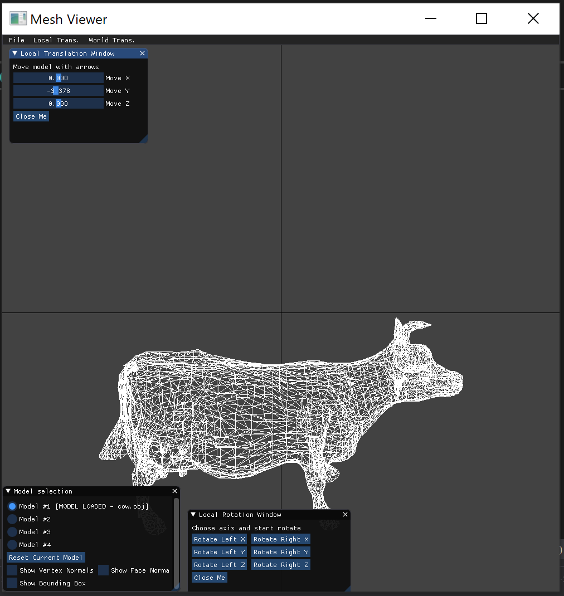
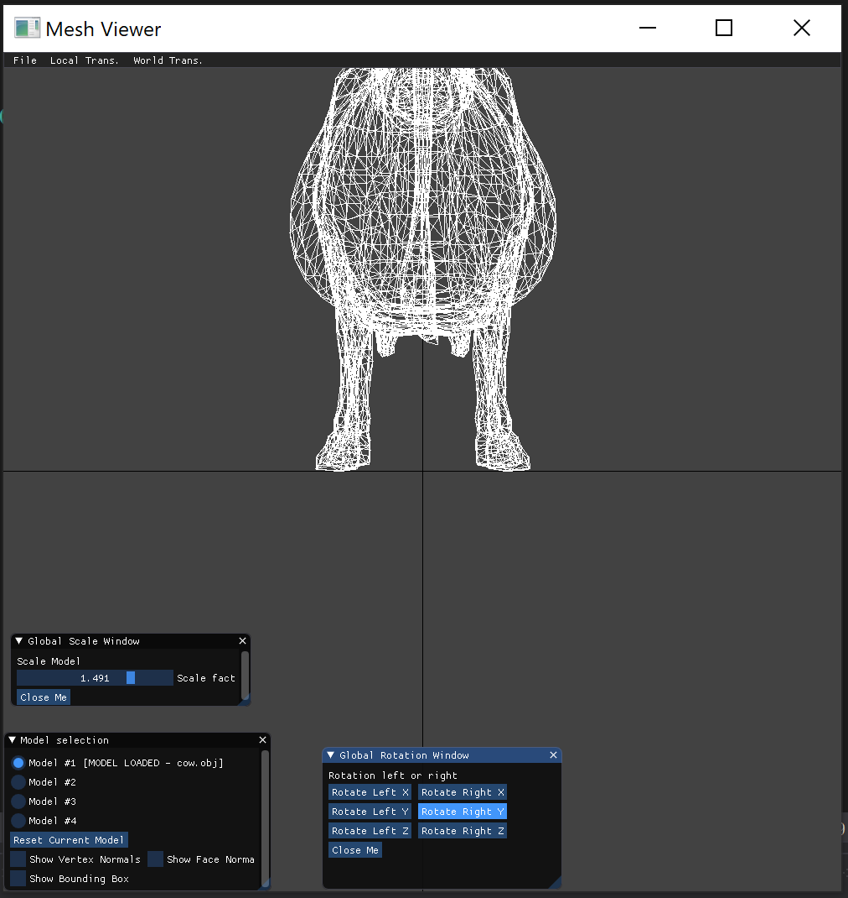
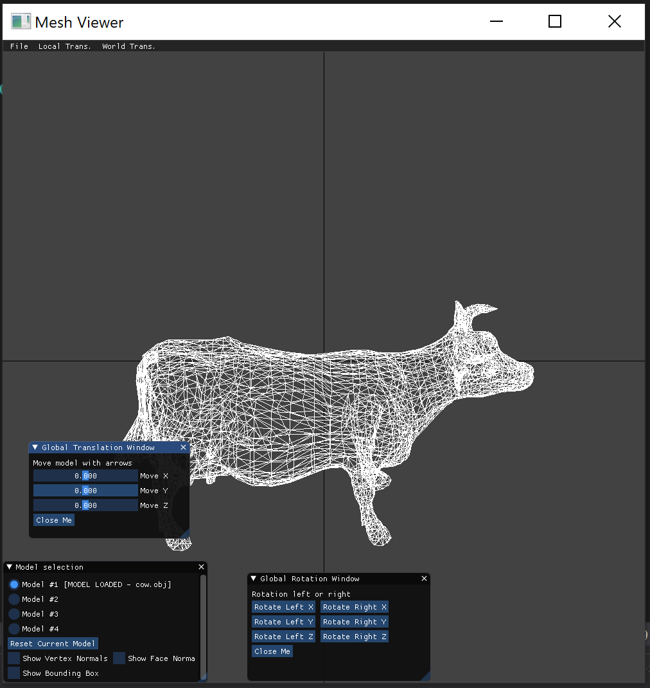
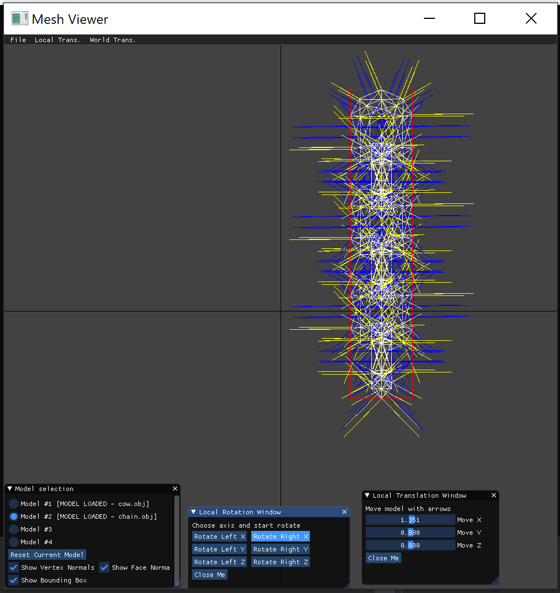

# 1. Teapot 45 degree rotation around Z axis-   

 

## NOTE: We changed the background colors
# 2.  Compare different frames  
### T1 = Rotate_X(45) * Translate_down_Y  
### T2 = Scale(1.5) * Rotate_Y(90)  

  

*T1_model*  
   
  
*T2_world*  
  
  
*T1_world*  
 
  
*T2_model*  
  

# 3. Face normals, vertex normals and bounding box 
  
 

# 4.    

# 5. 

# 6. Open models and switch between them:   
 