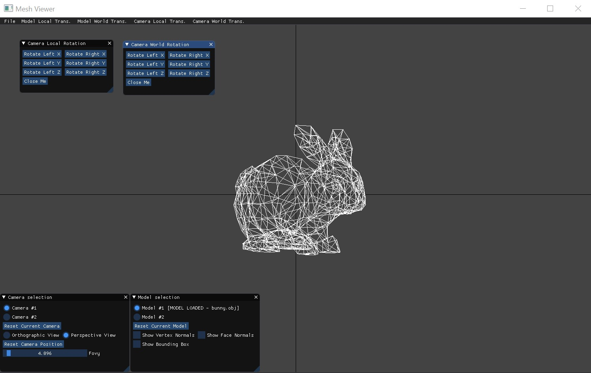
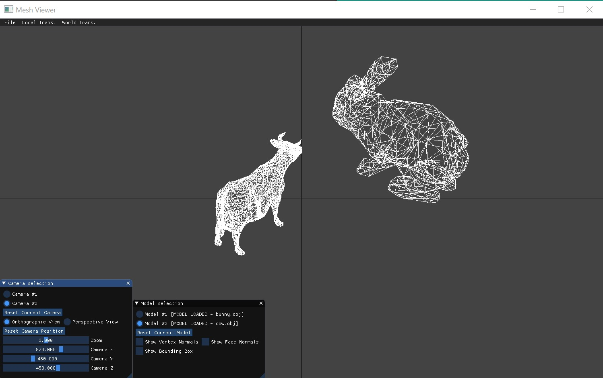

# 1. Teapot 45 degree rotation around Z axis-   

 

## NOTE: We changed the background colors
# 2.  Compare different frames  
### T1 = Rotate_Z(45) 
### T2 = Translate_Y

T1_model x T2_world  
   
  
T1_world x T2_model  
 

# 3. Face normals, vertex normals and bounding box 
  
 

# 4. Compare the orthographic projection vs. the perspective projection  
    
  

# 5. Perspective projection - Difference between changing the zoom and moving closer or farther from the model  
  
  

# 6. Compare camera rotations
- ### Rotation of the camera in the camera frame around the y (up) axis:   
     
- ### Rotation of the camera in the world frame around the y (up) axis:   
     
  
# 7. Camera position is at (300, 300, 300)  
     

# 8. Multiple models and cameras on screen  
     
     
  
# 9. Resizing the window  
     
     
  
# 10. Showing as much of your GUI as possible
     